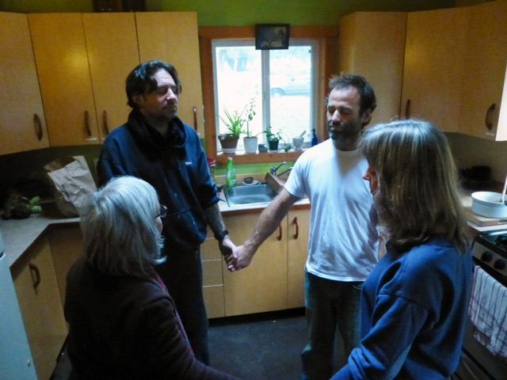
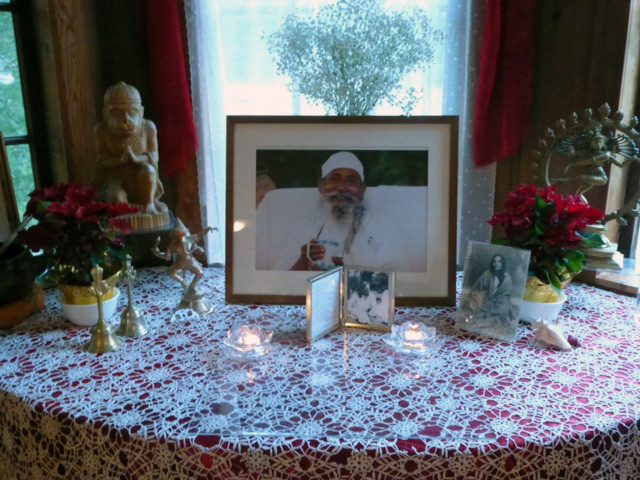

Greetings and Happy New Year!
Life at the Centre is very quiet in mid winter. Later this month, the resident community will begin growing again, but for now it is very small. We meet for meals in Sage House rather than the main program house. Scooch, the Centre’s resident cat, will be delighted when there are more people and more laps to sit on.
 Meal circle at the Sage House
Babaji continues to radiate sweetness. The latest [update on his health](http://www.babaharidass.org), as reported in this newsletter, includes some recent photos. Although Babaji’s age is definitely showing, so are his beauty and love. I hope you enjoy the photos.
 Altar
There are several articles in this month’s edition of Offerings that I think you will enjoy. January’s [‘Our Centre Community’ features Raven Hume](https://saltspringcentre.com/2013/12/our-centre-community-raven-hume/), who has been connected to the Centre for about ten years. Many of you know him through satsang; here is an opportunity to learn about his background and the path by which he arrived at the Centre.
I invite you to read [‘Finding God, Finding Peace’](https://saltspringcentre.com/2013/12/finding-god-finding-peace/), focusing on both the intentions we set for the new year and a reminder of why we’re here in the first place, prompting us to bring our minds and hearts back to the place of peace that we all recognize as the centre of our being.
Pratibha has shared another Ayurveda gem this month - [‘Winter Wellness Routine’](https://saltspringcentre.com/2013/12/winter-wellness-routine/), full of practical advice for thriving in the winter as well as suggestions for when you have a cold. Jenny Collver, who has spent many years at the Centre, from her early years helping Usha in the Centre School, later as a YTT student and, in recent years, as a yoga teacher at the Centre, has contributed the Asana of the Month article - [Dhanurasana (Bow Pose)](https://saltspringcentre.com/2013/12/asana-of-the-month-dhanurasana/).
Yoga classes will resume again in the week of January 6th, and of course satsang continues every Sunday. The Centre School will be back in session January 6th, so there will again be the sound of children playing.
Dharma Sara’s AGM will be held at the Centre in the spring (April or May). The date hasn’t yet been determined, but please note that in order to vote you need to have been a member for 90 days, so [now is a good time to join, or to renew](https://saltspringcentre.com/dharma-sara-satsang-society-form/) if you are currently a member.
Our popular karma yoga program - KYSS (Karma Yoga Service and Study) - is being enhanced to include more emphasis on study, workshops, mentorship and self study. There will be deeper immersion into all aspects of yoga, with many teachers, including several of our YTT teachers, offering classes. This new program - YSSI Yoga, Service and Study Immersion, running from June 1 through August 31 - will replace KYSS. Details will be posted on our website in February. Those who have already applied for KYSS will be notified about the program change, and given the option change their applications to YSSI.
With best wishes for a peaceful new year,
Love,
Sharada
