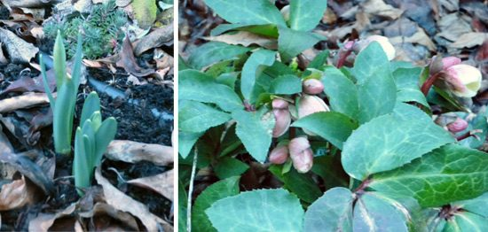

Hello everyone,
Although some of you may still be shovelling snow - and others basking in tropical climes - we at the Centre are enjoying what feels like the beginning of spring. The robins are back, the trees are budding, and it’s slowly getting warmer. We can still be hit by another bout of winter, but we’re definitely moving toward spring. It won’t be long before planting can begin on the farm.
[caption id="attachment\_8998" align="alignnone" width="550"] Early signs of spring[/caption]
David, the Centre’s farm coordinator, reports that the garden is still providing abundantly despite a week of minus ten degrees in the Blackburn Valley earlier in January. Our luscious kale and other greens are making a comeback, along with thinnings of our first crop of arugula. We have also been enjoying renegade rutabagas along with multiple seeds sprouting up with vigour out of dormancy and we have already feasted upon our first meal of nettles. Jai Ma!
[caption id="attachment\_8993" align="alignnone" width="491"] You will be missed, Scooch![/caption]
Many of you will already have seen the announcement on our Facebook page of the passing of our resident feline yogi. Scooch passed away peacefully on February 19, and was buried in the garden by the blackberry patch, one of his favourite hunting spots. He will definitely be missed by the many karma yogis and guests who sat with him on their laps on the back deck.
[caption id="attachment\_8994" align="alignnone" width="450"] Thanks for everything, Stacey![/caption]
Another Centre resident will be leaving at the end of this month, but he’s very much alive. Stacey, our maintenance manager for the past two years, will be heading off on his new adventures. We’re sending him off with love and warm wishes.
Claire and Kris will be back by the time you read this newsletter - Claire returning from Australia, Kris from Calgary - and the office will be humming. It will be wonderful having them back.
On the 27th of this month, we will be celebrating **Shiva Ratri** at the Centre. Please read the [details posted on the website](https://saltspringcentre.com/2014/01/shiva-ratri-2014/). I invite you also to read Babaji’s teachings in **[Shiva Ratri: the Destruction of Ignorance](https://saltspringcentre.com/2014/01/shiva-ratri-the-destruction-of-ignorance/)**.
There are several features in this month’s newsletter that I trust will interest you. Check out **Pratibha’s Ayurveda teaching, [What’s my Type?](https://saltspringcentre.com/2014/01/whats-my-type/)**, with information about the doshas, the bio-energetic qualities that make up our body-mind types, including a chart to help you figure out your own prakriti type. This month as well, we introduce **[Darryl Jagannath Janyk](https://saltspringcentre.com/2014/01/our-centre-community-darryl-jagannath-janyk/)’s story in Our Centre Community**. Jagannath has been connected with the Centre since the mid-80s, serving as a builder, advisor and pujari. He’s often a behind-the-scenes kind of guy, so if you don’t know him, here’s your chance. I hope you also enjoy **Andrea Mueller’s Asana of the Month article, focusing on [Salamba Sarvangasana aka Shoulderstand Pose](https://saltspringcentre.com/2014/01/asana-of-the-month-salamba-sarvangasana/)**, which Andrea refers to as the Queen or Mother of Asanas.
The new **[YSSI program](https://saltspringcentre.com/karma-yoga-service/) (Yoga Service and Study Immersion)** information has now been posted on the Centre’s website, and applications are steadily coming in. This program is similar to KYSS (now replaced by YSSI), but has more of an in-depth yoga study/practice component with a number of experienced YTT teachers. Please share this information with anyone who may be interested in this opportunity.
During the past month, we on the island have been fortunate to be able to study **Introduction to Asian Religions**, taught by Dr. Martin Adam, who teaches this class at UVic. It is a 12 week course, divided into three parts: Hinduism, Buddhism, Chinese Religions. It’s not too late to join; anyone wanting further information can call the Centre office.
The Centre School is in the midst of its annual **Reading Month and Off-Screen Challenge** - probably a difficult challenge for all of us (especially the off-screen part!)

If you love the Salt Spring Centre of Yoga (SSCY), want to know what's new and want to support it and [Dharma Sara Satsang Society](https://saltspringcentre.com/about/dharma-sara-satsang), you can **become a member for only $25 annually**! You will be able to attend Board meetings, read Board minutes and attend the Annual General Meeting (AGM) on Saturday, May 3, 2014, 1-3 pm at SSCY. If you join by February 2, 2014, you will be eligible to vote at the AGM. To join or renew, [click here](https://saltspringcentre.com/dharma-sara-satsang-society-form/).

I wish you abundance in this season of transition into spring, and for those living in the midst of drought and wildfires, may this abundance come forth in the form of rain!
Love,
Sharada
