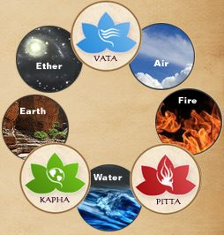

 Doshas and the five elements
“Eat what you can digest” was Babaji’s basic prescription, when he was asked like, “Babaji, how do I know what to eat?” Sounds simple, eh? “Eat what you can digest!” And yet, the next question comes easily, “How do I know what I can digest?”
Two basic principles are involved in answering this question:

1. Eating foods that are compatible with your constitutional nature, your “prakriti.” (February's Ayurveda column called [“What's my Type”](https://saltspringcentre.com/2014/01/whats-my-type/), described how to determine your constitution). We’ll come back to eating for your body type in a few minutes.
2. Understand your digestive process. A strong digestive power (called agni) is essential to staying healthy according to Ayurveda. How to assess your agni? Some of the things to look for are a healthy appetite, signs of indigestion, and regular bowel movements.

A good appetite means you are eager to eat when food is ready. Be aware that a low appetite is a signal to eat less at the next meal. Signs of indigestion include burping, bloating and flatulence. These indicate that the food is not being digested properly. Regularity of bowel movements will vary among individuals, and usually means 1-2 per day. (And for some people 1 movement every 2 days may be regular).
Being aware of these signals will help us to choose what to eat on any given day. One basic principle that is helpful to me is to always wait until the bowels have moved before taking the first meal of the day.

## **Guidelines for Healthy Eating**

These basic suggestions apply to all of us, regardless of our dosha predominance:

1. Eat in peaceful surroundings. Sit quietly to eat, saying a prayer or making an offering before the first bite.
2. Allow a minimum of 3 hours between meals. For vata, eating small meals every 3-4 hours is suggested; for pitta, every 4-5 hours; for kapha every 5-6 hours.
3. Chew your food well. Digestion of carbohydrates begins in the mouth, so chewing properly improves both digestion and absorption.
4. Eat until you are 2/3 full, allowing space for the churning of the digestive process.
5. A short walk after eating will assist digestion. No vigorous exercise for at least 2 hours.
6. The last meal should be taken at least 2 ½ hours before bed; the last liquid, at least 1 hour before bed.

Now, let’s take a look at what to eat according to your constitutional type. If you are of a dual dosha nature, be sure to read the recommendations for both of your predominant doshas.

## Vata Dosha Predominant

**Consider** – Vata predominant people need warm, moist, grounding foods to balance their naturally light, cold, dry qualities. The sweet, sour, salty tastes are balancing for vata. Hot cereal in the morning, hearty vegetable soup for lunch, root vegetables at suppertime are examples of foods to maintain a healthy vata nature.
**Signs of Imbalance** – Intestinal gas, the sense of no movement in the digestive system.
**Emphasize** – Warm, soupy, cooked foods with oils, whole grains (basmati rice, oatmeal, cream of wheat, quinoa), adequate protein (milk, eggs, cheese), root vegetables, small beans (like lentils and split mung), nuts in moderation. Warming spices such as ginger, cardamom and nutmeg are recommended.
**Reduce** – Dry (popcorn, sprouts, rice crackers, chips), cold and raw foods, cold and yeasted foods, excessive fruits and sugars, ice water, caffeine, potatoes, apples, and beans that create gas.

## Pitta Dosha Predominant

**Consider** – Pitta predominant people thrive on cooling, grounding foods to balance their naturally warm, light, moist qualities. Sweet, bitter and astringent tastes are balancing for pitta. Granola with warm milk (dairy, coconut or almond milk) makes a nice breakfast. Adequate protein is essential to nourish pitta.
**Signs of Imbalance** – Belching, acid indigestion, loose stool.
**Emphasize** – When hunger is strong, more protein; when hunger is less, more carbohydrates. Dairy products and legumes are an important source of protein for pitta folks. Cooked vegetables, including leafy greens. Sweet cooling fruits (especially melons) help keep pitta dosha happy.
**Reduce** – Spicy, hot (chilies, tomatoes, mangoes), sour (sour cream, yogurt, aged cheese), salt, yeasted, citrus fruits, fermented foods (beer, tempe, sauerkraut), and alcohol.

## Kapha Dosha Predominant

**Consider** – Kapha predominant people thrive on warm, light and dry foods to balance their cool, heavy, moist qualities. Pungent, bitter, astringent tastes are balancing for kapha. Light foods such as popcorn and rice crackers can be enjoyed. Include ginger, black pepper and other moderate spices to enhance the appetite.
**Signs of Imbalance** – A feeling of fullness, lack of appetite, and a sense of stagnation in the digestive tract.
**Emphasize** – Warm, cooked, easily digestible foods, including plenty of vegetables. Good protein sources include legumes (all except soy), low-fat dairy and eggs; grains such as barley, couscous and millet.
**Reduce** – Cold food and drinks, raw foods, sour foods, salt, sweets (ice cream, candy), nuts, avocadoes, fats and oils, fried foods, bananas, cheese, and peanuts.
Ayurveda teachings emphasize human nutrition and digestion, believing that the strength of our digestion is at the heart of maintaining a healthy balance. Every cell of the body requires nourishment each and every day. When adequate nourishment (not only food, but water and oxygen as well) is not received, the cells cannot function nor reproduce themselves properly.
It’s also important to remember that the doshas are in a constant state of fluctuation within us. Everything we do, say, even think, affects this always moving balance. So our attentive mindfulness to food - meal preparation, the act of eating, digestion and elimination - can help lead us on along the path of vitality, longevity, and (hopefully) enlightenment!
Peace,
Pratibha
 Pratibha Queen
**Pratibha Queen** is a yoga instructor and Ayurvedic practitioner, who attends Salt Spring Center of Yoga retreats on a regular basis. Feel free to email with any questions that arise as you engage in health practices to support your yoga practice: pratibha.que@gmail.com.
