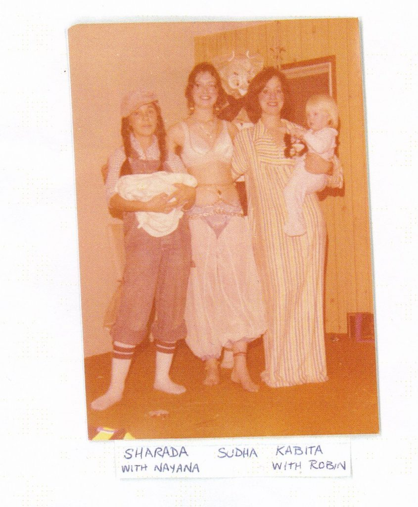
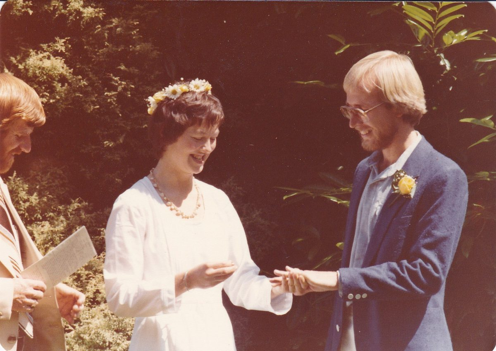
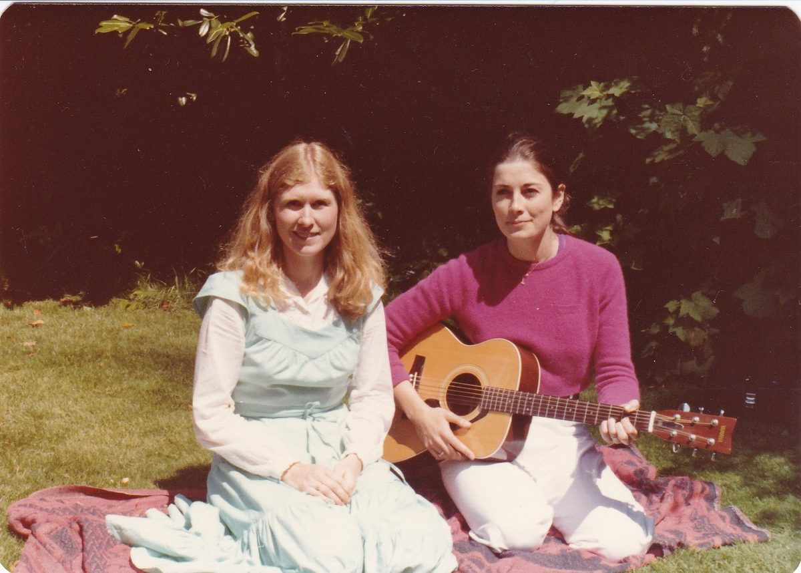
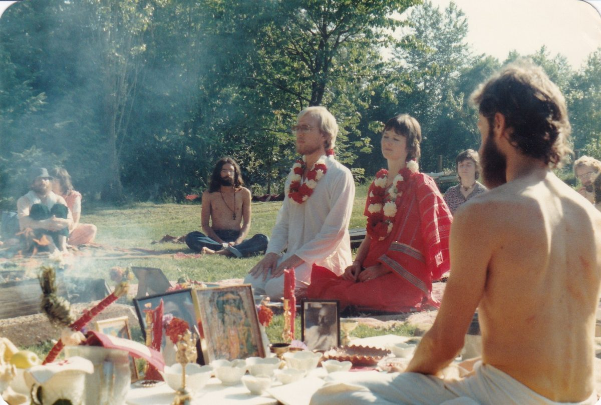
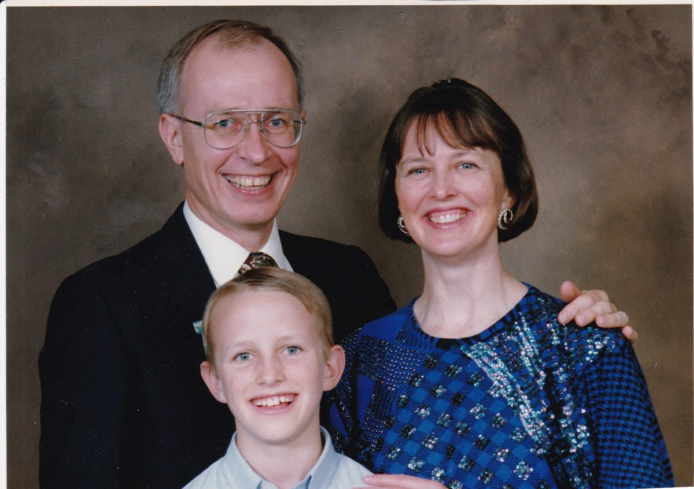

# 

## Sudha Soleil (aka Theota Makortoff)

It was summer of 1976. I was 25, single and ready for change. I planned to change my birth name, Margaret. I liked my name, but I found that when people called me by Margaret, it just didn’t feel like me. I was trying out Theota as a possible name.
I edited the BC Federation of Women newsletter, but I grew tired of all the militant feminist rhetoric, and wanted more spirituality in my life. I meditated 20 minutes a day using a technique from TM (Transcendental Meditation). I wanted to learn more about yoga. Chandra, a woman I met at SFU teacher training, was involved with a group who were putting on a yoga retreat. Her guru, Baba Hari Dass, would be attending the retreat.
I remember registering for the retreat at a place on. 4th Avenue. AD was there, wearing shorts and a tee shirt with a sweatshirt tied round his waist. I can see him standing there like it was yesterday. How was I to know that AD would become my all-time best teacher ever, and that this retreat would change my life?
Backpack and sleeping bag in hand, I travelled to Oyama via Greyhound bus. I met a woman named Nona and her two girls, Ruby and Lena, who were also going to the Retreat. After six hours on the bus, we were glad to finally reach our destination. We walked into the Oyama retreat site in the early evening, and were greeted by Shankar bearing plates of wonderful, vegetarian food for us. Whenever I think of that night, the pure love and beauty of that moment touches my heart.
This first Oyama retreat was 10 days long, and very intense. I was up at the crack of dawn learning cleansing techniques like pouring salt water through my nose. I went to every class, from pranayama to asana to afternoon sadhana. Just before supper I went to afternoon arati. Hungry and tired, I tried as best I could to sing the kirtan songs, which were mostly in Sanskrit. Everything was so unfamiliar. I can still remember grabbing handfuls of the prasad, a delicious assortment of nuts, seeds and fruits that was served in large, wooden salad bowls. If it hadn’t been for that prasad, I may never have learned arati.
I was very impressed by Babaji's answers to people's questions: Never speak against any religion. All true religions lead to the truth.
**Some fond memories:**
• Babaji sitting at the head of the children's table.
• singing kirtan, while standing in a big circle around the children’s table, waiting to be served dinner. (Sometimes it seemed like we would never get to eat!)
After I got home from the Oyama retreat, I wanted to get involved with Dharma Sara Satsang in Vancouver, but something inside was holding me back. After the retreat I would wake up every Sunday and ask myself, "Am I going to satsang today?" The answer was always "no", until December 5th, the answer was "YES". What a wonderful birthday present!
I started attending Vancouver Satsang regularly. We sang spiritual songs together in English and Sanskrit, which I loved. We prayed and meditated together. I felt a strong bond developing with these people with whom I shared a common goal: to learn and practice Babaji's teachings. We were co-aspirants, sowing the seeds for lifelong friendships as well. I felt a sense of belonging that I had been craving, but never experienced before.
 *Halloween in Aldergrove 1977 - Sharada with Nayana, Sudha, Kabita with Robin*
Sometimes we worked together on activities outside of satsang. We had lots of potluck dinners; we all loved to eat! I learned how to figure out amounts when cooking for a large group. This was very helpful when I was helping cook at the Centre.
In 1977, I was preparing to attend my second yoga retreat at Oyama. As part of Dharma Sara Satsang, I was eager to help any way I could. I still remember AD asking me if I would head up the kitchen clean-up crew. I agreed right away, having no idea what I was getting into. It was hard work and I was grateful for the opportunity to be of service (most of the time). I was in the early stages of learning the practice of karma yoga.
I loved being at the retreat. I enjoyed learning more of Babaji’s teachings, and studying the eight limbs of Ashtanga yoga. I appreciated the opportunity to study again with Anand Das (AD), a very gifted yoga teacher. I felt like I had finally found what I had been looking for my whole life and didn't know it. I WAS HOME!
Evening programs at the Oyama retreats were special. Babaji sat at the front, surrounded by devotees. Ma Renu sat at the back, knitting. I remember one evening, all of us sitting or lying on the floor of the huge program room. Thinking of that night brings tears to my eyes. Naresh read aloud a story written by Babaji. His voice was gentle and loving. For that brief moment, we were all Babaji’s children and he was reading us a bedtime story.
Babaji played a huge role in my life. He and Ma were, in a way, like parents to me, God's way of making up for the lack of reliable adults in my family. My first letter to him ended up being 16 pages. I told him all the painful stuff that had happened in my childhood. He wrote back, telling me that as a result of my father’s anger, I had fear in every area of my life. My job was to work at removing this fear. Easier said than done. Over the years, I wrote him many letters, asking for advice. I was grateful that he answered every letter and shared his wisdom and good sense.
In the many darshans I had with Babaji, he gave me wise counsel. His feedback was sometimes candid, always right on. For example, when I told him I wanted to find a good man to marry, he said, “Grow your hair long. You look like you’re not interested in men.” When I grew my hair long, I reconnected with my feminine side.
Babaji had a great sense of humour. I was down in California at a retreat when the issue of finding a husband came up again at my darshan with him. When I was taking part in the retreat, three men, two of whom I had never met before, said Babaji told them to ask me to marry them. I still don't understand what Babaji was trying to communicate with this bizarre little exercise.
I went home to Vancouver and was immediately offered a teaching job over the phone (something that rarely happens) at the school where Dharma Sara Satsang had a daycare (Rainbow's End). I was hired to fill in for the regular learning assistance teacher who was off indefinitely with a broken hip. In the first week, I noticed a good looking, blonde man coming down the hall and I thought to myself, he looks nice. A voice inside my head said " I will marry that man one day." I was startled. Who was this voice? Did it really know who I was going to marry? Apparently, yes.
Phil was the childcare worker at the school. We had a chance to meet professionally because we worked with some of the same children. We began dating in April 1979. That summer, we went to California together for a holiday. I called Ma Renu and told her I wanted to introduce Phil to Babaj. She kindly allowed us to come to her home for a private darshan with Babajj. We sat on the edge of Babaji's bed. He talked with us, asked us a few questions and then said, "Live together. It will change your life ."
 *Sudha & Phil wedding photo 1980 (Divakar on the left)*
 *Anuradha & Kalp singing, Sudha & Phil's wedding*
We moved in together in October of that same year. On June 28, 1980, we were married outdoors, at what was then the Botanical Gardens at UBC. Music at our ceremony was provided by Kalpana and Anuradha, who sat under a tree with their guitars and sang like angels. On July 12 we had our yajna at Sid and Sharada's place in Aldergrove. AD was our pujarii; he agreed to do our ceremony for us, even though he was not well. In this beautiful ceremony we talked about being friends to each other and committed ourselves to marry in all future lifetimes.
 *Sudha & Phil wedding yajna, AD officiating*
On December 23, 1981, I gave birth to our beloved son Mischa Pavan. He has grown up to be a wonderful person and a loving son.
 *Sudha & Phil & Mischa - family photo*
When I was 46, I was diagnosed with Early Onset Parkinson's Disease. (Parkinson's is a progressive disease of the nervous system marked by tremor, muscular rigidity, and a deficiency of the neurotransmitter dopamine, which affects most functions in the body, including movement, memory, behaviour & cognition, sleep, mood & learning.) From that time on, my health gradually got worse until I became physically disabled and had to get around in a wheelchair. I am forever grateful to Phil for his enduring love, care and support. We have been married 34 years.
Babaji's teachings have been the cornerstone of my life since I first joined Dharma Sara Satsang in 1976. Connecting with others who also aspired to follow Babaji's teachings has benefited me in so many ways. I learned to sing beautiful kirtan and play the harmonium. I developed a strong bond with Dharma Sara members; they are not only co-aspirants and friends, they have become family. Whenever Mischa Pavan or I visit the Salt Spring Centre, it is like going home. Babaji directed us to buy a piece of property, which would serve as a place to build a yoga centre for the community and provide a peaceful place for families to come. The Salt Spring Centre fulfills both purposes beautifully. A very special memory for me is of coming to the Centre to help hostess Women's Weekends, and feeling like I was in the lap of God.
I loved going to the Retreats. I went to 5 retreats when I was in a wheelchair. When the challenges of being physically disabled made it too difficult for me to attend, I would send my Sudha book to the retreat. Chandrika would circulate the Sudha book and encourage people to read it and write me a note. (In the Sudha book I would write a letter for everyone to read, talking about some of the things I had been doing and asking them to write me a note) After the retreat, as I was reading through the notes people had written, I was thrilled when I came across this note from Babaji:

*Dear Sudha,*

*Jai Sita Ram*

*By God's blessing I came to Salt Spring Centre. Day by day life is inching towards old age but God is so giving that I am still working physically.*

*I am thankful to God that he has given you courage to face your disability. Live with a positive frame of mind. Help others and go on living happily. May god bless you.*

*Baba Hari Dass*

I am honoured that Babaji wrote me such a beautiful note. I am trying every day to follow his advice.
Thank you, Babaji.
Jai Sita Ram!
