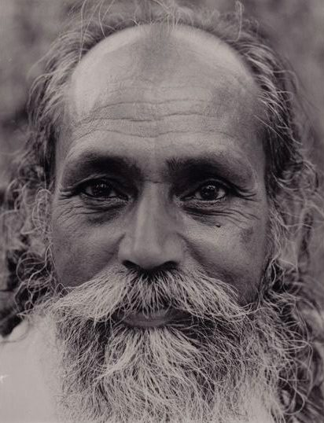

Duty is not a popular concept in the western world. This culture, with its emphasis on individuality and endless personal choice, has an aversion to anything that smacks of obligation.
In chapter two of the Bhagavad Gita, Krishna instructs Arjuna to perform action, “being steadfast in yoga, abandoning attachment and balanced in success and failure. Evenness of mind is called yoga. One should abandon the fruits of action, carrying out one’s duty; yoga is skill in action.”
Because we have so many choices, we can easily become confused about what we should do. Krishna is saying clearly, “Do your duty.” But how do we know what our duty is?
In his commentary on the Bhagavad Gita, Babaji outlines our duties clearly:
***Duties for yourself**, like eating, cleaning, exercising and working.
**Duties toward your family**, such as supporting the family by working at a job to earn livelihood, growing food, educating children and taking care of one’s parents in old age.
**Duties toward the community**, such as reducing violence and corruption in the society and caring for the needy.
**Duty toward one’s country**, such as being a good citizen and being prepared to help others whenever the country goes through a disastrous period.
**Duty toward the earth**; Nature creates, controls, guides and supports the creation. If nature is harmed by pollution in the air, water and earth, the whole universe will be affected.* 
Those are pretty straightforward instructions that we can all understand. We can strive to follow them regardless of our life situation. Whatever form the external work in the world takes, we can develop the attitude and the practice of choosing our action (rather than resisting and resenting it) because it serves others and serves life. If you’re working in a job you don’t enjoy, you can switch from the thought, “I have to do this work.” to “I choose to do this work because it’s supporting my family.” It requires a conscious effort to see what you’re doing from a different perspective, shifting from “What’s in it for me?” to “How can I contribute?”
Verse 19 of chapter 3 says: “Strive constantly to serve the welfare of the world; by devotion to selfless work one attains the supreme goal of life. Do your work with the welfare of others in mind.”
*You have your duties and responsibilities to the world and you can do them with a smile on your face or with a sad heart and tears in your eyes. It doesn’t make any difference to the world but it makes a difference in the way you feel.*
Shifting the angle of the mind isn’t always easy because we see the world through egocentric lenses. Our aim is the key. *The mind should be aware of the aim, “I want liberation from all worldly pain.” If you keep this aim in mind it will naturally guide you in choosing selfless action. If you can bring hidden self-interest to light, you can transform selfishness to selflessness.* 
These instructions don’t tell us what to do in specific situations, but they guide us in making choices in all situations based on the principles by which we we want to live our lives. We don’t “have to” help others because someone else tells us to, but we can choose to help because we want to live with kindness, truthfulness and gratitude. Our actions then become a self-chosen duty.
*Ego always gets in the way, but if you understand your ego, then it can’t possess your mind. There is always some ego in everything. One should beware of the ego turning to the negative side. Positive ego is important for progress in the world as well as in the spiritual path. Complete elimination is liberation.*
*Life is not a burden. We make it a burden by not accepting life as it is.*
*Wish you happy.*
Contributed by Sharada
Note: All text in italics is from writings by Babaji
