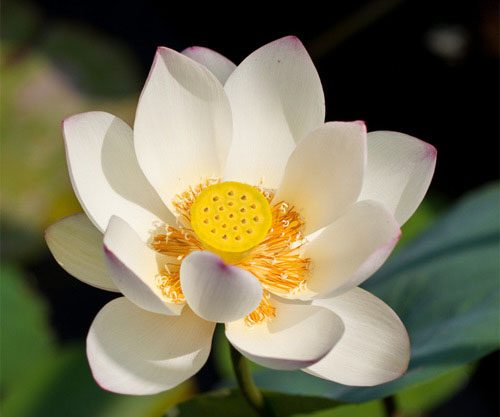

Babaji was once asked, “I have a hard time meditating; I don’t have much devotion; I don’t have time for karma yoga. What can I do?” Sometimes he replied, “Develop positive qualities.” Other times he answered, “Live a virtuous life.” Both these suggestions point to enhancing sattva in our lives.
Last month, we talked about [bringing sattvic qualities into our Ayurvedic dietary habits](https://saltspringcentre.com/2014/05/the-yogic-sattvic-diet/). This month, we’ll shine the light of Ayurvedic understanding on our efforts to develop a sattvic mind. Through the purification practices of yoga, we gradually purify the mind of negative qualities – like lust, anger and greed – and learn how to promote the sattva principle in our yogic life.
The three cosmic gunas – sattva, rajas, tamas – are subtle energies that permeate the entire universe. They describe the forces at work that mysteriously bring creation into being. These three infinite forces are also constantly at work to continue the creation and sustenance of the universe. The constant state of interplay between the three gunas allows for the continuous creation throughout eternity.
Sattva is the force of balance, purity, equilibrium, wisdom, light, truth and peace. The light of the sun and keen intelligence are examples of the force of sattva. Rajas is the force of action, passion, energy, will, dispersion. Rajas manifests as activity, movement, and engagement with the world. Tamas is the force of stability, cohesion, resistance, dullness, inertia. The darkness of ignorance and the staying power of bad habits are ways that we see tamas manifest in our daily life.
In the daily activity of life in the world, we see primarily the interplay of rajas and tamas. At night we rest; during the day, we are active. After each breath, the breath pauses, suspended in the interval between the inhale and the exhale. This cycle of activity and rest – rajas and tamas – goes on throughout out life of engagement in world activities.
In our spiritual development, however, our goal is to enhance the sattvic qualities that we all possess as human beings. Love, compassion, generosity, patience, non-violence, peacefulness, wisdom, positivity. These are the qualities of a sattvic person, who is capable of living a virtuous life and manifesting positive qualities.
In order to develop a more sattvic lifestyle, we gradually reduce the worldly forces of passionate rajas and lethargic tamas, and to increase the force of sattva in our lives. We modify our diet to include more calming, balancing foods. We avoid activities that kick our passions into high gear. We use the practices of asana, pranayama and meditation to turn our attention inward.
And thus we begin by reducing the downward pull of tamas in our lives – to overcome any tendencies toward lethargy, depression, and dullness that may creep into our nature. Next we gradually develop the power to transform our aggressive, negative, rajasic tendencies into positive qualities, to see others as friends and fellows, rather than as rivals or enemies. We expand our daily concerns beyond our own self-interest.
Our vata nature expresses its sattvic side through qualities such as enthusiasm, delight, inspiration, devotion to others, expressing divine love. Sattvic qualities in pitta predominant people come thru as clear perception, brilliance, dedication, and keen insight. Kapha people express their sattvic nature through patience, compassion, generosity. Remembering that all of us have all three doshas in our make-up, we watch these positive qualities develop as we grow in our self-development.
And in the process we learn to live a virtuous life through developing this positive side of our nature - learning enthusiasm, dedication and patience, developing insight, compassion, and devotion to others’ welfare. This is the sattvic side of our nature. One that is an essential part of who we are, but also the side that is often buffeted about in the striving and struggle of our daily lives. Our spiritual practices – sadhana, selfless service, rituals of devotion – all provide an avenue for us to develop and enhance the purity of mind that resides in our sattvic nature.
Wishing you peace as we come to see ourselves as the divine sattvic being we truly are.
[caption id="attachment\_8434" align="alignleft" width="287"] Pratibha Queen[/caption]
**Pratibha Queen** is a yoga instructor and Ayurvedic practitioner, who attends Salt Spring Center of Yoga retreats on a regular basis. Feel free to email with any questions that arise as you engage in health practices to support your yoga practice: pratibha.que[at]gmail[dot]com.
