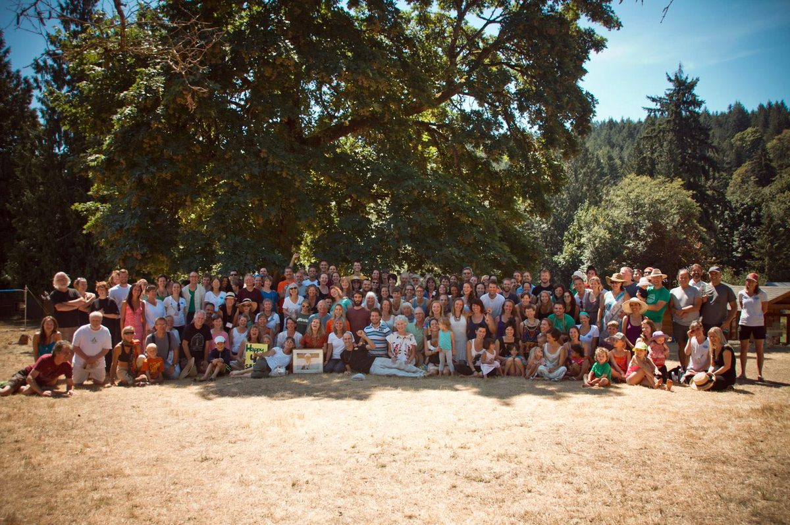

Hello everyone,
As I write this, the sky is cloudy, and although there may yet be many days of sunshine, fall is definitely in the air. Just a short while ago, we were in the midst of YTT and ACYR in the heat of July and August. Both programs were uplifting and deeply satisfying on many levels.
 YTT participants, 2014
 Group shot at this year's 40th Annual Community Yoga Retreat!
 Meal Circle at this year's Annual Community Yoga Retreat
Now the nights are crisp and the days are a bit shorter. Kids are getting ready to go back to school and the karma yogis in the YSSI program are preparing for the next step in their lives - some going to school, others embarking on travels, some heading home, others stepping into unknown adventures. I’d like to take this time to acknowledge the huge contribution made by the people who have joined us for the summer season. Jai community!
 Brenn, Anne and Hannah
 David threshing
This is the season for harvesting fruit from the Centre’s orchard. Most of the apples have been picked and taken to a local farm to press into juice - hard work, but fruitful (pardon the pun). We now have over 300 litres of apple juice to take us through the year! The pears will be next.
 A truck-load of apples!
 Brenn and Tana making apple juice

## In this Month's Newsletter

Two of our recent YTT grads have agreed to write **[personal reflections on their YTT experience: Kim Gillett and Ginny Kloos](https://saltspringcentre.com/2014/09/reflections-on-the-centres-yoga-teacher-training-program-ginny-kim/)**. I am grateful for their openness in sharing their experience.
 Babaji altar in the kitchen
The kitchen, meanwhile, continues to provide delicious meals to Centre residents and guests. Raven Hume, the Centre’s kitchen coordinator, has shared his reflections on the practice of **[Kitchen Sadhana](https://saltspringcentre.com/2014/09/kitchen-sadhana/)**, bringing the aim of finding peace to all our activities.
This month’s Our Satsang Community story is by **[Glenda Saraswati Garcia](https://saltspringcentre.com/2014/09/our-centre-community-glenda-saraswati-garcia/)**. Saraswati is an integral part of both the Salt Spring Centre of Yoga and Mount Madonna Center. Along with teaching, she also serves on Dharma Sara’s Board of Directors. I’m sure you’ll enjoy reading her story.
Pratibha has again contributed her wisdom in the article **[Balancing Vata Dosha in the Fall Season](https://saltspringcentre.com/2014/09/balancing-vata-dosha-in-the-fall-season/)**. This article is full of immediately useful information for responding to the changes that fall brings.These suggestions can help us keep our balance during this time of year. One way to keep our balance is through asana.
Peter Ashok Baragon has contributed **[Upavista Konasana, wide-angle seated forward fold](https://saltspringcentre.com/2014/09/asana-of-the-month-upavista-konasana/)**, in Asana of the Month. This asana helps in letting go and decompressing after a stressful day, something we could all use.
There are a few more opportunities to enjoy a visit to the Centre during the fall season, with Yoga Getaways in September, October and November. For those who live close by, Wednesday evening kirtan and Sunday satsang continue every week.
With wishes for health and balance,
Love,
Sharada
