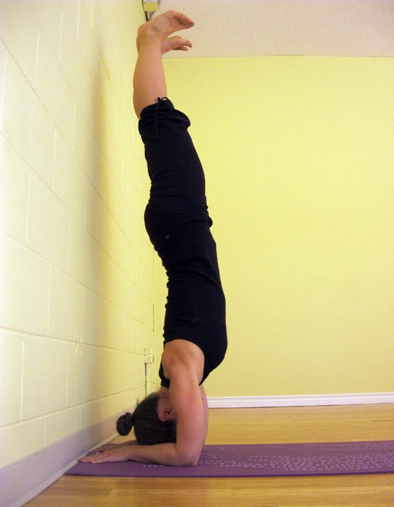

## Pincha Mayurasana (pin-cha my-your-AHS-anna) aka Feathered Peacock or Forearm Balance pincha=feather mayura=peacock

[caption id="attachment\_10434" align="alignnone" width="575"] Kenzie demonstrating full Feathered Peacock pose.[/caption]
Yogi/blogger J. Brown recently wrote a brave piece dethroning the King and Queen of yoga – Salamba Sisasana (headstand) and Salamba Sarvangasana (shoulderstand). Though he discussed the very real potential for injury, especially in group classes, his greater emphasis was in regards to sticking to an ideal 'pose' in teaching and practicing when in reality it does not serve our body or reflect our body of wisdom. We need to teach what we know, and our knowledge must evolve with our practice over time.
I relate to this because these two poses have never served my body. Maybe it's my long neck/short arms/long torso combo but I have intuitively refrained from practicing these poses. Since having kids my home practice has migrated to evenings and my full inversions have been traded for partial ones. Now that my children have begun full time school I have again claimed morning (and full inversions) for my practice. In doing so I have found my royal couple! I crown Adho Mukha Vrksasana (handstand) and Pincha Mayurasana (fore arm balance) my new 'King and Queen of the Asanas'!
Let me tell you about my Queen. She is less intimidating than her husband as she has a firmer base with the head not as far from the floor.
Pincha mayurasana is technically a symmetrical inverted balancing arm support pose. While the lower body is designed for carrying weight and balancing, the upper body is less well designed to do the same. This pose is not only perfect for strengthening the entire body, but having the hands, arms, shoulders and upper back co-ordinating support for the lower body counteracts the negative postural effects of the ubiquitous forward slumping default pose of our digital age.
As I begin the journey towards my fullest expression of feathered peacock pose I see myself working through three kramas (stages) to get there. The kramas are meant to be practiced very slowly and deliberately over time to build up the physical strength and proper alignment in order to eventually perform the full pose safely. Start by staying in the first krama for 15 seconds and working up to one minute. Finding ease in one pose is an invitation to move on to the next one.

### Krama 1

[caption id="attachment\_10437" align="alignnone" width="575"] Modified Adho Mukha Svanasana[/caption]
**Modify Adho Mukha Svanasana (Downward facing dog) by placing palms and forearms on the floor shoulder distance apart.** This 'dolphin' pose allows you to become familiar with the composition of the upper body while only in a partial inversion. You can begin improving your ability to hold the arms parallel and shoulder distance apart by hugging the shoulder blades against your back and pulling them towards your tailbone. Hug your forearms inward as you rotate your upper arms outward to keep your shoulder blades wide, then spread fingers, engage hands and press your wrists into the floor. Try 'dolphin push ups' by bringing your nose to the floor between the hands and then back and between the elbows while maintaining the integrity of the 90 degree angle between torso and thighs. This will help build up the strength needed to perform the next krama.

### Krama 2

[caption id="attachment\_10435" align="alignnone" width="575"] Ardha Pincha Mayurasana at the wall[/caption]
**Ardha (are-dah = half) Pincha Mayurasana** **at the wall** will build up even more strength and confidence for the full pose. While sitting in dandasana (staff pose) with your feet against the wall make an imaginary mark on the floor at your hip. Kneel with your back to the wall and place your elbows on this mark and lift up into dolphin pose. Step one foot high up the wall, then the other, walking both feet down until they are parallel to the floor and your torso is upright. Press upper thighs and tailbone towards the ceiling as the feet press firmly against the wall. Play with shifting the weight between elbows and hands, perhaps finding the sweet spot for balancing just ahead of the elbows and towards your forearms. Allow your head to hang down between your shoulder blades and find your drishti (focal point) across the room from you.

### Krama 3

[caption id="attachment\_10433" align="alignnone" width="575"] Full pose using the wall for balance[/caption]
**The final karma is to practice the full pose using the wall for balance.** Kneel and bring your fingertips to the base of the wall and press into dolphin pose. Step one foot toward you while pressing through your opposite heel and take a few practice hops while exhaling fully. Once the legs make contact with the wall press through your heels to straighten your legs and hug your inner thighs together. If the low back is arched due to tight armpits and groin hug your front ribs into your torso, reach your tailbone towards the heels and press the heels higher up the wall. Keep shoulders lifted and broad as you come down one foot at a time on an exhalation. Practice moving yourself further and further away from the wall, using it only to guide you into balancing on your own.

### Extra tip

To encourage proper shoulder action, especially if your elbows keep sliding away from each other, press your hands onto the opposite ends of a foam block with wrists perpendicular to the floor. Alternately have palms face up and press pinkies into the ends of block. If this isn't enough, buckle a strap over your upper arms just above the elbows at shoulder width.

### Contraindications

back, shoulder or neck injury; headache; heart condition; high blood pressure; menstruation, third trimester of pregnancy or if not a part of your regular practice.

### About the Instructor

Kenzie Pattillo completed her 200 hour YTT at Salt Spring Centre of Yoga in 2002. She is a householder yogi/mama living in North Vancouver, B.C. and presently teaches yin, hatha and flow yoga in her community. En route to completing her 500 hour YTT designation she has recently begun practicing one on one restorative therapeutics.
