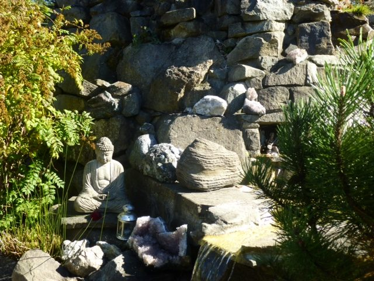

Hello everyone,
[caption id="attachment\_10460" align="alignnone" width="575"] Autumn's long shadows on the fountain[/caption]
Autumn, the “season of mists and mellow fruitfulness” (from ‘Ode to Autumn’ by John Keats) has arrived in its gentle beauty. This is the month of Canadian Thanksgiving, a time for all of us to join in gratitude for what we have been given: the guidance of our teacher, Baba Hari Dass, the gift of this community of yogis, the sharing of our many forms of spiritual practice, the abundance of organic food. We continue to feast on zucchini and other squash, tomatoes, cucumbers, peppers, eggplant, carrots, beets, chard and other greens, apples and pears. To top this off, the trees along the driveway have again produced an abundance of walnuts.
[caption id="attachment\_10458" align="alignnone" width="575"] Fresh, organic produce[/caption]

### Farewell to Kris!

Last month we said farewell to Kris, our extremely capable programs & rentals coordinator, who has moved back to Calgary. Fortunately for us, she will continue to help us out for a while. Kris, we love you and will be very happy to see you anytime you want to come and visit!

### Wedding on the Land

Congratulations to Mamata Kreisler and Kris Gomez on their recent wedding. Mamata, Rajani and Rajesh’s daughter, was born in a cabin on this land, and decided to get married here, her first home. It was a beautiful sunny day for this wonderful celebration on September 27.

### Rosh Hashanah at the Centre School

[caption id="attachment\_10457" align="alignnone" width="575"] Lining up for apples and honey in celebration of Rosh Hashanah[/caption]
In late September Sharada again had the pleasure of celebrating Rosh Hashanah, the Jewish New Year with the children at the Salt Spring Centre School. It is a time to review our lives, our habits, and recommit to living by our values and developing positive qualities. And it’s a time to dip apples in honey and wish each other a sweet year.
Also in late September, the community here had an opportunity to do a day-long First Aid workshop. Everyone who participated in the full program received a First Aid and CPR certificate.

### In this month's Newsletter

There are a number of articles I hope you will enjoy. Pratibha’s Ayurveda article, ‘**[Soup, Beautiful Soup](https://saltspringcentre.com/2014/09/soup-beautiful-soup-recipes-for-fall/)**’ contains recipes for nourishing, warming soups for all body types in this chillier fall season. Kenzie, in Asana of the Month, introduces what she calls her new queen of asanas: **[Pincha Mayurasana - Feathered Peacock](https://saltspringcentre.com/2014/09/asana-of-the-month-pincha-mayurasana-forearm-balance/)**, a forearm balance pose. It is a strengthening pose for the entire body (though not for everyone; there are some contraindications listed.) The article ‘**[What is it you really want?](https://saltspringcentre.com/2014/09/what-is-it-you-really-want/)**’ explores the possibility of being happy now. It has no contraindications; it is for all of us.

### Programs at the Centre

Coming up this month: **[A Yoga and Cancer Workshop](https://saltspringcentre.com/retreats-programs/yoga-cancer-workshop/)** with Chetna is a yoga therapy training for yoga teachers who want to learn how to support people who are journeying through cancer. Later this month there will be another **[Yoga Getaway](https://saltspringcentre.com/retreats-programs/yogagetaways/)**, with one more to follow in November - the last one of the 2014 season. We will also be celebrating Thanksgiving at the Centre as we do every year, with a gratitude circle followed by a delicious vegetarian potluck dinner, on Monday, October 13.
As always, Sunday satsang continues each Sunday, as does Wednesday kirtan (for a little longer), morning and evening arati at the temples every day, Bhagavad Gita studies and asana classes.
May you be filled with loving kindness
May you be well
May you be peaceful and at ease
May you be happy.
Love,
Sharada
