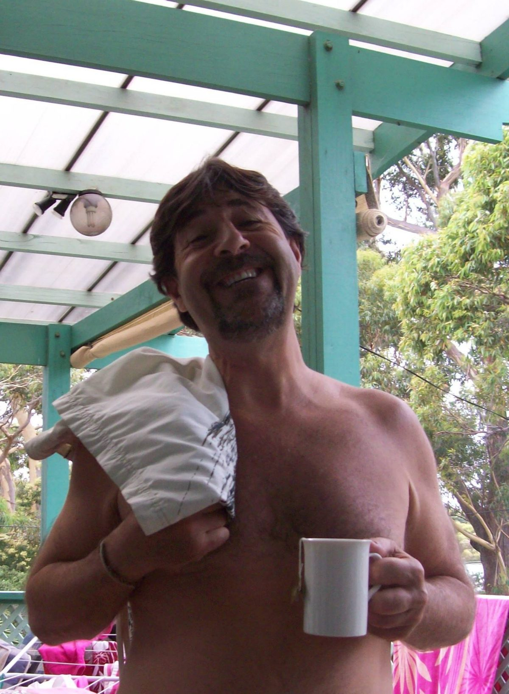

[caption id="attachment\_10528" align="alignnone" width="575"] Ravindra smiling[/caption]
On behalf of Dharma Sara, I would like to acknowledge the recent passing of our satsang brother, Ravindra (Theo) Lefterys. Ravindra was a longtime student of Babaji’s and a lifetime member of Dharma Sara Satsang society. He was one of the early group of people whose great support (both financial and otherwise) led to the purchase of the land which became the Salt Spring Centre of Yoga.
In those early days Ravindra and his family lived in Vancouver and were part of our Vancouver satsang group. It was during that time that Ravindra frequently made his home available for various gatherings of the Vancouver group, including pre-retreat activities during Babaji’s stay in Vancouver.
[caption id="attachment\_10530" align="alignnone" width="575"] Ravindra, 1976, Oyama Retreat[/caption]
Later on when Ravindra and his family moved to California to live near Mount Madonna Center, his home was on many occasions a welcome place to visit and stay for Dharma Sara people coming to see Babaji or attend MMC retreats and programs.
For the last number of years Ravindra lived abroad but frequently attended our annual summer retreat (ACYR) where he was an appreciated presence on the Latte Da crew and in the Centre kitchen.
His long contribution to our yogic community will not be forgotten and his playful spirit will be greatly missed. We extend our condolences and best wishes to his children and other members of his family. And we thank all those in our Salt Spring satsang community who assisted with Ravindra’s care or otherwise supported him in his final days.
Om Shanti, Shanti, Shanti,
Divakar
