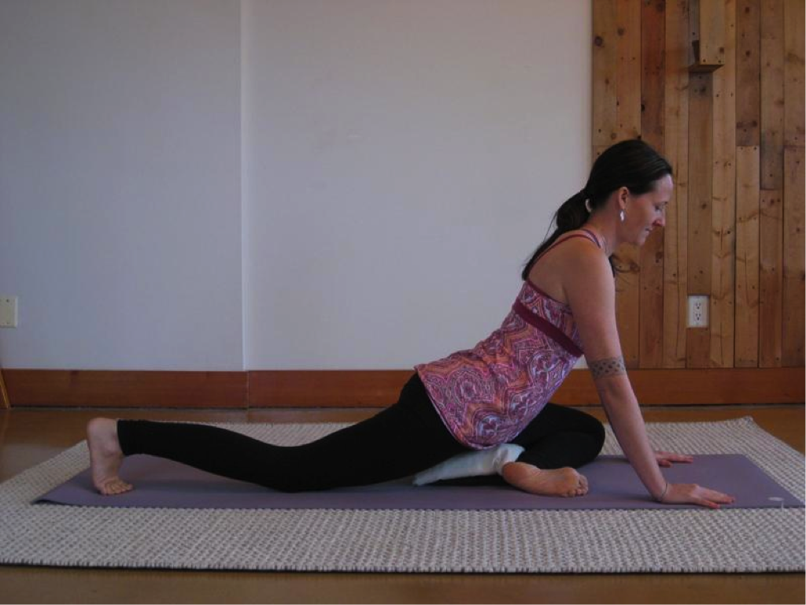

Kapotasana, or Pigeon pose, is one of my favourite poses. I love how it opens my hips, grounds my body, and calms my mind. Like other seated poses and forward bends, it is particularly useful at this time of year. The stormy, windy fall weather signals increasing vata (ether and air) in our natural surroundings. This rise in vata is mirrored in our bodies and minds. Pigeon is a wonderful way to calm and ground vata.
Pigeon pose is a great accompaniment to more active pursuits like hiking, cycling, and running because it targets the muscles these activities use – the abductors, piriformis, gluteus medius and minimus, and iliopsoas (hip flexors). It’s also a wonderful pose to incorporate into your asana practice after standing and balancing poses.
**Benefits**
- opens hips
- increases flexibility in hips, knees and ankles
- grounding, calming, and rejuvenating
- good for sciatica
- tones lower gastrointestinal tract
- calms vata and strengthens apana (downward moving energy in the body)
**Contraindications**
- knee injuries
- hip injuries
- bursitis of hip and knee joints
**To come into the pose**
**Step 1:**

- Start by sitting in Bull pose (Vrisasana) with the left leg in a “cross-leg” type position and the right leg bent, similar to Virasana, with the heel resting near the right hip/buttock.
- Notice your seat. Is your weight evenly distributed between the right and left sit bones? Often most of our weight will fall onto the thigh, hip and sit bone of the front leg. If this is the case, place a folded blanket, block, or bolster under the sit bone resting on the floor to help you find balance between the left and right sides of the body.
- Check in with your knees and hips. Try to keep the ankle, shin, and thigh bone in the same plane to help protect the knee joint. Keeping the front foot flexed will also help protect the knee.
- This may be enough of a hip opening for you. If so, stay here. You can explore Bull pose by walking your hands forward, keeping your spine long and spacious. You may be able to bring your forearms down on to the mat. You can support your chin in your hands or rest your forehead on stacked forearms or on a block. To come out of this variation, bring the hands back towards the knees, inhale as you press back up and take bull pose on the other side.
  
- Any pain in the knee or hip is a signal that this might not be the pose for you today. You can practice Figure 4 instead (see end of article for details).
  

**Step 2:**

- Place your hands on the floor on either side of your left knee. Shift your weight forward onto your hands, lift the hips slightly, and extend the right leg back behind you. Check to make sure that your right leg went straight back and is in line with your right hip. You can keep your toes tucked or let the top of the foot rest on the mat. Make sure that your heel and toes are in line with your leg. If your right foot turns in when the top of the foot rests on your mat, tuck your toes under.
- Check in with the position of your hips. Align the front hip bones so they are parallel or square with the front of your mat. To do this, draw the right hip slightly forward. Invite the left hip crease (front of the hip) to sink deep into your body and draw the left thigh bone back into the hip socket.
- Notice how your weight is distributed. Are you balanced between the left and right sides of the body? You may find support under the hips helpful here to maintain balance between the left and right sides. Place a folded blanket, block or bolster under the front leg hip.

**Step 3:
**

- Once your weight is evenly distributed and your hips are parallel with the mat, walk your hands forward, keeping your spine long and spacious. You might be able to bring the forearms onto the ground. Keep the head and neck in line with your spine. You may be able to bring the forehead to rest on the floor. If not, rest your chin in your hands or stack your forearms and rest your head here. You can also support the head with a block or bolster. You may even choose to let the whole torso rest on the bolster to increase the calming and grounding effect of the pose.
- Notice your hip alignment. Is your weight still evenly distributed between the right and left sides? Is the back of your pelvis parallel with the floor? If not, repeat alignment details from step 2.
- Allow yourself to savour this delicious hip opening. Breathe naturally, following the soft, fluid wave of your breath. Embrace the gifts and challenges that the posture offers. Notice any sensations, thoughts, and emotions that arise. Acknowledge and welcome them; try to remain open in heart and mind, with no judgement. See if you can be the neutral witness, the unbiased observer. Remember to practice self-observation without self-judgment; when you judge yourself you break your own heart.

**To come out of the pose**
Bring both hands back to either side of left knee. Inhale as you press up. Shift your weight over towards the left hip and thigh. Draw the right leg back to Vrisasana (Bull pose). Take a moment to notice the effects of the posture on your body, mind, and breath. Take Kapotasana on the other side.
**Alternate Option – Figure 4
**
**Step 1:**

- Lie on your back, with your knees bent, soles of the feet flat on your mat. Place your left shin on the right thigh. You may be able to place the left ankle just below the right knee. Keep your left foot flexed to support and protect the knee. Pause here and notice – this may be enough of a stretch for your hip. If this is so, stay here and breathe naturally.

**Step 2:**

- To explore Figure 4, lift the right foot off the floor and draw the right knee and left shin toward your chest. Slide your left hand through the space between your thighs, placing the right and left hands on the back of your right thigh or on top of the right shin. If you cannot reach the legs with your hands, use a strap or a towel to help you. You might also find that you need support under your head to keep your head and neck in line with your spine.
- Keep the knee and ankle in the same plane.
- To explore a little more, keep the right hand on the right leg. Place your left hand on the left thigh, just below the knee. Gently press the left leg away from your chest.
- Follow your breath. Let yourself settle into the support of Mother Earth beneath you. When this side feels complete, bring the right foot to the ground and release the left foot down. Pause here for a few moments to notice the effects of the posture. Take the other side.

## About the Instructor

Tanya Gita Roberts has been practicing yoga for a little over 14 years. She started in university as a way to alleviate stress and anxiety. Her practice has evolved to become the corner stone for all aspects of her life. Gita completed her 200 hour training at the Salt Spring Centre of Yoga in 2011 and 500 hour training at the Mount Madonna Centre in 2014. Drawing on her background in Classical Ashtanga and Hatha Yoga, Gita focuses on alignment, breath, subtle body, and Ayurveda in her classes. Her teaching style emphasizes union of body, breath, and mind, encouraging students to dive deep and connect with their deepest selves or Spirit. Gita teaches Hatha, Gentle, Prenatal and Yin classes in Victoria, Colwood and Langford.
