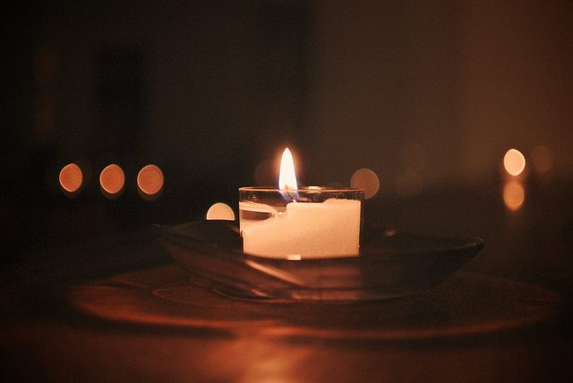

Particularly in the northern latitudes where daylight can be as little as 6-8 hours during the winter months, the darkening days can often pose a challenge to our peace of mind. Then when the sky is cloudy, the wind whips up, and the rains pour down, our mind can so easily follow . . . down, down, down into the gloom of discouragement and discontent.
Ayurveda teaches us that our mind is the most powerful of healing tool that’s available to us. One of the most beneficial effects of a yoga meditation practice is that it trains the mind to deflect unwanted thoughts . . . and for most of us, the doom and gloom scenario is one that’s useful to deflect from our day-to-day consciousness. Meditation develops the light of awareness, no matter what form that meditation practice takes.
**So here are a few practices from the Ayurvedic and Yogic traditions that can bring more light into our life:**

- **Candle lighting -**As soon as you arise, light a candle. Think of the oil in the butter lamps on the altar of a Tibetan Buddhist temple; these are often the only source of light and heat through the long dark days of winter. Candle light brings a magical quality to any time of day, but first thing in the morning, that living light reminds us of the light of the divine that dwells within each of us. Sleep time takes us deep, often into our subconscious wounds, and the candle light can help us make a smooth transition into our meditation practice. Evening is another perfect time for candle light, again bringing us the qualities of living light to the end of day.
- **Ghee -** Ghee, also known as clarified butter, can be purchased at any natural food store, or you can make your own by slowly boiling unsalted butter until the water boils away and the milk solids sink to the bottom and rise to the top where they can be easily removed. One teaspoon ghee added to your grains or your soup allows the digestive fire to burn more brightly, enhancing the digestion both in the belly, the mind, and even down to the cellular level. A drop or two of ghee in the eyes is also a helpful method of keeping the eyes healthy.
- **Abhyanga** - Oiling the body is another avenue to bringing more light into our lives. Self abhyanga with warm sesame oil before your morning shower nourishes this largest organ of elimination in the body, the skin. Sesame oil is warming and calming to the nerves. Keep the oil on while you brush your teeth and scrape your tongue, then take a warm shower to help drive the oil deeper into the tissues.
- **Light eating day** - Once a week or so, take a light eating day. If you live in a sunny clime, you can actually spend time outside in the direct sunshine. That’s one way to eat light – taking sunlight directly into the skin. Whether the sky is clear or not, you can eat lightly by reducing your customary quantity of food by one-half. Or abstain from food for 24 hours; eat dinner one night and don’t eat again until the following dinner time. Either practice offers the digestive system a bit of a rest, and a time to catch up on its own cleansing practices!
- **Kapal Bhati** - The next two practices come from the shat karma system of yoga. Kapal bhati, or skull shining, reduces excess kapha, clears impurities from the head, and brings a sense of lightness to the mind and spirit. Practice a series of quick and light exhales and inhales through both nostrils. Emphasize the exhale, letting the inhalation come as a natural reflex. After 20-30 of these quick, light breaths, exhale completely; rest a moment and repeat. Begin with 3 rounds of 30 exhalations each and increase gradually.
- **Tratak Meditation** - Taking a comfortable meditation seat, place a lighted candle at eye level about arm’s length in front of you. Focus your gaze on the candle flame. Hold the gaze for as long as possible without blinking. After a few minutes, close our eyes and focus on the internal “after-image” in the mind’s eye. Focus on this internal gaze until it fades away. Repeat the process again if you wish. At the conclusion of your meditation, take a few moments to appreciate the effects. By the practice of tratak, sloth, laziness and heaviness are overcome.
- **Meditation on light at the heart center -** Assume a comfortable meditation posture, and bring your attention to the center of the chest in the region of the heart. Visualize a bright golden-white light in the heart center. Allow the light to fill the region, and then expand in all direction, illuminating every cell of your body, every corner of your mind, your entire being. Visualize the light expanding infinitely in all directions. As you notice your mind wandering, return your attention gently to the light of the heart. Continue to focus the attention on the light at the heart center for the period of your meditation.

The act of remembering to bring light and goodness into our lives actually activates the healing process within our body-mind complex. The power of intention, directed toward positivity, will in itself bring light into our life. And keep in mind that in just a few weeks, the process reverses . . . the days will begin to lengthen, as we slowly move in the direction of springtime. All part of the great wheel of life! Peace to all beings.
- Pratibha
[caption id="attachment\_8434" align="alignleft" width="287"] Pratibha Queen[/caption]
**Pratibha Queen** is a yoga instructor and Ayurvedic practitioner, who attends Salt Spring Center of Yoga retreats on a regular basis. Feel free to email with any questions that arise as you engage in health practices to support your yoga practice: pratibha.que[at]gmail[dot]com.
--
Candle photo by [Miki Yoshihito](https://www.flickr.com/photos/mujitra/8276780771) via Flickr Creative Commons.
