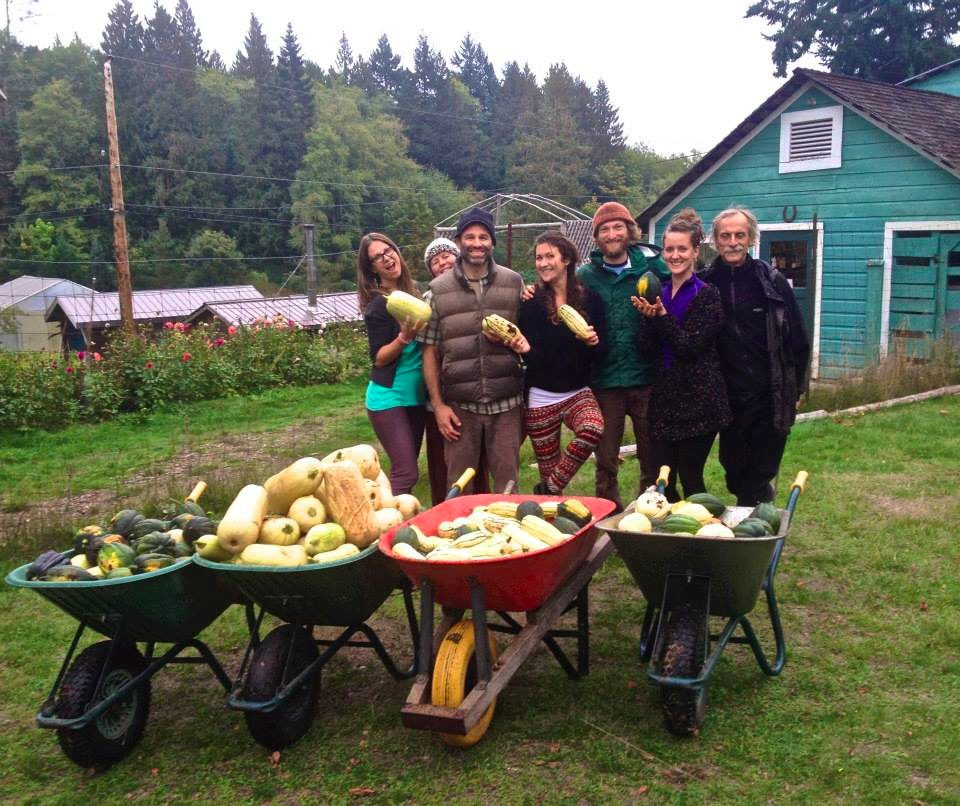

Hello everyone,
Time seems to have speeded up (must have something to do with aging), and it is now November, and most definitely fall. The long dry period has ended and all the plants and trees are happily soaking up the rain. The harvest has been abundant. David and Jeff filled several wheelbarrows full of squash.
[caption id="attachment\_10534" align="alignnone" width="575"] Karma Yogis Christine, Tana (behind Raven), Raven, Olivia, Jeff, Marianne, Mark and all the squash![/caption]
[caption id="attachment\_10533" align="alignnone" width="575"] Karma Yogi Olivia preparing stuffed peppers for dinner.[/caption]

### Remembering Ravindra

As the seasons turn, change is the one constant. Early in October we said goodbye to our dear friend Ravindra (Theo Lefterys) . He had been ill for months and spent many weeks in the hospital on Salt Spring before he left his body. Click here to read [Divakar’s memories of Ravindra](https://saltspringcentre.com/2014/10/remembering-ravindra/) and see photos of him from the early days - 1976. We send our love to his children, Harish (Rish), PK (Isaac) and Gita (Mikaila).
[caption id="attachment\_10527" align="alignnone" width="575"] Ravindra, 2006[/caption]

### Happenings at the Centre

Later in October we celebrated Canadian Thanksgiving with a very large gratitude circle that over-filled the satsang room, followed by an amazing vegetarian potluck.
[caption id="attachment\_10536" align="alignnone" width="575"] Zyleah and Christine by the harvest altar[/caption]
We held our second-last Yoga Getaway of the season recently - one more coming up November 7 -9.
As usual, there will be a small winter residential community, with more opportunities for study and practice than during the busy program season. Two new people who first came here as YSSI participants, will join the office team, Bergen as office coordinator and Marianne as programs coordinator. We are all very happy to have them here.

### Centre School's Celebration of Light

On Nov. 25 the Centre School will hold its annual Celebration of Light, led since the the earliest days of the school by Usha. During the evening, all the children, holding candles set into apples, walk one by one through a spiral of cedar boughs sprinkled with stars, to light their candle from the big candle in the middle. Throughout, everyone sings songs of light from many traditions. By the end of the evening, when all the candles are lit, the school’s teachers sing everyone out the door: May the longtime sun shine upon you, all love surround you, and the pure light within you guide your way home.

### In this Month's Newsletter

As always there are a number of articles I’d like to draw your attention to. Pratibha’s contributions are always rich and full of practical wisdom. This month she has contributed “[Dealing with the Dark Days](https://saltspringcentre.com/2014/10/dealing-with-the-dark-days/)”, with practices from the Ayurvedic and Yogic traditions for dealing with the dark days of the coming winter and bringing more light into our lives. Tracy Chetna Boyd (well known to all YTT grads and recent participants of the Yoga and Cancer workshop) has shared her story in “[Yoga Journey](https://saltspringcentre.com/2014/10/our-centre-community-chetna-boyd-yoga-journey/)” which I’m sure you’ll enjoy reading. Like her teaching, it is full of wit and wisdom. Tanya Gita Roberts brings us instructions for [Kapostasana (pigeon pose)](https://saltspringcentre.com/2014/10/asana-of-the-month-kapotasana/) in the Asana of the Month, a wonderful pose for calming and grounding, especially in this stormy, wintry time of year. Further reflecting on the theme of change and impermanence, I invite you to read “[Reflections on the fragility and preciousness of life.](https://saltspringcentre.com/2014/10/reflections-on-the-fragility-and-preciousness-of-life/)”
*Wish you all happy and healthy.*
Love,
Sharada
