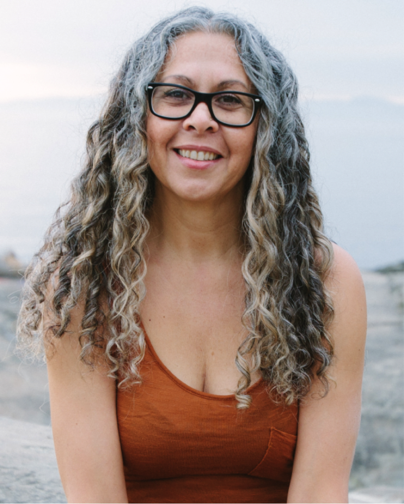

[caption id="attachment\_10509" align="alignnone" width="575"] Chetna, part of our Centre community[/caption]
I was that kid who always had the questions, “what if I’m just dreaming, and I wonder what it’s going to be like when I wake up” running through my head. I would often question my friends, who would look at me like, can we just play please! So, that summer, at 9 years old when I went to visit my father in Stewart, BC I had my first taste of “Yoga.” I found myself climbing up into some rafters with a friend, chanting Hare Krishna, Kirshna, Krishna, Hare, Hare, Hare Krishna…I had no idea what it meant or what I was singing, but a seed must have been planted.
[caption id="attachment\_10512" align="alignnone" width="575"] Me at 9 years old, Stewart, BC[/caption]
Life went on, I grew up, went to school, I travelled and lived in Mexico and Costa Rica, moved back to Victoria, got married, went back to school and studied some more, got divorced, you know, regular stuff. So, what brought me to Yoga as an adult? Why, suffering of course. I had been experiencing a health-related issue and heard that Yoga was great for all sorts of things, so I tried it and lo and behold, like magic, my symptoms dissipated.
Fast forward to the spring of 2002: My family surprised me with birthday gift to a Yoga Getaway weekend at the Salt Spring Centre of Yoga, and since I had been secretly looking at the centre’s website for many months, you can imagine my surprise. I was excited, I was nervous. All the practice I had done up to that point was self-directed, through books and small local asana classes. I remember that weekend like it was yesterday: all of my fears dissolved. During the weekend I felt like I awoke from a deep sleep and felt things that I hadn’t felt before, both physically and emotionally. At the end of the weekend, Kishori, who had been leading classes in meditation and asana, looked at me and said “you know, we have a program called Yoga Teacher Training, and I think you’d love it” and she handed me a brochure. I thought she must have been mistaken about me, but on my drive home, I had a flash of insight…if not me, then who, and if not now, then when? And so it was then that my relationship with the Salt Spring Centre of Yoga and Baba Hari Dass began.
[caption id="attachment\_10501" align="alignnone" width="575"] Salt Spring Centre of Yoga - Parsvakonasana[/caption]
In the summer of 2003 I started Yoga Teacher Training and yes, I was excited, I was nervous. I wasn’t sure how it would all unfold and what it all meant. I only knew that I was being called to look at life from a different perspective. They say when the student is ready the teacher will come, and so it was on the day I walked into the satsang room and saw Babaji sitting in his chair, head down, looking at something. So, I brought my hands together at my heart and bowed my head, thinking I had anonymously paid respect. Without missing a beat, Babaji did the same and our eyes met. It was the first time that I had actually felt like I had been seen. This was a deep seeing, beyond the body and into the soul. I felt a tears trickle down my cheeks, which surprised me. It almost took my breath away….I was excited, I was nervous.
[caption id="attachment\_10515" align="alignnone" width="250"] One of the last visits Babaji made to the Centre 2007[/caption]
As long as I can remember, my life has been dedicated to service, whether it be by sticking up for the kid in school that everyone picked on, doing volunteer work in support of immigrants and refugees or through public service with the provincial government. So the mission of SSCY through the practice of karma yoga or selfless service as prescribed by Babaji was a good fit with my own vision of world.
[caption id="attachment\_10511" align="alignnone" width="575"] Dallas Road, Victoria, BC[/caption]
I have received two very insightful teachings from Babaji. The first is, “if you work on yoga, yoga will work on you.” I hold the belief that Yoga is practice of getting to know oneself. And I have to say travelling this road and getting to know myself hasn’t always been an easy one, in fact , the truth is sometimes it’s been downright difficult learning about myself and how I move through the world – I can’t “unknow” what I now know about myself, but I wouldn’t have it any other way. The other teaching that I have received from Babaji is “teach to learn.” Yoga has been working on me and through me, by offering what I have learned about this deep well of Yoga. I began teaching public classes in Victoria in 2003 and since 2007, I have been on the faculty of the Yoga Teacher Training team, part of the YTT committee, teaching at the Getaway Weekends (the same ones that brought me to the centre) and in October of this year, taught the first Yoga for Cancer therapeutic workshop to 22 yoga teachers (I was excited, I was nervous).
[caption id="attachment\_10514" align="alignnone" width="575"] YTT, 2014[/caption]
After a meeting with Babaji where we “talked” and laughed about life and love, in 2008, I met my samskara mate\*, Rick (Svaroop), who has come to teach me much about love and commitment and more importantly, laughter. I am grateful beyond words that Babaji came into my life in the most profound and gentle way. His teachings and example of how to live a peaceful life of service has become such a large part of my life. The centre itself and all the hard work of the larger community have made the land a sacred, safe haven for me, and for my family who have come to visit during YTT for the past 6 years, not to mention the hundreds of visitors & students who come to forge a deeper relationship with themselves and experience a little piece of heaven on earth. What more can I say, beside “108 thank you’s” Babaji. OM
[caption id="attachment\_10508" align="alignnone" width="575"] Me and my love, doing what we do best – laughing![/caption]
\* samskara mate: someone whose tendencies and conditioning line up with yours, drawing you to each other. People often refer to someone as their “soul mate”, but as Babaji points out, the soul never mates.
