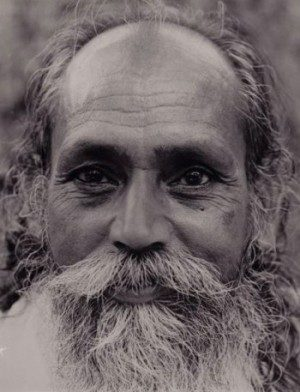

The recent passing of our longtime friend, Ravindra, has led me to reflect on the preciousness of the connection we shared over many years.
As I age, I am more and more aware of all the people I know who have died, and that is sure to increase. I am also aware that I too will die. Everything in life is subject to change. *One who takes birth will die. In other words, one takes birth to die. Death is sure and is always waiting. Because we don’t know when we will die it is said, “Death comes from behind.”*
In our culture, most of us rarely have direct experience of witnessing either birth or death, yet these are universal life experiences. For many, the subject of death is morbid and fearful, yet it is as much part of life as birth - just the other end of the rope.
*If we know that death is an unavoidable thing, then why be afraid? Why make it such a big thing? Death can be an offering to God. God gave us birth and now we are offering this body back to God.*
*Life’s essence is absolute, omnipresent, and immortal. Death is but a change of form. Human beings, animals, the vegetable kingdom - all are alive. They take birth, grow, decay and die (change form). When one form changes into another form it is called death, although the life force still exists in a that form. For example, as soon as a plant dies, a second life force takes birth and starts to decay it. When it is completely decayed, a third life force starts working. The cycle of change of forms goes on and on, but the essence of life is always there - it is immortal.*
Even for one who believes that the death of the body is not the end of the story, it is natural to grieve when someone close to us dies. We miss the presence of that person, although our love never ceases. The death of someone dear to us brings home the reality of death. People die; we will also die, and we are reminded again of the preciousness life - so fragile and fleeting.
Shakespeare, in “The Tempest”, gave Prospero these words:
Our revels now are ended. These our actors,
As I foretold you, were all spirits, and
Are melted into air, into thin air:
And like the baseless fabric of this vision,
The cloud-capp'd tow'rs, the gorgeous palaces,
The solemn temples, the great globe itself,
Yea, all which it inherit, shall dissolve,
And, like this insubstantial pageant faded,
Leave not a rack behind. We are such stuff
As dreams are made on; and our little life
Is rounded with a sleep.
This world is impermanent and we are “such stuff as dreams are made on”, only here for a fleeting moment. We may live to be over 100, yet this life is still impermanent. While we are here, we have a rare opportunity to stay open to the gifts this life brings, in whatever form they arrive (whether we like them or not.)
In the end we all have to let go, and we may as well practice right now. Life includes everything. Loss is part of life, giving us many opportunities to begin to let go of our attachments and let ourselves fall into grace. It is the fragility of life that makes it so precious. Illness, loss and death are reminders of the transient nature of physical existence, and the miracle of this human birth.
*This is life. It includes pleasure, pain, good, bad, happiness, depression, etc. There can’t be day without night. So don’t expect that you or anyone will always be happy and that nothing will go wrong. Stand in the world bravely and face good and bad equally. Life is for that. Try to develop positive qualities as much as you can.*
May we be happy,
May we be at peace,
May we be free.
*May we never again forget our immortal nature.*
contributed by Sharada
All text in italics is from writings by Baba Hari Dass
