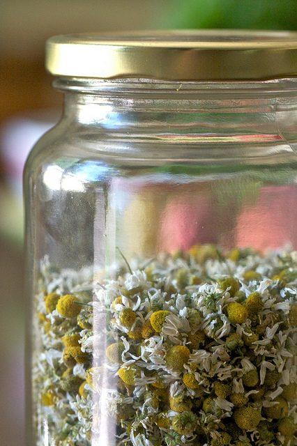

 A cup of chamomile tea can help to relieve stress

We’ve all heard that stress has a wearing effect on the nerves, the emotions, and even on the strength of our immune response. Relationship challenges, job insecurity, climate change, or simply waiting in line at the airport can trigger a stress response, sending debilitating hormones racing through our system. From a medical perspective, stress can trigger anything from allergies and asthma to headaches and indigestion.

Over time, the effect of too much stress can contribute to high cholesterol, ulcers, diabetes, obesity, and heart problems. From an Ayurvedic perspective, stress also disrupts the inner balance of the doshas – vata, pitta, kapha – the three forces that govern our health on a subtle level. Here are a few stress-reducing tips based on yogic and Ayurvedic principles that each of us can include in our daily life.
**Abhyanga**
Self-massage with sesame oil is a time-tested way of bringing the force of vata into balance. Before you shower in the morning, warm 2-3 tablespoons of sesame oil and rub liberally into the body. Then do your usual morning routine: jal neti, oil pulling, teeth brushing, tongue-scrapping routine as you wait 10-15 minutes for the oil to be absorbed into the skin. Follow this with a nice warm shower that helps to drive the oil deeper into the tissues. The soothing effects of abhyanga will be felt all day long.
**Meditation**
Meditation gives the mind a rest. Sit in a comfortable meditation posture with your head, neck, and spine aligned. Observe the natural flow of your breath. Then practice meditation as desired, either focusing the mind one-pointedly, or simply observing the flow of thoughts, while holding our attention in the present. Meditation helps us to connect with our true nature as peace or pure consciousness, a place where stress has no place.
**Yoga Postures to Relieve Stress**Shoulderstand (sarvangasana), plow pose (halasana), half spinal twist (ardha matsyendrasana), locust pose (shalabhasana), and lion pose (simhasana) are all helpful to access and release any deep chronic stress patterns that may have slipped into our life.
**Ayurvedic Herbals**
Ayurveda offers a variety of herbal teas in its stress-busting team. Chamomile, of course, but also tulsi (also known as holy basil) and angelica all encourage a relaxed state of mind. Or mix equal amounts of brahmi, bhringaraj, jatamansi, and shanka pushpi. Steep 1/2 teaspoon of this mixture in 2 cups of hot water for 10 minutes. Drink 2 or 3 times throughout the day.

*What is contentment?*
 *When all mental demons subside,*
 *then the mind sits in such a peaceful state as if it owns the whole world.*
 *Contentment doesn't come in a packet from outside;*
 *it develops by accepting life and by working towards our self-development.*
-Baba Hari Dass

**Manage Your Mind**
Be mindful when you become aware of stress slipping in. Notice if the stress you’re feeling is over something you can change, and something you can’t. If you can do something about it, then do it! If there’s nothing you can do, then accept it and move on. When stuck behind a truck waiting to make a left turn, as the traffic is rushing along on your right, there’s nothing much to do take a deep breath and relax! Dr. Lad suggests, “By staying in the present moment, you will fall in love with your life. Then anything that touches you—even stress, anger, anxiety—becomes meditation.”
Book II, verse 33 of Patanjali’s Yoga Sutras advises: “The mind becomes serene by the cultivation of feelings of love for the happy, compassion for the suffering, delight for the virtuous and indifference for the non-virtuous.” When we cultivate serenity, compassion, delight and indifference, there’s no room in the mind for anxiety and stress!
**Emotional Release**
Crying is a great stress reliever, especially if you have stored up sadness and grief. As the tears flow, let any unresolved emotions simply roll down your cheeks and out of your life. Laughter is good medicine, too. Even if you are angry or depressed, just begin chanting: ha ha hee hee ho ho. Soon, real laughter will come…and with it, a joyful release of tension all through the body. The practice of ujjayi breathing can also help release our long-held emotions.
**Ginger-Baking-Soda Bath**
A soothing hot bath is a relaxing way to end a stressful day. Adding one-third cup ginger and one-third cup baking soda, along with a dollop of sesame oil, has additional vata reducing effects. Ginger enhances circulation, while the baking soda helps to alkalinize the system; both help to balance the effects of external stressors. Put on some relaxing kirtan music while you soak. And prepare for a sound sleep.
**Restorative Yoga**
Practice shavasana (lying on the lap of mother earth pose) for 10-15 minutes each day. Visualize the muscles softening, melting into the floor. Let the breath be full and deep, breathing stress out with every exhalation. Activating the parasympathetic nervous system with the full yogic breath brings us to the resting/digesting state, releasing all the stressors inside and out. When you notice the mind wandering, bring it gently back to the breath. One student said recently that shavasana is like pressing the reset button on a computer; it brings us back to ourselves.

*Beyond a wholesome discipline, be gentle with yourself.*
 *You are a child of the universe no less than the trees and the stars;*
 *you have a right to be here.*
 *And whether or not it is clear to you,*
 *no doubt the universe is unfolding as it should.*

Desiderata

--
 **Pratibha Queen** is a yoga instructor and Ayurvedic practitioner, who attends Salt Spring Center of Yoga retreats on a regular basis. Feel free to email with any questions that arise as you engage in health practices to support your yoga practice: pratibha.que[at]gmail[dot]com.
--
Photo of chamomile flowers by [Chiot's Run](https://www.flickr.com/photos/chiotsrun/) via Flickr Creative Commons license
