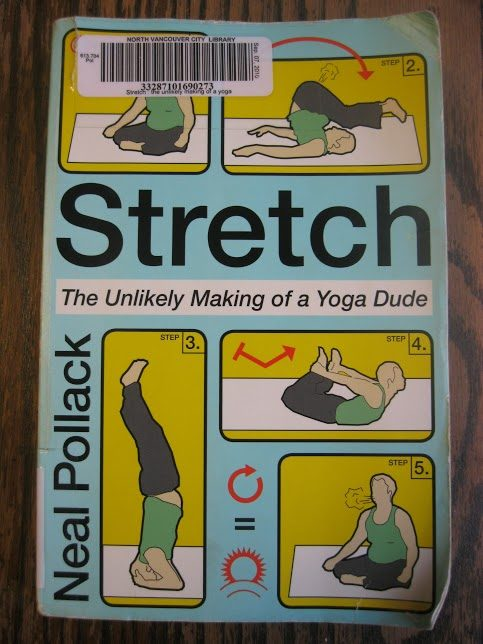

### 'Stretch - The Unlikely Making of a Yoga Dude’ by Neal Pollack 'Warrior Pose' - How Yoga (Literally) Saved My Life’ by Brad Willis AKA Bhava Ram

In the last sixteen years, I've read almost all the books in the yoga section of each of my local libraries, and I've finally had to begin looking further afield for my yoga-related reading fix. This is what I've learned: not all yoga books are in the yoga section!
As an aspiring yogi, I've often been encouraged to read the lives of saints, and I have! But now I am coming to see the value of reading about the lives of present day seekers, whose experiences often parallel those of my myself, my students and my peers, on this path of yoga. Here I review two books I found in the memoir section of my local library.
Neal Pollack's 'Stretch' is undoubtedly much lighter fare than Brad Willis' 'Warrior Pose', and treads on much more familiar ground for most western yogis in the 21st century. In his twenties, Pollack experienced great literary success which built up his ego, identity and career around a certain cynicism and self-deprecation that left him reeling when his career nearly imploded because of his own self destructive and egocentric behaviour. The pain of losing one identity and finding a new one - in parenthood and middle age - sent him to yoga.
He started, like many, in a fluorescent-lit gym, on a borrowed mat, in a crowded and bewildering class, but even then knew he'd found something precious: his best self, a self he'd not known since high school, and a self he wanted to be again:

"...(T)he whole concept of finding my best self went against everything for which I stood. It even sounded stupid...Nevertheless I had to put that cynicism aside, at least partially, because I found myself wanting to go deeper into the yoga...In the walk of life, I'd stepped into a big pile of yoga doo, and nothing could get it off my sole. Or my soul".

Pollock takes the reader on a journey into yoga that is occasionally cringe-worthy, often laugh-out-loud funny, and heartwarming throughout. He is an earnest seeker, and yoga continually meets him where he is at. As he pursues his best self, he is again and again thwarted by his, shall we say, less than best self. As he makes his way through the Ashtanga primary series, he shares with the reader his insights into yoga philosophy, as it relates to his everyday life. He explores the Yoga Sutras, especially the idea of avidya (ignorance of our true nature, leading to suffering) as it relates to sex and bramacharya: "In other words: Have sex, sure, but stop seeing it as a game or a goal. Go about your sexual business ethically, causing as little harm to others as possible."
His path becomes more interesting when he takes part in a 24 hour Yogathon for charity, which leads to his becoming a writer for Yoga Journal. He covers the Yoga Olympics ("the idea of a yoga competition seems as absurd as the idea of competitive prayer."), a Yoga Journal Conference, Wanderlust Festival, and interviews many master teachers in their home studios. The description of the tantrum he throws at a Jivamukti studio in New York City nearly brought me to tears of laughter. He bumbles through it all with self-deprecating humility and humour, but also fresh eyes and a desire to glean deeper truths from an often times circus-like atmosphere that, on the surface, seems anathema to the true goals of yoga.
Like many of us, his practice crystalizes when he finds a teacher he truly resonates with and takes pains to study with. There are some beautiful pages of discourse between him and his teacher about the first Yoga Sutra, 'Yogas citta-vrtti nirodhah',
which culminates with how best to react when one steps in dog poo, both literally and figuratively. In 'Stretch', Neal Pollack carries his practice into all aspects of his life, and in doing so, shares with us his growing insight, knowledge and transformation.

'Warrior Pose' is a much more intense journey from darkness to light. Brad Willis was a prominent foreign war correspondent who risked life and limb to report on the treachery and sufferings on the front lines of foreign combat, in hopes that sharing the truth would bring about change and help people. At age 35, he broke his back and left it untreated because he didn't want to risk his career trajectory. He suffered years of chronic pain, alcohol and substance abuse, until, at age 50, he found himself permanently disabled, with stage four throat cancer and months to live. His family staged an intervention, and, once drug-free, he found himself in an experimental outpatient program called the Pain Centre, which offered holistic therapeutics to manage chronic pain.
The first two thirds of the book chronicle his journeys abroad and his descent into darkness. They are well written, honest, and compelling. Throughout these parts of his story I couldn't help but notice the seeds of spiritual growth that were planted along the way: witnessing the indomitable spirit and miraculous recovery of people facing profound trauma, loss and injury; the gift of a golden Buddha in a secret shrine in Vietnam; the advice from Father Joe to "find your soul"; and the timely pleading of his son to just "get up Daddy". These seeds all begin to grow in the fertile soil of yoga practice, and, inevitably, bear fruit.
The final third of the book follows Willis through physical therapy, JinShin Jitzu, and bio feedback, the latter of which has a profound effect on him. "I begin to realize something that never occurred to me before: It's not just my physical body I have to heal, it's my thoughts and emotions as well". Eventually he is allowed to add yoga to his schedule. His mobility is severely limited, so his practice is primarily restorative, but he commits to it fully. He practices whatever he can after hours - reading yoga books, practicing pranayama, meditation, chanting mantras and singing bhajans. He feels he has found a systematic approach to healing body, mind and spirit, and he repeats to himself daily the affirmations "Stand in yoga" and "get up Daddy" to cement his conviction.
When the Pain Centre closes unexpectedly, he returns home and builds a 'cave' in which to practice twelve hours a day. He eventually finds a local teacher and studio to support his asana practice. He attends a retreat (unnamed but obviously Mount Madonna Centre) to learn the purification techniques of shatkarma, and returns home to begin many months of rigorous self-purification, in a final bid to cure his cancer within the time he's been given to live.
Four months into his yoga practice, Brad Willis' broken back is healed, and his cancer is in remission. He shares profound insight discovered through deep suffering and firm, unwavering commitment to healing himself. Two passages that best describe this follow:

"...my first step into yoga wasn't at the Pain center ...It wasn't the epiphany when I entered the yoga room...It was nearly four months earlier, on the morning I found my family downstairs and the intervention began. That is when I began to face myself, realized I had lost control of my life, chose to let go of all resistance, heard my inner voice telling me the truth about what I had become...I had no idea this was yoga. But it was."

"Yoga has taught me that a fundamental principle in life is that energy follows intention. When we create a strong intention and really believe in it, the world magically seeks to support us. People who think positively and have faith in something are vastly more likely to manifest it than those who feel doubtful and negative. It still takes great devotion and hard work, but it always starts with the mind".

Neal Pollack's memoir is equal parts hilarious and irreverent, but still informative and life affirming. He traverses the contemporary western yoga landscape and takes us along for the ride. Brad Willis offers a dramatic journey from darkness to light, and documents the transformative potential yoga holds. Both authors expose the true heart of yoga - still beating after all this time.
--

Kenzie Pattillo completed her 200 hour YTT at Salt Spring Centre of Yoga in 2002. She is a householder yogi/mama living in North Vancouver, B.C. and presently teaches yin, hatha and flow yoga in her community. En route to completing her 500 hour YTT designation she has recently begun practicing one on one restorative therapeutics.
