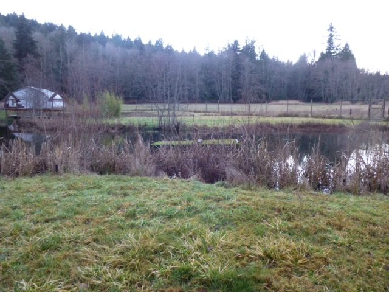

Happy 2015, everyone! The darkest day has passed and the light is beginning to return. I hope you’ve all enjoyed the various winter holidays (Solstice, Chanukah, Christmas and any others you may celebrate).
One of the traditions at the Centre is our annual winter potluck and gift exchange (aka non-attachment) game. There were 38 people in the circle this year, including 5 children who took an active part in the gift game, with Benjamin being our self-appointed number checker (making sure that the person choosing a gift was next in line).
 The pond in winter
Christmas week was quiet on the land, with most folks going off to visit with their families. Winter is the best time for resident karma yogis to take time off - and it’s also a good time to get projects done because we know it won’t be long before it’s busy here again.
 The altar
Although it’s cold outside (maybe not compared to where you live!), it’s toasty warm in the satsang room, and [sastang](https://saltspringcentre.com/2011/08/satsang-and-kirtan/) fills up every week. Each Sunday we raise our voices in praise and celebration. If you’re in the neighbourhood, please join us.
 Mark at satsang
 David, Mark and Christine in the kitchen
There’s lots of richness in this month’s newsletter. Pratibha continues to share her wisdom in “[Ayurveda, Yoga and You: Antidotes to Stress and Anxiety](https://saltspringcentre.com/2014/12/ayurveda-yoga-and-you-antidotes-to-stress-and-anxiety/)”. This is something we can all use! Pratibha is immersed in both Yoga and Ayurveda, and is a brilliant - and fun - teacher.
“[The Journey Home](https://saltspringcentre.com/2014/12/our-centre-community-johanna-peters/)” (part of the “Our Centre Community” series) this month features Johanna Peters, who first came here as a karma yogi several years ago, and stayed connected. If you’ve come to the Annual Community Yoga Retreat in the past couple of years, in particular if you’ve come with your children, you will know Johanna as the coordinator of the kids’ program. Perhaps you’ve seen her on Latte Da Stage with her ukelele and a bunch of kids.
We’re introducing a new feature this month: yoga book reviews. Kenzie Patttillo introduces us to two books: [“Stretch - the Unlikely Making of a Yoga Dude” by Neal Pollack, and “Warrior Pose - How Yoga (Literally) Saved My Life” by Brad Willis (aka Bhava Ram)](https://saltspringcentre.com/2014/12/book-review-stretch-by-neal-pollack-warrior-pose-by-brad-willis/), stories of present-day seekers. Kenzie is another yogi who came here initially as a karma yogi many years ago before taking YTT, and who is an excellent teacher and writer.
At the beginning of a new year, we often reflect of our lives, and sometimes make new year’s resolutions - which we may or may not follow through on. [“Not Taking Things Personally”](https://saltspringcentre.com/2014/12/not-taking-things-personally/) is an invitation to do some deeper self-reflection, to understand what’s working, what’s not working, and why - and what we can do about it.
Please note that information about the [Yoga Service and Study Immersion](https://saltspringcentre.com/yoga-service-and-study/) program, along with [application forms](https://saltspringcentre.com/yoga-service-and-study/yssi-application/), is posted on the Centre’s website. The program runs from May 31 - September 1, 2015. Applications have already begun to come in. [Yoga Teacher Training](https://saltspringcentre.com/yoga-teacher-training/) program information and applications are also posted, and registrations have been coming in for some time. The [website](https://saltspringcentre.com/) is a great source of information about everything that goes on here. [The Centre’s Facebook page](https://www.facebook.com/saltspringcentreofyoga) is also full of interesting news, updates and inspiration.
May this new year bring you peace.
*Nonviolence in the mind*
 *and unconditional love in the heart*
 *bring eternal peace.*
Love,
Sharada
