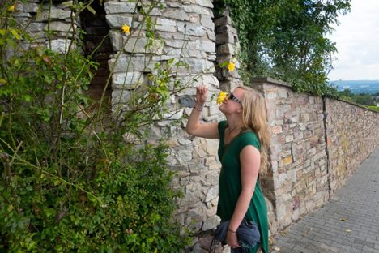

### The Journey Home

I have a sense, if I look far enough back in my experience, of being a child — of existing before all the seeking began, before all the stories of ‘me and my life’ took hold, and the freedom and wonder inherent in that open not-knowing. It seems to me, that the rest of my life and all the actions I’ve taken, have been an attempt to return to that innocent freedom, and in a big way my discovery of the Salt Spring Centre and its community has supported me on the journey home.
Growing up in Calgary, despite the cold winters, I had a rich array of activities to keep me engaged and connected, including going to the mountains most weekends to take advantage of the snow and learn how to fly down icy slopes on two long, narrow slats.
 At Panorama Mountain Village, contemplating the view.
I had a lot of wonderful, enriching and sometimes challenging experiences growing up. I learned about music, acting, horse-back riding, writing. I learned about drinking too much, kissing boys and awkward high school parties. I learned a lot about social norms, human behaviour, who I should and shouldn’t be to fit in. But even amidst this rich array of experience and learning, it still felt like there was something missing. Something that was essential to me, that I couldn’t find in all these experiences, as diverse and exciting as they were.
This sense of seeking more and questioning my purpose was particularly strong as I neared the end of high school and felt the upcoming unknown that was life beyond high school. Longing to embark on a journey of self-discovery, but unsure how that might look, I followed the more traditional path, applying to different universities and eventually deciding to move to the west coast and study at the University of Victoria.
 Uncovering the wild beauty of BC’s forests.
The grace present in that choice, which I was completely unaware of at the time, is so clear to me now.
Life on the west coast opened up my experience in a brand new way. I fell in love with the trees and the ocean, and started to find myself more and more in the peace and beauty of the natural world. My friendships began to take on a more authentic feel and I started meeting people who were asking the same questions I was asking: Who am I? What is the point of all of this? What are we doing here?
Even my studies reflected these questions as I studied eastern religions and learned about teachers like the Buddha, Gandhi, Krishnamurti and even contemporary teachers like Eckhart Tolle. I learned many years later that the professor who referenced all these thinkers lives on Salt Spring island, and I’ve since run into him many times on the Skeena Queen ferry. Go figure.
As I neared the end of a rich and varied university experience, I was faced with another transition point, and this time it was so clear to me that more schooling wasn’t going to help me find the answer to those essential questions that kept following me around. I didn’t know where the answers were going to come from, but I was open to the discovery.
In 2010, grace and a series of serendipitous events led me to the Salt Spring Centre and the karma yoga program.
Arriving at the centre for the first time in the summer of 2010 felt like coming home.
 A view of the centre from Blackburn Road.
Finally, I was in a place where my own search for truth was reflected in the people, land and experiences around me. It seems to me, that past a certain point, our life is really about unbecoming. Like ice melting, the layers of conditioning peel off to reveal the open radiance of that conscious awareness that we are so much connected to as children. That state of being fully awake. As Babaji says, “Dream is real as long as you are asleep. Life is real as long as you are not awakened.”
 Taking a lunch break on the mound with Aneeta and Shyam, summer 2010.
Though I currently find myself living and working in Vancouver, I continue to remain connected to the centre and its community, returning to the land often. My connection to the centre has, and continues to transform my life in profound and surprising ways, as the uncovering that took place there begins to trickle into other areas of my life — work, family, friendships.
I think the greatest miracle of all is in the discovery that the joy and peace that I found to be fundamental to my being while at the centre, can be unveiled as the very basis of our existence in any moment, any experience, any place. It is, if we look close enough, the very fabric of life itself. This discovery has been the centre’s and Babaji’s greatest gift to my life. And I am grateful that it is there to remind me what matters whenever I forget.
 Double downward dog with my little cousin. My love of working with kids and sharing yoga with little ones begins...
 At ‘work’. Making magic potions with some of the kids at the daycare where I work.
 August 2013 and 2014 I had the privilege of co-ordinating the Kids Program at the Annual Community Yoga Retreat. Here Genevieve guides us in a family yoga class.
 In 2013 I complete a Rainbow Kids Family and Kids Yoga training.
 Exploring the beautiful grounds at the Mt. Madonna Centre where I meet Babaji for the first time.
 A blessed life. Celebrating a birthday with some of my dear centre family.
 August 2014, with my parents in Germany where my brother got married.
 Enjoying the sweetness of summer.
