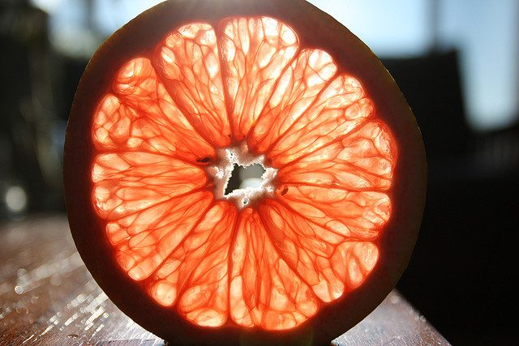

Making healthy food choices often seems like a daunting task. So many things to choose from, and so many filled with sugar and fat! And, everyone seems to have a different philosophy of what and how to eat, so that our individual food choices seem to require a doctorate in food science! And then, we have to consider our dosha predominance, the season, the climate, our level of activity, our age! No wonder so many of us just give up and eat whatever’s put in front of us!
These days, the concept of superfoods is gaining popularity! So what makes a food a superfood? I’ve heard them described as “protein rich,” “powerful antioxidants,” with “densely packed nutrients.” A simply way to understand it is that superfoods give you more ‘bang for the buck,’ with no empty calories or quick-burning carbs.
Including some of these in your regular meals will provide a boost to the immune system, promote balanced digestion, increase energy levels, as well as build ojas and endurance. Here is a list of some of the superfoods to support your body type:

**Vata:** avocados, olive oil, nuts/seeds (flax, chia, hemp), quinoa, sweet potatoes, ghee.
**Pitta:** beets, kale, apples, seaweeds, kiwifruit, edamame, coconut oil.
**Kapha:** grapefruit, lemons, honey, pumpkin seeds, garlic.

And then there is the seasonal consideration! Following are some of the superfoods that are especially important to make a part of your wintertime meals.

### Superfoods for Vata in Winter

**Olive Oil**
Vitally important for vata is a good source of oil, since vata tends to cold and dryness. Organic extra virgin olive oil is nutritious, hosting beneficial fatty acids, antioxidants, and vitamins E and K. Being anti-inflammatory, olive oil helps support the entire circulatory and nervous system; contemporary research suggests that olive oil works to lower blood pressure and cholesterol.
Olive oil is one of the most volatile oils and is best used fresh, rather as a cooking oil. Instead, olive oil can be added to a dish as a final ingredient, or at the table.
**Avocados**
Avocados are a great source of digestible protein and balanced fats. Avocados provide healthy fats for optimal metabolism and brain function. Avocadoes nourish the skin by helping to maintain and rebuild collagen, and are also great for satisfying PMS-related cravings. Research suggests that eating one avocado a week can balance hormones, shed unwanted weight, and prevent cervical cancers.
**Chia Seeds**
Cultivated by the Aztec and Mayans in ancient times, chia is said to have been as important as maize as a food crop. Rich in Omega-3 fatty acids, chia seeds are also an excellent source of fiber and contain protein and minerals including iron, calcium, magnesium and zinc.
Emerging research suggests that including chia seeds may help improve cardiovascular risk factors such as lowering cholesterol, triglycerides and blood pressure. (See Chia Seed Pudding below.)

### Superfoods for Pitta during Winter

**Coconut Oil**
Keeping our cool is especially important for pitta dosha. The therapeutic effects of cooling coconut oil are becoming well known these days. The lauric acid can kill bacteria, viruses and fungi, helping to stave off infections. Research studies show that coconut oil helps lower high cholesterol, which may translate to a reduced risk of heart disease. Studies also indicate that the fatty acids in coconut oil can help supply energy for the brain cells of Alzheimer’s patients, thus relieving symptoms of brain disorders. The fatty acids can also reduce appetite and increase fat burning, which can help reduce body weight over the long term. Coconut oil appears to be especially effective in reducing abdominal fat, which lodges in the abdominal cavity and around organs.
**Beets**
Beets are one of the best sources of performance-enhancing nutrients. Beets as a regular part of our diet helps maintain a healthy blood pressure and improve delivery of oxygen and nutrients to the cells. Beets are very rich in B vitamins, calcium, iron and powerful antioxidants such as alpha lipoic acid (ALA). All of these support healthy liver function and bile flow.
Despite the high sugar content, beets have actually been shown to help support healthy blood sugar levels in type 2 diabetics.
**Kale (and other dark leafy greens)**
Kale is a mainstay for many of us! This alkaline and slightly bitter green leafy vegetable is nutrient dense and a versatile food in the kitchen; it lends itself well to salads, soups, smoothies, green juice, stir-fries, or steamed vegetable entries. Kale is 45 percent protein based on the total calorie content, and contains folate, which supports healthy cell growth and nourishes hair, skin, and nails.
When using greens like kale, you will want to break down the plant fibers by massaging the greens with lemon, olive oil, and salt to make them more digestible. And always insist on organic kale!

### Superfoods for Kapha in Winter

**Garlic**
Affectionately called “the stinking rose,” garlic is an amazing nutritional powerhouse that is rich in antioxidants and sulfur-compounds to support the immune system. According to Ayurveda, it is stimulating and can be too strong for everyday use. But garlic can be your first line of defense during cold-weather flu seasons and has many wonderful medicinal properties. A great source of manganese, selenium, vitamins B6 and C, in its raw state, garlic is anti-bacterial, anti-fungal and anti-inflammatory, supporting the respiratory and circulatory systems by helping to lower blood pressure and cholesterol. It is also a very thermogenic herb, cultivating our internal heat and metabolism.
**Grapefruit**
Grapefruits are rich in vitamin C, which boosts immunity and promotes healthy circulation, which is so important for kaphas to help avoid stagnation and lethargy. Pink grapefruits are high in an antioxidant called lycopene, which has been shown to support prostate health. The pith or white part of the skin is high in constituents like diosmin, which has been shown to support vascular function and microcirculation, helping build strong veins.
**Raw Organic Honey**
Raw organic honey has a myriad of health benefits. In addition to being a mineral rich substitute for sugar and sweeteners, honey is also anti-bacterial, anti-viral, and anti-fungal and can either be consumed or used topically. It contains trace amounts of protein, vitamin c, calcium and iron, and fuels us with simple sugars and starches the body can recognize. A potent source of antioxidants and enzymes, raw honey actually boosts immunity and helps to stabilize blood sugar levels. Honey is warming which counteracts the cool nature of kapha, but must be used in moderation so as not to increase kapha’s earthy nature.
Bringing these powerful superfoods into your diet, especially in conjunction with Ayurveda’s wisdom of eating to pacify your predominant dosha, will help stabilize your every-day vitality through the winter, and will also help build immunity for the future, when we’ll want to be planting our spring garden, and frolicking in the summer sunshine! And do try the Chia Seed Pudding recipe below – a delicious way to start the day!

---

### CHIA SEED PUDDING

**Ingredients**
1 cup chia seeds
2 cups pure water
2 T maple syrup
Cinnamon to taste (optional)
Clove to taste (optional)
Nutmeg to taste (optional)
¼ chopped apple
¼ cup blueberries

**Directions**
Put the chia seeds in a bowl and soak. It takes about 10 minutes for the chia to absorb all the water, but leaving the water and chia to soak overnight is okay. Soaked chia alone is good for up to 2 weeks. When the chia is gelatinous, add the chopped fruit and any desired flavorings (sweetener, spices, fruit, etc.). Mix well and serve!
Note: In general, soak chia seeds in 9 to 12 times their volume of water. You can also make chia as a savory, salty, or spicy type of porridge. But the best taste is sweet. You can also try it with cinnamon extract, chai spices, or cacao nibs.

---

 **Pratibha Queen** is a yoga instructor and Ayurvedic practitioner, who attends Salt Spring Center of Yoga retreats on a regular basis. Feel free to email with any questions that arise as you engage in health practices to support your yoga practice: pratibha.que[at]gmail[dot]com.
--
Photo of grapefruit by Dan Zen via Flickr Creative Commons license
