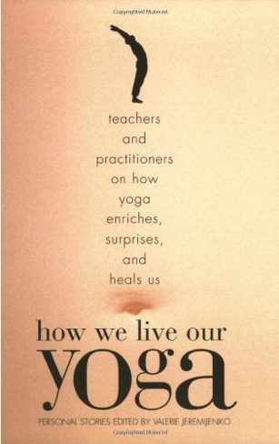

# How We Live our Yoga

## Teachers and Practitioners on How Yoga Enriches, Surprises, and Heals Us Personal Stories edited by Valerie Jeremijenko

Upon finishing this book and contemplating this review, foremost in my mind was the need to convince everyone to read it. The collection of personal stories, 'How We Live Our Yoga', feels like a very important book to me, though, for quite some time, I couldn't exactly pinpoint why. What I am starting to grasp is that this book is a piece of radical activism that offers a new narrative of what it means to be human in a world that desperately needs new stories that show our potential for living truth fully.
The authors collected in this book, teachers and practitioners of yoga, humbly offer a look back at their lives with the discernment gained through their yoga practice. They explore the themes of celibacy, parenthood, the guru/devotee relationship, cultural appropriation, aging parents, traumatic injury and illness, the relationship between yoga and art, and so much more. They share traditional yoga philosophy along the way but are fully grounded in the context of their lives. They offer myriad answers to the question "what happens to a practice based on stillness and acceptance in a world based on striving, distraction and insatiable appetite" with such profound honesty that their words at times felt like Holy Scripture for the present day.
I suspect there is a little something for everyone in this book, and I personally found that every story resonated with me in some way. I'll share with you a few that truly struck a chord.
Adrian M.S. Piper's 'The Meaning of Brahmacharya' shared the author's own practice of celibacy over twenty years and the West's conflicting and hostile views of this interpretation of Brahmacharya. She places the practice in the context of the ancient Vedic Brahmanas that outline different life stages that put sexual activity in an appropriate framework. She also gives us a possibility to ponder: perhaps celibacy comes about as a result of spiritual growth rather than a precondition for it; perhaps the point of relationship between two people is spiritual rather than sexual.
Judith Lasater's 'Swami Mommy' treads on very familiar terrain for many of us who took our yoga with us into parenthood. After years of formal yoga practice she struggles with how to maintain her practice post baby and realizes that it's her attitude which has to change. Before parenthood, she could keep her yoga on the mat in a predictable form, but as a parent, she truly has to live her yoga moment by moment and accept that her formal practice would look very different. She explains the concept of an upa guru (upa meaning near) which is whoever is near that is teaching you in that moment. Her children become this guru for her and she also finds parallels between how her asana practice informs her parenting and vice versa.
The guru/devotee relationship comes up in many of these stories with various levels of doubt, questioning and conclusion. Elizabeth Kadetsky tells her story of studying with the Iyengar family in India and returning home with more questions than answers (a good sign in my mind), while in 'The Guru Question" Jeff Martens is plagued by the story of the farmer who digs many holes but never finds water, until he transforms the story into a narrative that helps him truly arrive at a place of deep knowing. In 'Journey of a Lifetime' Vyaas Houston studies and travels with his guru and struggles within the relationship - conflicted when he seeks his teacher's path, critical of his imperfections and power when he deifies him, yet aware that his teacher sees in him possibilities he himself had not perceived.
I could go on! 'An Insomniac Awakes' and 'Journey in Yama-yama Land' explore the effects of our disconnection with our bodies. In the former, Lois Nesbitt shows us firsthand the suffering caused by living too much in the mind and the place yoga has in teaching us that we are not our thoughts and that the mind cannot offer the truth of reality as it is un'know'able. In the latter, Robert Perkins shares his descent into and ascent out of suicidal depression through the loss of his wife and the gaining of a yoga practice, realizing along the way '…that I breathe, that tension and anxiety have their roots in my mind and their blossom in the body.."
The story that seemed to touch me deepest was one of the first I read. 'Brick by Brick' is the story of Samantha Dunn's traumatic physical injury and the healing journey that followed. In a riding accident her horse's hoof nearly shears off her entire lower leg and what enters her mind at that moment is the words of a friend; "God touches us with a feather to get our attention. Then if we don't listen he starts throwing bricks". As a freelance fitness writer she always approached her body as a problem to be solved from a place of deficit and expressed this belief through her writing and her lifestyle. When a writing assignment landed her on Gurmukh Kaur Khalsa's doorstep post injury she 'felt like a wanderer who had just found shelter and, now safe, could admit how terrified she'd been of the storm'. When her healing stalls and she immerses herself in a healing meditation practice, it is pointed out to her that her horse, whom she had saved from slaughter, was actually the one who saved her.
I loved reading this book. I was reminded again and again that each person's path is unique because yoga meets us all where we are at. Though we must all live our own yoga we are not alone on our journey from darkness to light. Whether it is a physical guru, inner guru, or upa guru, our teacher is always present.
Sometimes we tire of our own story, but maybe we can look at it anew as the path that brought us here - forgiving ourselves for not knowing better until we did, striving to live our truth as our truth is slowly revealed, accepting that we can be painfully slow learners at times. Maybe through the divine alchemy that yoga offers our spirit to reveal our soul we can better release our past and truly greet the future without fear, standing firmly in the light.
--
 
**
Kenzie Pattillo** completed her 200 hour YTT at Salt Spring Centre of Yoga in 2002. She is a householder yogi/mama living in North Vancouver, B.C. and presently teaches yin, hatha and flow yoga in her community. En route to completing her 500 hour YTT designation she has recently begun practicing one on one restorative therapeutics.
