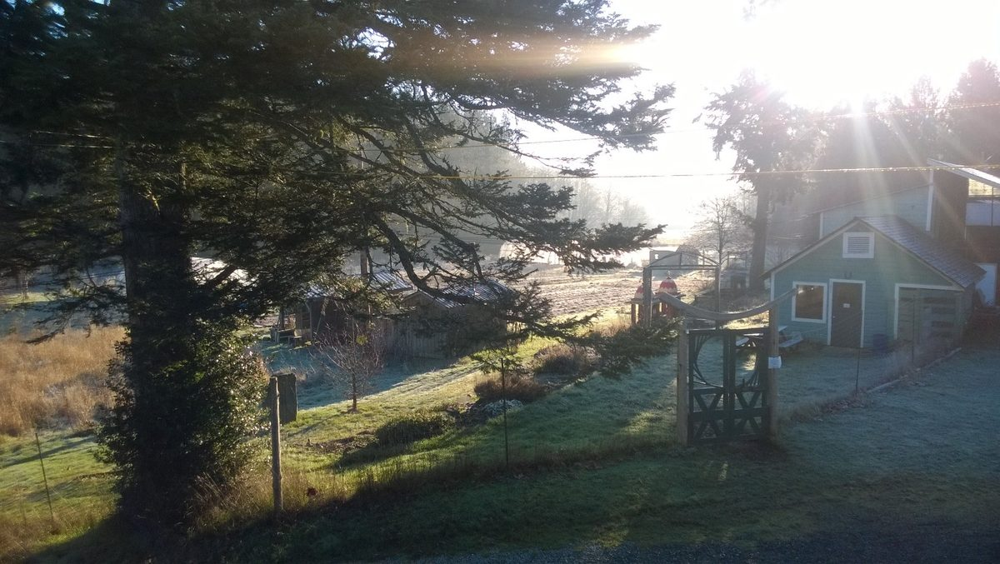

Hello everyone,
I recall writing last year at this time that spring had arrived, only to note the following month that winter had returned, complete with a heavy snow storm. So far, spring seems to be in the air, but who knows? Right now, spring bulbs have begun to sprout and the robins are back in abundance. We shall see what comes next.
[caption id="attachment\_10974" align="aligncenter" width="575"] Morning sun streaming over the garden[/caption]

### Celebrate Shiva Ratri with us

Please note that Shiva Ratri will be celebrated this month - from 6:30 pm Tuesday, February 17 through to the morning of Wednesday, February 18. Shiva Ratri is the Night of Shiva, the god of destruction, referring specifically to ignorance of our true nature. It is an all-night vigil filled with Shiva kirtan and two pujas. You can find more information about this celebration by following [this link](https://saltspringcentre.com/2015/01/shiva-ratri-2015/).
The Vancouver satsang will celebrate a shorter version of Shiva Ratri, from 7:00 pm - 11:00 pm on February 17 in West Vancouver, with Shiva kirtan and readings. Please contact [vancoversatsang@saltspringcentre.com](mailto:vancoversatsang@saltspringcentre.com) for more details.

### Renew your Membership

It is now time to renew your [Dharma Sara Satsang Society](https://saltspringcentre.com/about/dharma-sara-satsang/) membership in order to be able to vote at our AGM in the spring. You can join or renew online by following this link to the [online form](https://saltspringcentre.com/dharma-sara-satsang-society-form/).

### In This Month's Newsletter

I’d like to draw your attention to several articles in this month’s edition of Offerings. Pratibha has contributed **[Ayurveda, Yoga and You: Superfoods for Your Body Type](https://saltspringcentre.com/2015/01/ayurveda-yoga-you-superfoods-for-your-body-type/)**. It’s very easy to get drawn into the latest superfood trends without knowing what’s best for your body. Now you will!
Kenzie has shared another insightful and inspiring book review, **[How We Live Our Yoga](https://saltspringcentre.com/2015/01/kenzies-book-review-how-we-live-our-yoga/)**, with writings by teachers and practitioners on how yoga enriches, surprises, and heals us. Also in this edition - **[The Problem with Self-Interest](https://saltspringcentre.com/2015/01/the-problem-with-self-interest/)**, based on teachings by Baba Hari Dass, continuing the theme of exploring our thoughts and habits.

### Lots to Learn at the Centre School

[caption id="attachment\_10970" align="aligncenter" width="575"] Who has an easier time getting food? A tadpole collecting algae or a frog catching bugs?[/caption]
The Centre School has been very busy. The students have just completed their annual reading month, leading up to the Battle of the Books. Coming up is 100’s day (the 100th day of school), with children bringing 100 objects of all kinds, followed by the annual Lunar New Year celebration. The ongoing theme of the school year has been study of life in the wetlands, (water in general) with a focus on the endangered red-legged frog, which thrives in the wetlands of the Salt Spring Nature Reserve next to the Centre’s property. When I dropped into the school a couple of weeks ago I found two of the classes totally absorbed in a study of permeability, which all the kids understood. During the time I sat in on the class, I learned a lot!
May we all continue learning and growing.
Love,
Sharada
