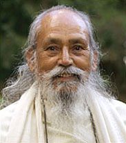

*Quiet and peace is the real nature of a being. It is disturbed by our desires, attachment, and ego. As long as the desires, attachment and ego remain strong, the mind will remain disturbed. So one should practice meditation, or any other spiritual practice, to purify the mind.*\*
Babaji often discussed the three great demons – desire, attachment, and ego – as blocks in the path of our spiritual development. These forces are necessary for our life in the world, but can get in our way when our goal is returning to the peace and quiet of our real nature. Below are some of his writings on the topic:
*There are three great demons in life called evils: 1) ego, 2) attachment, 3) desire. Without ego, attachment and desire, we can’t exist. Ego is the main energy. ‘I am, I want, it’s mine.’ ‘I am’ is ego. ‘I want’ is desire. ‘It’s mine’ is attachment.*
*Desire, attachment and ego is our life. We can’t function in the world without these energies.*
*Desire and attachment are the field of expression of the ego. Ego alone is only the sense of ‘I am,’ and nothing more. Ego is no different from atman (the Self), except ego is individualized atman, and works through the mind and intellect. If it separates from the mind and intellect, then it discovers its real nature, the Self.*

### EGO

Asmita (egoism) is an essential aspect of being human. We identify ourselves as existing, and in so doing, we separate ourselves from others, seeing ourselves as an independent entity. Our yoga practice allows us to notice that the same ego exists in each and every one of us, and that all humans share the experience of ‘I am ness’. Shared and separate? A wonderful koan for meditation.
*Ego is the most mysterious thing in a human incarnation. It is small in one situation and in the next moment it will be big as a mountain. So one should always keep an eye on the activities of the ego.*
*The mind’s nature is ego, attachment and desire. The ego expresses itself by creating attachment and desires. When attachment and desires are removed, then there will be no selfish identification. Ego expresses its existence by desire and attachment and the ego always seeks for its self-interest.*
*Ego is strengthened only by negative thinking and actions. By positive thinking and actions, the ego is weakened.*
*The ego sounds like a bad word in English. Yet it is all we have. When the ego sits in the mind, it becomes the owner of the world. When this ego separates from the mind, it identifies itself with its true nature, the atman.*
*A watched thief cannot steal. There is always ego. Without the ego, we can’t live. The ego that traps us in worldliness, that ego should be watched. Self interest in every action and thought is watched.*

### DESIRE

Desire is essential for our life in the world. Many of our desires are obvious: to breathe, to eat, to sleep, to move, to procreate. Others are more subtle, and only appear in the presence of an object. Others are still more subtle, samskaras such as the desire for recognition, or the desire to return to God. Some desires can lead us onto a wrong path, however, and these are the ones with which we’re encouraged to do battle.
Desire and attachment are expressions of ego. Desire without attachment doesn’t create a reality of anything desired. Without the ego there are no desire and attachment. So ego, attachment and desires are together.
*Without desires, we can’t function. But the question is desires that are obstructing our path and desires that are supporting us on our path. We can’t become desireless all at once. First weaken the desires by removing the objects. If there is candy in the refrigerator, the mind will go toward it. If there is no candy, the mind will accept that and the desire will get weaker.*
 *Then the next step is to face it. Facing is only in the mind; it’s a test. In life, you always go through tests. If you are trying to remove some habit or desire, you have to test it.*
*Desire makes the object, all of the objects that are in your life. The only escape from the trap is to realize that the objects and conditions of your life come out of you, that they are illusions projected by you. So why identify with them?*
*Limit desires. You have a desire to eat sweets. You don’t watch it and you don’t have a limit. When your mind wants to stop it, then at first you must reduce the quantity of sweets. You put one limit. Then you say, ‘I will eat only certain sweets.’ And then you say, ‘I will eat at certain times.’ All these self-imposed limits will remove that habit. This is called austerity or tapas.*
An example of desire without attachment:
 *A person is craving for ice cream. Ice cream is in his hand and in his mind. Another person gets ice cream because he is thirsty. Ice cream could be replaced by water. Because ice cream was available, he takes it. He goes with no memory of ice cream. The other person leaves with a memory of ice cream because his attachment to the taste created a deep impression on his mind.*

### ATTACHMENT

When we carry the memory of our experience and crave for more of it, or not to lose it, then we begin to see and feel how attachment blocks our path to liberation, our path to peace. But when our intention is to realize the truth, our desire to reduce attachment begins to sprout. We can begin to replace our attachment to objects with our attachment to God, truth, reality, beauty, peace.
*Attachment is a feeling in the heart generated by the ego of ownership. It has nothing to do with your outer activities. You still love your partner, children, friends, but you never forget their mortality. You are not attached ignorantly.*
*We create our own realties. That reality is ‘I may live forever and all those who are dear to me will be with me all the time.’ It appears very real, and we cover the truth, which is ‘neither will I live forever nor will those dear to me remain with me forever.’ When this truth is understood, the person still functions as before but doesn’t feel the same feelings of attachment as before.*
 *A child is attached to the toy. The toy for an adult has not the same meaning, but the parent still keeps the toy for the child. When we understand the truth, we don’t stop our duties in the world.*
*You are attached to your family and feel a sense of duty. If you deeply reflect on attachment, you will understand the attachment and desires in the world are separate. We express our attachment in a state of ignorance. We think “the family cannot exist without me.” This selfish tie doesn’t exist if attachment is understood. But the actions and duties will remain the same.*
*The first step is to develop nonattachment to objects. It will weaken the desires. When attachment and desires are weakened, the ego will lose its control over the mind. Ego is the root cause. But we need steps to lead up to the ego.*

*\* \* \* \* \**

*The ego appears in millions of faces. All those different faces are based on one ego. Actually, all identifications are the faces of the ego. You don’t need to paint all the faces black. Only remove the ego that is reflecting in so many different faces. In a room of mirrors, one candle light is seen as so many. By removing the real candle, all others will be removed. But how? By surrender to God, by selfless service and by living a virtuous life.*
**\*Words in italics are from the unpublished writings of Baba Hari Dass. All of the writings of Baba Hari Dass are copyrighted by Sri Ram Publishing.**

---

[caption id="attachment\_8434" align="alignleft" width="287"] Pratibha Queen[/caption]
**Pratibha Queen** has been a student of Baba Hari Dass since 1976. She took yoga teacher training at Mount Madonna Center in 1981, and has been teaching asana, pranayama and meditation for many years. She is also a student of Ayurveda, and is currently offering a series of classes at the Pacific Cultural Center called “Ayurveda, Yoga and You” and writes [articles about Ayurveda](https://saltspringcentre.com/tag/ayurveda/) for the Salt Spring Centre's newsletter.
