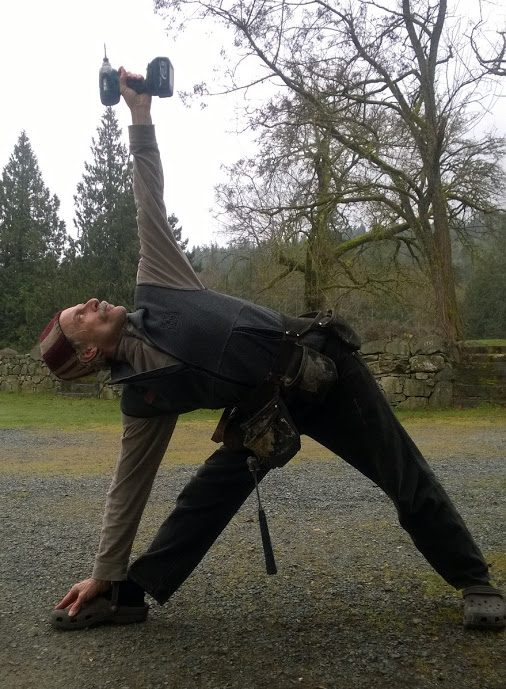

[caption id="attachment\_11164" align="alignright" width="350"] Karma Yogi Mark[/caption]
I first came to the Centre in the mid 80s for a weekend yoga workshop. My friend and I left the program for an evening to see Valdy in Fulford. We got chastised for leaving, but it was worth it. More recently I heard about this place from my roommate, Johanna. I came here about a year ago on a bike trip in the winter and stayed with Daniel and Cristina whom I met through Johanna. That’s when I found out about the maintenance opening and I was interviewed for the position.
I had been working in Vancouver as a long-distance truck driver, driving from Vancouver to Alberta and back. The job appealed to me because it enabled me to work five days a week and have more time for yoga. But driving long distances can be lonely work, and that’s certainly one of the things that drew me here.
I enjoy working with my hands; even as a child I made go karts out of golf caddies. I collected a lot of tools over the years, which languished in a storage trailer for a long time, and I finally brought them here. I yearned to work with my hands in a meaningful way which to me meant community. I enjoy problem solving, working with recycled materials, solving challenges that arise.
My other passion is music. I got into music because my brothers all played guitar and I really wanted to be like them; I thought they were cool. I was the youngest of six children, the next youngest being 8 years older - and my sister was 20 years older. I grew up in a world of big people.
I went to music school in Nelson for three years and was hoping to connect with other musicians, but I didn’t have the confidence. I love call and response kirtan, the shared journey. I sing the Hanuman Chalisa every morning with Christine, a practice I started since coming here. Because Hanuman is the embodiment of selfless service, it is the perfect way to set up one’s day and get into the right spirit.
Once a week I return to Vancouver to visit my soon-to-be 108 year old friend, Gordon. He was my brother’s roommate, and when my brother passed away a couple of years ago, I continued to visit Gordon. He is completely blind and confined to a wheelchair but his mind is brilliantly clear, and I happily spend hours listening to his stories. I’m genuinely interested in the stories he tells, full of Vancouver’s history. When he forgets some of the characters I’m able to fill in the blanks, and he always compliments me on what a good memory I have. I help him at mealtime, getting to the toilet, whatever is called for.
Each time I come back from the city, I’m always warmly greeted. I love the variety of people who come here. I seem to be able to make a connection with everyone and I get into some interesting conversations. The Centre attracts people who are a bit off the beaten path, which I find fascinating and engaging. I like the aspect of teamwork in the community, helping each other with firewood, coordinating the use of the truck, the little ways we interact with each other that scratch beneath the surface, building connection, the medicine of community.
