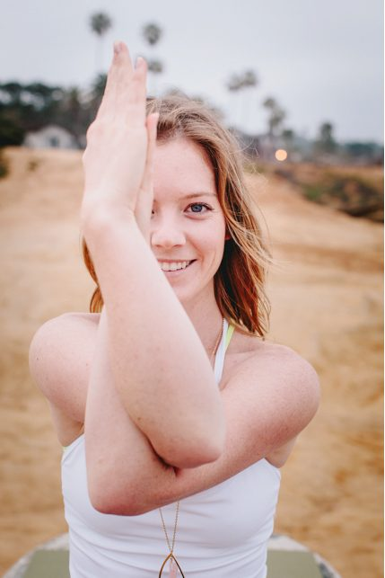

From my earliest years, my parents encouraged me to follow my intuition and listen to my heart. My family and friends formed an extended community of love and mutual support which, by example, showed me the amazing support system that could be created by those close to me. We all were there for each otherin the tough times and celebrated the good times together. Little did I realize back then that the basic philosophy of karma yoga was present in my life and nourishing me well before I even had heard of the term.
 My dad and I playing and laughing, as usual.
At the age of 5 , I began to appreciate the role of animals in my life as I realized my love of horses. I spent every summer living on a ranch from the age of 5 until I turned 20. I spent most of my time at the ranch vaulting (gymnastic on horseback). Come to think of it, that may have been my first experience with yoga. Vaulting requires a lot of focus, mainly focus on the breath. I had to be acutely aware of my own breath and the breath of the horse I was vaulting on, connecting each of my movements with the rhythm of the horse. The ranch itself, the animals, the land and the people all formed a loving community, similar to what we experience today at the Yoga Centre. The land, and the people, working together in harmony, provided everything we needed to experience a supportive communal existence. I miss the ranch, but what we have here is so similar that I feel as much at home here as I did there growing up (except for the horses).
 Bob and George, the inspiration behind my vegetarianism. 
 The first horse I fell in love with, Bugsy.
In high school and college I was a dedicated long distance runner, spending most of my weekends at races or logging road runs. In college I began to compete in half and full marathon races. Running was my first form of meditation. While I ran I would recite different mantras in my head, over and over again, sometime just a word for miles and miles. I often found myself in prayer, selecting a point in the distance, then focusing all my attention on someone or something until I reached that point. I created some sort of strange prayer pattern, praying for a different person during each segment. After many years of running I started to realize it was great for my mind but hard on my body. My pita nature drove me to ignore pains in my body and focus on winning and improving. Eventually, I realized I needed to nurture my self in a more holistic way.
 Completing a half marathon 
 Lake in the Andes on the border of Peru and Bolivia
After my undergraduate degree I moved to San Francisco to pursue my Masters in Public Health. The degree in Public Health was most appealing because there were opportunities to study abroad. During undergrad I was able to study in Peru, Bolivia and Spain, I hoped to continue to study and learn from different cultures. San Francisco opened my eyes to a whole new way of life. I moved into an alternative neighborhood with an apartment complex full of creative, inspiring, and likeminded people. I started to attend different festivals and workshops and I began learning about communities and alternative living. My interest shifted from traveling to environmental public health, more specifically community living. Then I met Jeff at a yoga and music festival, that’s where my journey to the Centre began. I realized I had done a lot of research and reading about intentional communities; the natural next step was to write my thesis in a tent at the Centre, right?
 Jeff, friends and I at Burning Man
As I arrived here at the Salt Spring Centre of Yoga, I had no idea of what to expect. I had heard so much about the Karma Yoga program from Jeff and it sounded like a great opportunity. Everything inside me told me that the Centre was right, I couldn’t wait to take the leap and spend a summer immersed in Karma Yoga.
 Jeff, Scootch and I- Summer 2013
The first three months I spent at the Centre were challenging, and it took nearly three months to just get acclimated to the environment here. I had been living in the frantic and rapid-paced environment of city life. But as I left the stresses of the urban living, work and school, I absorbed the serenity of the yoga and meditation practices taught at the Centre.
After a 6-month term I left the Centre and traveled to Hawaii to live in a different community and participate in Yoga Teacher Training. This experience allowed me to see the Centre in a different light. I realized I deeply missed the community and the island. As I began my Yoga Teacher Training I had deep gratitude, love and respect for the teachings that Baba Hari Dass has shared with us. I knew in my heart I needed to return to serve at the Centre. I became aware that the Karma Yoga Coordinator position was available and I thought it would be a perfect way to be of service in the community. The next night, I went to Kirtan at the studio where I was studying. While singing, I turned my head and saw Lakshmi at the studio in Hawaii! I instantly knew I would be returning to the Centre.
 Paia, Hawaii- January 2014
Soon after, I returned to the Centre to serve as the Karma Yoga Coordinator. I love welcoming Karma Yogis from all around the world to be part of our community. I learn so much from each of the different yogis who grace the Centre with their presence. For me, it was another season of growth through the practice of yoga. It felt like a time in which we were reconnecting with the “play” aspect of Babaji’s teaching. We laughed and experienced the joy of bringing back (a shorter version) of the Ramayana.
 Helping out YTT 2014
 Ramayana cast 2014
This past winter Jeff and I walked the Camino de Santiago. We felt inspired and called to walk the pilgrimage and indeed it was a powerful, deep, moving pilgrimage across Spain. Again I was reminded of the importance of practice and the support the community provides on the spiritual path. We were surprised by the many acts of kindness and selfless service. It felt as though we followed the trail letting our hearts lead us along the way. It was a beautiful journey and as it ended it felt right that I would be returning home to the Centre.
 Jeff and I on the Camino de Santiago
This is my third year back at the Centre, second year as the Karma Yoga Coordinator. I feel blessed to consider the Salt Spring Centre of Yoga my home. I have had amazing opportunities to continue my study of yoga and deepen my practice here. I am constantly inspired and grateful to Babaji and the Centre. The community has supported me and encouraged me as I get to know my true self. I can feel deep in my heart the Centre is exactly where I need to be right now.
Om
