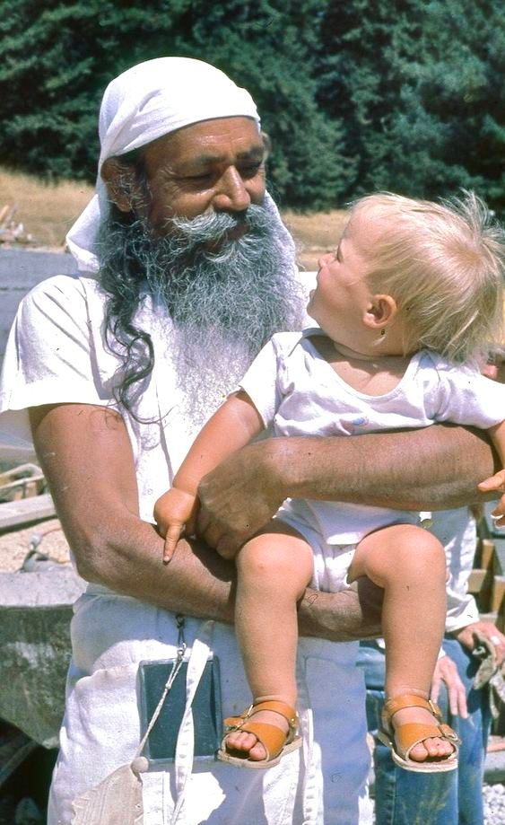

An ongoing theme that has come up regularly during yoga retreats over the years: How can I do all these practices I learned at the retreat when I go back to my regular life, usually called “the real world ”? How can I practice when I have kids? a job? How can I find time?
Here’s the thing: You do what you can. It won’t look the same as when you’re at a yoga retreat - unless you have no other responsibilities and have limitless free time. Even then, you need motivation. Assuming that readers of this article do have responsibilities - probably lots of them - what’s realistic?

*The mind is purified by meditation, developing good qualities, and selfless service. One can choose any one or all three. In fact each one includes the other two.*

Yoga is much bigger than the way it’s usually thought of it in this part of the world. Yes, asana is part of yoga, but it’s not all of it. There any many practices - and yoga is as much how we do things as what we do.
Asana classes are the easiest to access. There are yoga studios everywhere, and if you’re organized enough, you can schedule at least one class a week. Daily practice is best, of course, and maybe you’ll be inspired by the class to do at least some asana every day, even if it’s for a shorter period than you do in the class. Just a little each day helps.

*We are in the world. We have to desire the things we need. But in desiring the world we should also desire to get out of the world. Sadhana is very important. It does not matter what sadhana you do. The important thing is to do it regularly.*

A daily meditation practice may seem unrealistic in your busy life, but oddly enough, it may free up time for you. That may sound paradoxical, but consider how much time is consumed by worrying, strategizing, planning, engaging in unproductive activities (things like complaining and arguing, not just netflix). What if you took 5 or 10 minutes at the beginning of the day (or the end of the day if the morning seems too rushed to consider), and sat quietly, focusing on your breath, letting it become slow and steady, letting your whole being settle? That’s enough to start with. If you’ve learned a meditation practice, you can do that. You may soon find that 5 or 10 minutes isn’t long enough, so you can increase the time. After a while, you may come to treasure this period of quiet, uninterrupted time to reconnect with the peace that already resides within you, just covered up by the noise of daily life.
There are other practices that are simple to incorporate into your day as well. You just have to remember to do them, and then they become a habit. For example, when you sit down to a meal, take a moment. Breathe, relax, and allow a feeling of gratitude to arise. Here you are: You have a place to sit, you have food to eat, you are alive. If you practice gratitude for small things, soon your world will become a beautiful place simply because you can see it.
Our intentions to live peacefully in the world can guide our every action. Each time you speak, or are about to speak, you can ask yourself: Is it kind? Is it true? Is it helpful? When you look through the lens of these questions, you may find yourself speaking with more care, or possibly speaking less and listening more.

*Contentment, compassion and love are important in order to develop a positive attitude.*

*If you want to love and be loved, then don’t hate anyone, including yourself.*

Whatever situation we are in, we can practice. Your work is your practice, your relationships are your practice. If you have children, your family is your practice.

*Your children make a world of your family. God and the creation are not separate. To love God we have to love God’s creation, which is visible and can be identified. Your family is a miniature form of this vast creation. If you serve your children, you are serving the whole creation.*

*Don’t separate yourself from social activities, but do your sadhana regularly. The world is an abstract art. Everyone sees it as they want to see it. It is a garden of roses and it is also a forest of thorny bushes and poison oak. You don’t need to stop seeing your friends to seek the truth. You have to see the truth in everything, including your friends, family and society.*

Karma yoga, the yoga of selfless service, is available in every life situation. Whatever you’re doing can be done with a feeling of heaviness and resentment or as a gift, given with lightness and ease. It’s your choice. If you can recognize the opportunity each situation presents, you can then make a choice that lightens the load. The tasks you’re responsible for are still the same, but how you do them makes all the difference - to you and everyone around you.

*Life is not a burden. We create burdens by our desires, attachment and ego. If we accept life in the world, it creates contentment, and all conflicts fall away.*

*This is life. It includes pleasure, pain, good, bad, happiness, depression, etc. There can’t be day without night, so don’t expect that you or anyone will always be happy and that nothing will go wrong. Stand in the world bravely and face good and bad equally. Life is for that. Try to develop positive qualities as much as you can.*

*Do your sadhana every day and be happy.*

contributed by Sharada
All text in italics is from writings by Baba Hari Dass

---

 

**Sharada Filkow**, a student of classical ashtanga yoga since the early 70s, is one of the founding members of the Salt Spring Centre of Yoga, where she has lived for many years, serving as a karma yogi, teacher and mentor.
