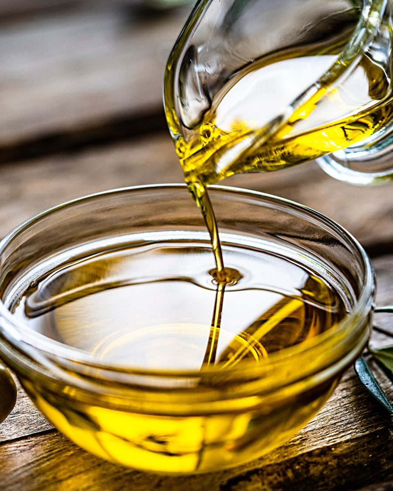

The summer months are the perfect time to experiment with abhyanga - the Ayurvedic art of oil massage. As we mentioned in last month’s column, abhyanga (self massage with warm oil) nourishes the skin, as well as soothes the nervous system, stimulates the circulation of blood and lymph, and enlivens the immune system. This nurturing practice also helps moisturize the body so it doesn’t dry out in the heat of the summer sun.
The way this works is that the warmth of summer heats up all of our bodily tissues, drawing moisture from each and every cell. We may not be aware of this at first, particularly kapha predominant people whose tissues contain more than average moisture. But the effects of dehydration can accumulate as the summer heat goes on and, especially for vata and pitta predominant people, can have a very damaging effect on the entire body. When the dry quality of vata accumulates during the warm summer months, it can then become aggravated when the autumn winds begin in late September or October. And then we become prone to vata disorders such as constipation, anxiety, and cracking joints.
To counteract this accumulation of vata dryness during the summer, abhyanga is the perfect antidote (along with the addition of aloe vera and cooling melons to your diet)!
Before we detail the process, let’s look at the properties of various oils you might choose. Sesame oil is used throughout India as a basic massage oil; it is heavy and warming, perfect for nourishing vata dosha. Coconut and sunflower oil are both cooling; they’re the best for balancing the pitta dosha. Kapha people may choose a light oil such as almond or may decide to massage without oil, simply massaging the skin directly.
Adding a bit of essential oil to your choice of base oil adds a delicious quality to the experience. Cooling rose, lavender and sandalwood oils are recommended for pitta. Frankincense, geranium rose and jasmine are calming for vata. Kapha predominants appreciate the warming and invigorating aromas of rosemary, eucalyptus and peppermint. Choose one oil to experiment with, one that feels most pleasing to you.
Abhyanga is best performed early in the morning, before showering. Fill a 2 oz. plastic bottle with your choice of oils, and heat it by placing it in a cup of warm/hot water for a few minutes. Choose a warm place for this practice, one where any excess oil will not damage carpet or furniture. Apply a small amount of oil to the whole body, beginning with the scalp. Massage the scalp slowly with firm pressure. After a minute or so, move down to your ears and face, using small circles.
Moving down to the arms, use circular strokes on the joints (shoulders, elbows and wrists) and long strokes on the upper and lower arms. Be sure to give each side equal time! Use circular strokes on the chest and stomach and upward strokes on the lower back. If you have a consenting companion, ask him or her to rub oil also into the upper back. Continuing on to the legs, again use long strokes on the long bones, and circular strokes on the joints.
You may wish to give special attention to the feet; working the acupressure points there can revitalize the whole body through reflexive action that connects to the internal organs. Apply oil to lubricate the whole foot; then massage each toe beginning with the pinkie all the way to the big toe, giving some loving attention to the space between the toes. Next massage the ball of the foot in a circular motion and complete the massage by circling the ankle joints with both hands in a clockwise motion.
Leave the oil on your skin for 10-15 minutes (or as long as possible). You may wish to do your teeth brushing or shaving while you wait for the oil to be absorbed. Now step into a warm shower. Use only as much soap as you actually need; the warm water will help draw the oil deep into the skin tissue. We want this oil to be absorbed, and not washed off with the soap. Towel dry and enjoy the rejuvenating effects of your self-massage.
This practice can be done daily, weekly, monthly, or occasionally – your choice. When you feel stressed, when you feel dried out, when you feel fatigued – whenever you find the time to include it in your daily routine, you’ll enjoy both the pleasure and the health benefits of this ancient practice.
Whether you massage the entire body massage or just the arms and legs, don’t rush. Take your time, focusing on feelings of love and support for this incredible body of ours. For decades, this body carries around our consciousness, our soul, our spirit in order that we can experience this extraordinary life and explore the process of liberation from our self-created dreams. When we’re able to appreciate this amazing life, we permeate ourselves with the qualities of acceptance, loving-kindness, and compassion which the world so crucially needs these days!
Happy oiling!
Peace,
Pratibha

---

 **Pratibha Queen** is a yoga instructor and Ayurvedic practitioner, who attends Salt Spring Center of Yoga retreats on a regular basis.
