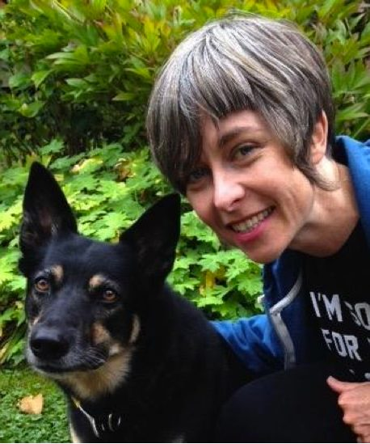

As a kid, I connected more easily with animals than with people. People were confusing, animals I could understand. My dad worked as a veterinarian and over the years I got to care for dogs, cats, horses, a 3-legged calf and a camel. I think spending time with animals can give you a better connection to the world, a clearer understanding of the components of physical and mental health and that caring for animals can be great karma yoga practice.
 This photo establishes a future pattern: my cousin goes on to become a model, while I become ever more committed to the wearing of funny hats. The horse’s name was Dusty and he was marvelous.
I began learning about yoga in Victoria when I was 28. I had decided that I needed a more effective way to work with anxiety and depression and I had a sense that my body might be the right tool for the job.
 Offering lettuce to the chicken
It was challenging for me to work with the intense self-consciousness that came with being in my body. I was lucky to have an exceptionally patient and inspiring teacher named Amy Nold, for the first 4 years of my practice. Her emphasis on breath-work, inspired by Donna Farhi, was the key for me in understanding how to work with anxiety. Her classes were a refuge for me and she taught me to cultivate this place of refuge within myself.
After the first 2 years, she asked me if I would teach part of a class. I responded in real horror; “only if I could be behind a sheet so no one could see me!”
She also knew when I started coasting in my practice, and kicked me out (lovingly!) to go and take more challenging classes.
I had attended several weekend getaway retreats at Salt Spring and loved the home-y atmosphere and the cheerful warmth of the community. In 2010 I attended the YTT 200 program. I learned so much about anatomy, Ayurveda, pranayama, meditation and even found myself singing “Om Jai Shri Ganesh” in the shower, much to my surprise.
Throughout the program I had a sense of wanting to serve; my fellow students, the teachers, the Centre itself. I became a member of the Dharma Sara Satsang Society and decided to attend board meetings to see where I might be useful. After serving in numerous ways on the board, I am so happy to see how the SSCY community has grown and evolved. Fears met, challenges overcome and the love and inspiration of Babaji still strong. Insurance, limited housing, tax regulation, all the operational challenges seem to pale during arati or kirtan or a quiet morning of mauna (practice of silence). This balance seems reflected in Babaji’s quote: “The world is an abstract art. We see it as we want to see it. It is a garden of roses and it is also a forest of thorny bushes and poison oak.”
Lately, I am most inspired by the relationship between the senior members of the community and those in their 20s and 30s. The sincerity and understanding that can be exchanged between those separated by years but united in the practices is a wonderful testament to “faith, devotion and right aim”.
 Hanging with small friends
I think my favourite quote from Babaji comes via Kishori. When she asked Babaji how they could possibly do all the work that was needed to establish and improve the Centre land and buildings, he said: “Work, work, work, then Kirtan.”
(Now there’s a guy who understands his audience!)
Jai!
Jules
 With dog named Zoe
