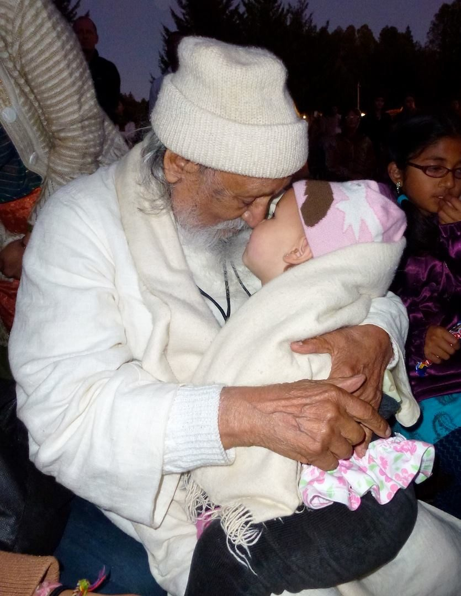

Babaji says, “Love is a universal religion” and the Dalai Lama says, “My religion is kindness.” Kindness is the outer face of love, and forgiveness is a form of kindness to oneself which touches everyone around us.
The first two limbs of classical Ashtanga Yoga are Yama (restraints) and Niyama (observances). Of these, the first is ahimsa: *to refrain from causing pain to any living creature, including oneself. Every action, word, or thought that creates pain to another - any thought containing anger, greed, lust, or attachment - is a form of violence. With perfection of ahimsa, one’s nonviolent nature and peace radiate to others.* When one lives in a state of complete nonviolence, what remains is unconditional love which automatically manifests as kindness.
Amma says, “The first step in spiritual life is to have compassion. A person who is kind and loving never needs to go searching for God. God rushes toward any heart that beats with compassion - it is God’s favourite place.”
It is natural for us to be kind and loving. When we’re struggling with a difficult situation, we may forget, we may speak and act in ways that are not kind and loving, but when we do we suffer. The good news is that we have what it takes to step out of our negativity.
*Painful thoughts are binding because the mind tends to dwell on them.* When you have a hole in your tooth, it’s hard to keep your tongue out of it even though it creates more irritation.
*The root cause (of negative emotions) is non-acceptance which is keeping anger inside. Intellectually one can say the past is past and now I’m in the present and there’s no need to dwell on those pains. But we are not separated from the past if it is coming in the present and creating its own reality. A person is beaten as a result of shoplifting; it is all forgotten, but once the person goes back into that place, the person will get beaten up again in his/her mind.*
*Sometimes it is not so easy to liberate oneself from past memories that are affecting the present. One may go through a process of wanting revenge, taking out one’s anger, doing penance for wrong actions, etc. When negative thoughts appear in the mind, dwell on the positive. If you play out the negative samskaras (tendencies, conditioning), it will make a deeper print.*
*Forgiveness is forgetting the past actions of some outer agency which created pain in life, and not feeling the least amount of anger or hatred toward the person.*
*The hero is not the one who wins battles outside, but the one who conquers the mind.*
Being able to let go of the past is also a way to be kind to yourself. It lightens the burden of pain you carry around with you when you’re angry. In releasing the past you come into the present, the only place you can be in peace.
contributed by Sharada
all text in italics from writings by Babaji

---

**Sharada Filkow**, a student of classical ashtanga yoga since the early 70s, is one of the founding members of the Salt Spring Centre of Yoga, where she has lived for many years, serving as a karma yogi, teacher and mentor.
