# Asana of the month: Setu Bandha Sarvanagasana

## *bridge-lock all-limbs pose, commonly known as Bridge / Little Bridge*

Versatile, accessible and hugely beneficial, Setu Bandha Sarvangasana (setu bandha for short) is integral to my asana practice.
This pose boosts the immune system and lowers stress levels. It is front-body lengthening and back-body strengthening. And - crucial for the winter-time - it serves to stabilise and reset the body.
Setu bandha is suitable to practice at anytime of day, and during any part of your practice. Work with it gently; the structural and energetic effects will really flourish if the mind and body are relaxed. The pose can take a number of different expressions, from the more restorative to the more strengthening; be aware of what’s going on in your body and choose the most appropriate form for you today. If you have neck or shoulder issues, it’s an especially good idea to work with an experienced teacher.

### Setup: Laying Foundations *Have a block at hand*

Lie on your back with your knees bent, soles of the feet on the ground. **The architecture of the pose begins with the feet** - place them mindfully, ensuring they are parallel, at the *width of your hips*, and positioned so that your *knees are stacked above your ankles*.
Take a few deep breaths to relax the body and focus the mind, and spend a moment here to *feel your spine on the mat*. Notice three points of connection between your back and the ground: Your sacrum, your shoulder blades, and the back for your head. Between these three key points, visualise the space - *like mini bridges* - in your cervical spine (neck) and lumbar spine (lower back). I encourage you to press down gently through the back of the head - this will strengthen and protect the neck. Breathe expansively - feeling the torso inflate and deflate three-dimensionally.
Setu bandha is a four-limbed pose; the arms playing an essential role in its structure. **Experiment with arm-positions to maximise ease and stability in your shoulders** and really cultivate a sense of grounding.
As you prepare to transition into the pose, position the arms in one of the following ways:
\* 45° from the torso, palms face down or palms face up.
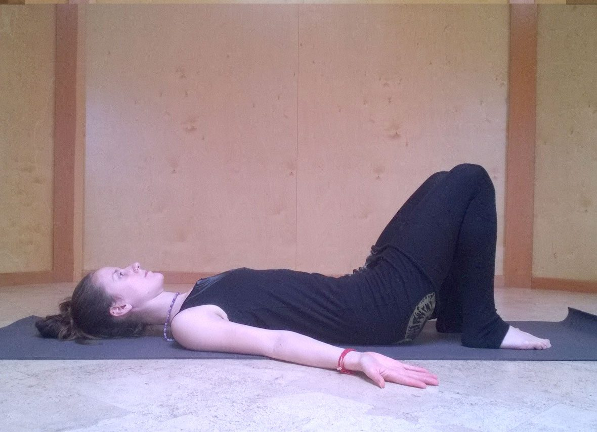
\* Parallel to the torso, elbows bent, fingers reaching towards the sky, and palms facing each-other.
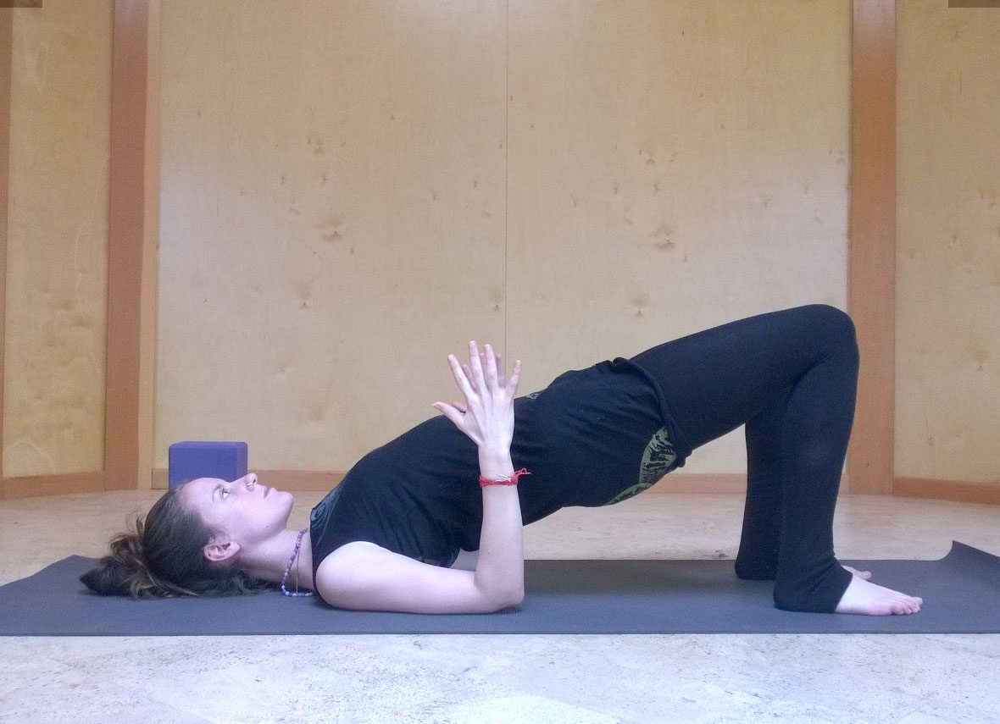

### Transitioning-in: Root to Rise

Taking your awareness back to the feet, press down through the big-toe mound, the little-toe mound and the heel of each foot. This triangular structure will keep all sides of the legs engaged and the pelvis even - protecting the lower back. Simultaneously press down through the upper arms and the hands (if they are touching the ground). **Concentrate on establishing an even pressure through your four limbs.**
At the end of an exhale, draw the lower abdomen in and tuck the pelvis slightly, lengthening the lower back. As the inhale begins, root down through your foundations (including the back of the head), and gradually lift the spine off the ground. At the top off the inhale, pause briefly, feeling a lift behind the heart.

### Flowing with the Breath

As the exhale begins, widen the shoulder blades and gradually lower the spine until the sacrum finds the ground again. At the end of the exhale, re-engage the lower abdomen, and repeat the lift beginning with a pelvic tuck. Flow like this for a number of breaths, lifting on inhale and lowering on exhale.
Practicing the transitions will help the body learn the correct alignment and build the strength needed to hold the pose comfortably. The flow is also a beautiful practice in and of itself, and will serve to reset the body structurally and energetically. Try to cultivate a calm and spacious energy, moving mindfully, and *allowing the inhale to carry the lift and the exhale to carry the lowering.*

### Holding the Pose

When you’re comfortable enough to breathe easily through these transitions, I encourage you to explore the subtleties of the pose with a longer hold. There are a couple of arm variations you can work with here:
\* Drawing the shoulder blades towards each other, roll the tops of the arms underneath the torso. Lengthen the arms toward the hips and maybe clasp the hands underneath the lower back.
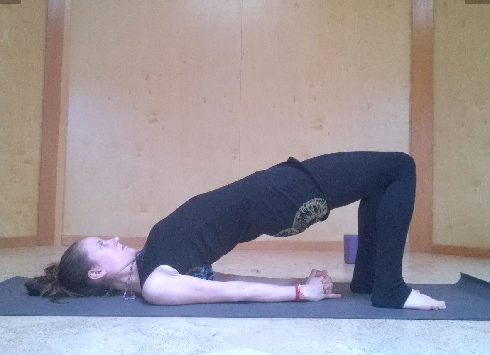
\* If you have a strong practice and your body proportions allow, you might also experiment with holding the ankles in the hands, creating traction to lift into a deeper back bend.
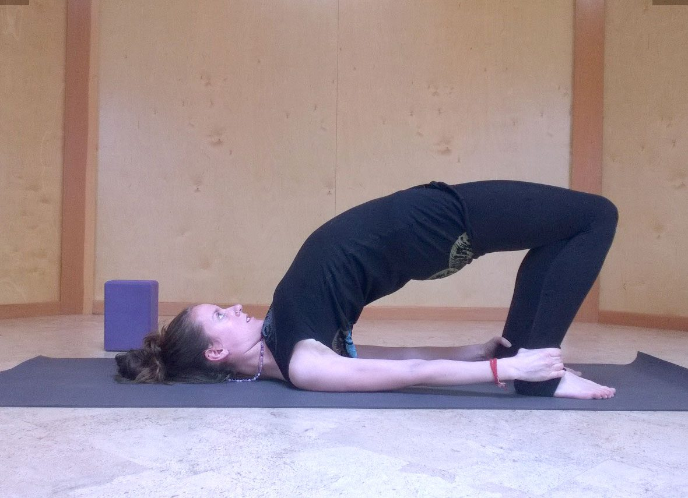
*Remember the arm position serves to create ease and stability in the shoulders, and the neck should feel spacious at all times. If you feel discomfort, ease off.*

### Exploring Tensile Strength

In setu bandha, the spine is suspended like a bridge. There is a tendency at first for strong gluteus muscles to hold too much of the form. As you practice rooting evenly through your limbs, the gluteals will ease off, and you can start to notice the gentle engagement of the entire backline of the body. Keep the idea of *lengthening* in your mind. Watch out for the knees splaying out; the intention is for the legs to remain parallel. If you work mindfully with your feet (rooting through big-toe mound, little-toe mound and heel simultaneously), your legs and pelvis will stay nice and even. If your body needs help remembering this, a good practice is to hold a block between the inner thighs. For an added bonus, you can squeeze the block, encouraging the deep core muscles to engage and support your lower back.
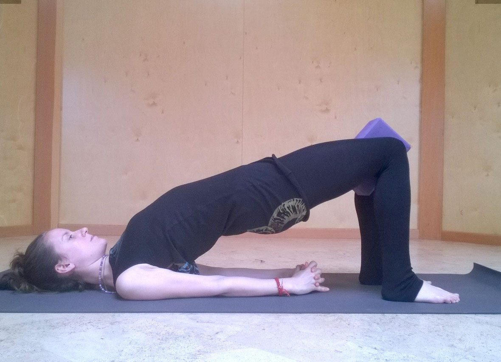

### Exploring Expansion

Setu bandha is a wonderful position to open through the front body, including the fronts of the thighs and hips, the chest and the heart.
As much as the hips lift away from the ground, think of lengthening the knees away from the hips. As you root down, let the shoulder blades lift behind the heart and let the chest expand towards the chin as you inhale. Throughout the pose, and particularly when lowering down, notice the space being created between each vertebrae of the spine.

### Supported versions

If your leg muscles would appreciate some help, or you’re looking for a restorative option, using a block under your pelvis is a great option. Position the block so that the sacrum rests flat on it. Experiment with the height of the block to avoid any pinching in the lower back.
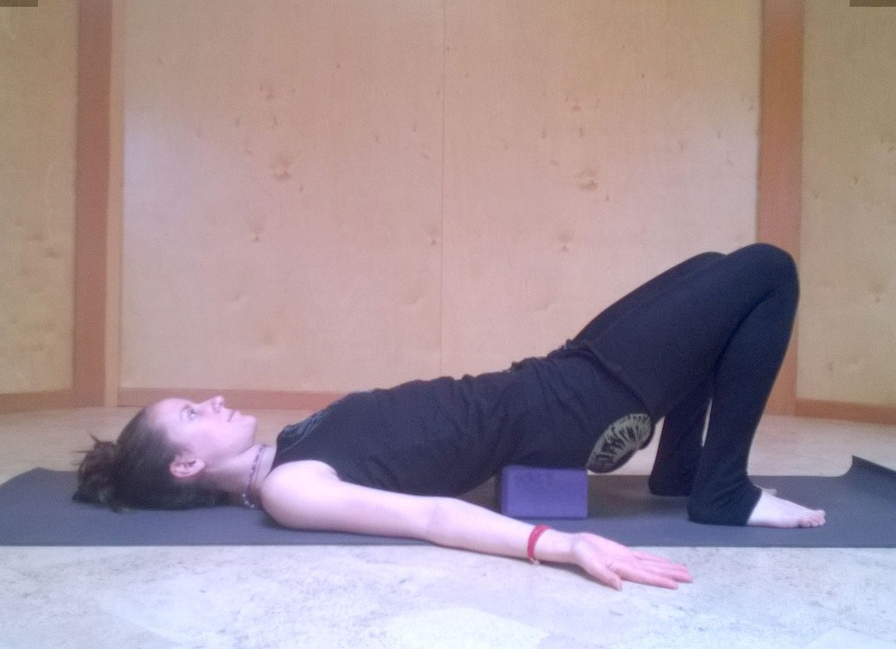 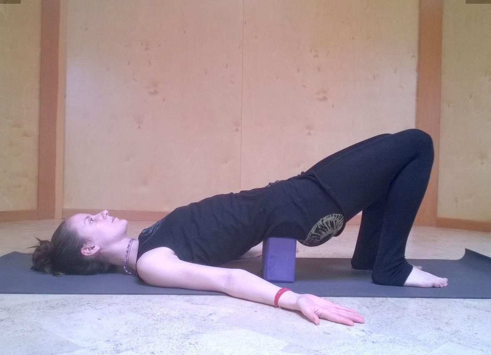 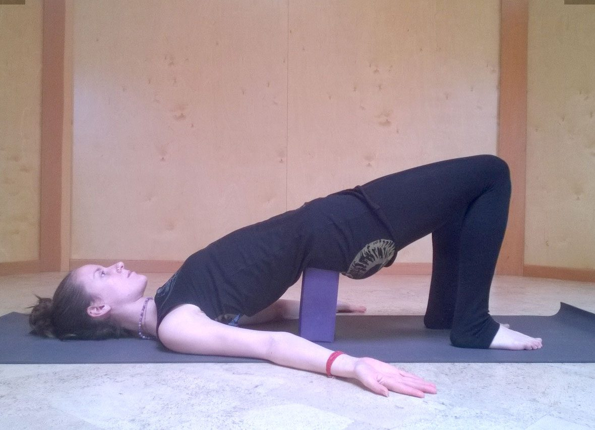
An alternative is to take more weight through your arms by holding the backs of the hips in the palm of the hands. This one requires more open-ness in the shoulders as your elbows will need to be stacked under your wrists.
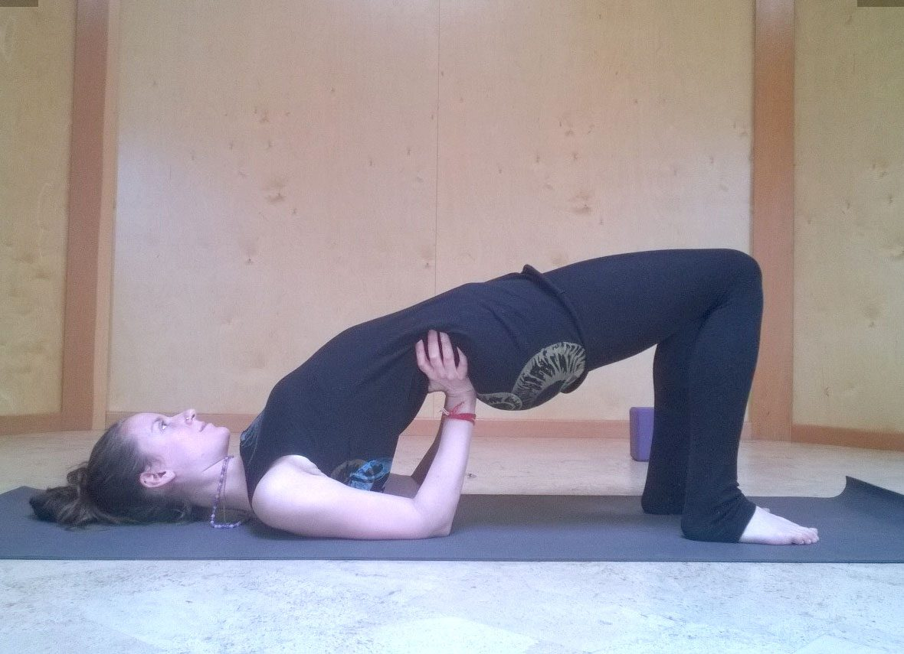

### Leg variations

When you’ve established a comfortable balanced energy in holding setu bandha, you can start to experiment with lifting one leg. I love this variation because it’s a wonderful reminder to return the attention again and again to rooting. To begin, position your arms in the supported version; hold your hips in your hands firmly. Root down through elbows and one foot, and on exhale draw the other leg towards your chest. Take a breath here to calm the mind, then on exhale straighten the lifted leg, lengthening through the sole of the foot.
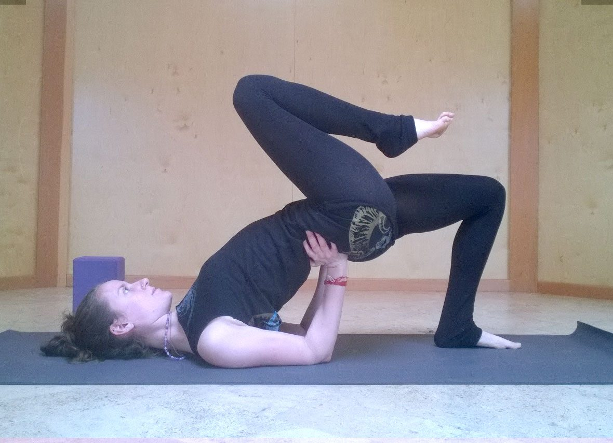 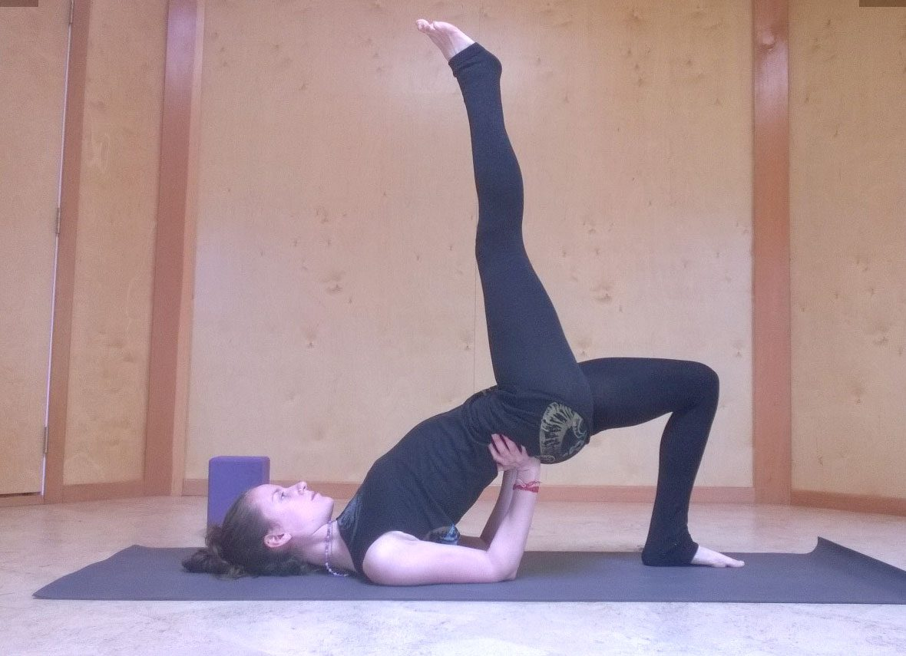If you have the stability, feel free to release the hands. With the leg in this position, the lift and expansion of setu bandha is accentuated. This Eka Pada (one legged) variation gives an added challenge of balance, necessitating refinement in the rooting of the foot and in the tensile strengthening of the body. Exhale to transition out, bending the leg in towards the chest and then mindfully placing the foot back down. Repeat on the opposite side.
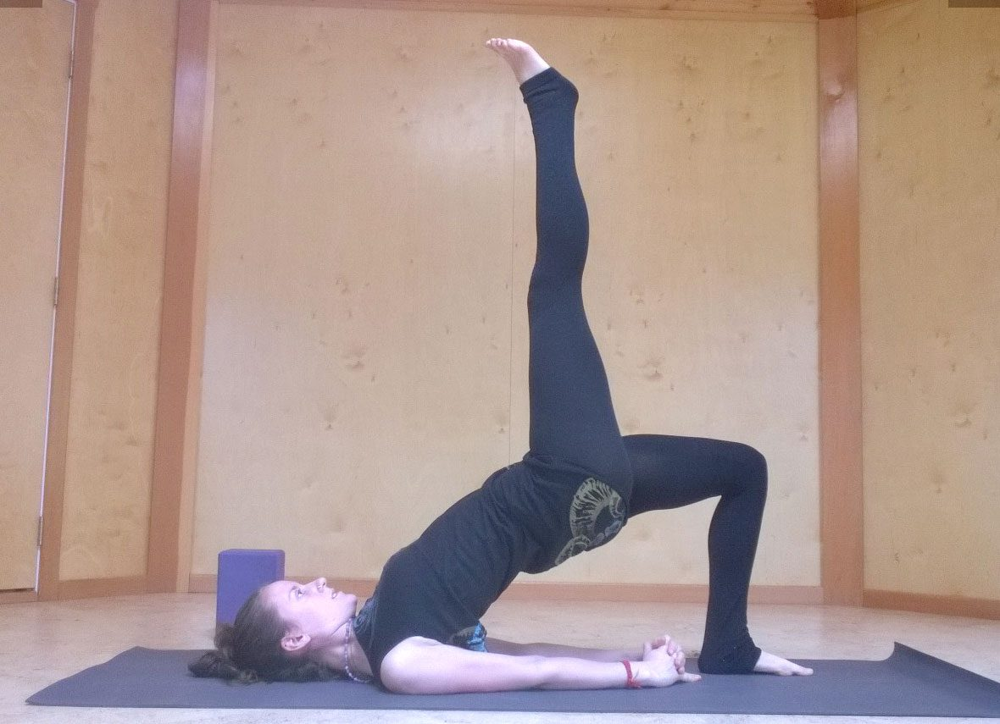

### Interpose

After and between sets of setu bandha, relax the legs in a gentle supine twist and/or supta baddha konasana (reclined cobblers pose). Your hips and sacrum might also really enjoy ananda balasana (happy baby).

### Cues for further play

You can use setu bandha to prepare for deeper backbends, as it will help you get comfortable with your pelvic positioning and open up tight quadriceps and psoas muscles. It also fits beautifully into a shoulder-stand flow. Wishing you happy and grounded explorations!

---

Motivated by a love of movement and a craving for peace, Marianne has been practicing Yoga regularly since 2009. Drawing on her experience of a rich variety of styles and teachers, she encourages her students to develop internal awareness as they move and breathe through carefully designed sequences. She completed her 200hr Hatha Yoga Teacher Training and an advanced workshop in Sequencing with Joy Morrell, a teacher with a passion for anatomy and a wide open heart.
Marianne came to the Salt Spring Centre in 2014, where she’s studied and taught asana and pranayama, as well as exploring the practice of Karma Yoga through serving in Programs Management. Continuing to deepen her practice, Marianne is currently undertaking Cathy Valentine’s Vijnana Yoga Apprenticeship.
