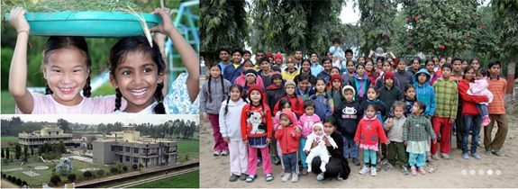

Sri Ram Ashram, (literally “home” in Hindi), is located in the northern state of Uttaranchal, on 16 acres of rural farmland near the town of Haridwar. The Ashram, founded in 1984, was inspired by Baba Hari Dass. To learn more about this wonderful home for abandoned and destitute children, visit their [website](http://sriramfoundation.org/).
Supporting Sri Ram Ashram is a way of showing our appreciation for the many gifts of teaching that Baba Hari Dass has given us.
**It may not be too late to make a tax deductible donation for the tax year if dated by December 31.**
In order to receive a receipt for tax purposes in Canada, donations to Sri Ram Ashram may be made through:
**Ram Yoga
6479 CONC.2 RR3
STN. MAIN
Stouffville, ON
L4A 7X4**
http://donate2charities.ca/en/RAM.YOGA.CENTRE.\_.0\_888783461RR0001
