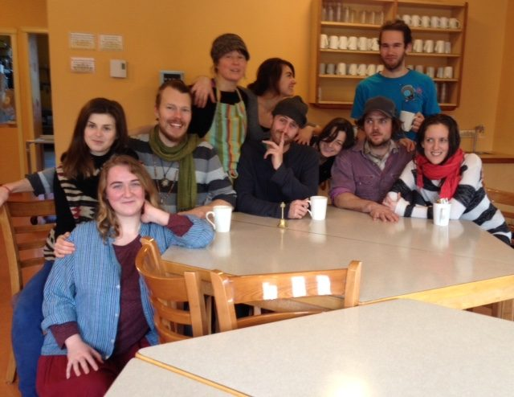

 Some of our winter resident community
The opportunity to live in a spiritual community is a great blessing. It is also an opportunity to learn about yourself, what is important to you, and how to live with other people. Many years ago, when Dharma Sara Satsang Society purchased this land that came to be known as the Salt Spring Centre of Yoga, Babaji instructed us to create a place where people could come and experience peace.
*Human beings are tribal by nature. They know for their survival they have to be supported by each other, so like-minded people get together and make their own tribe. The tribe creates rules and a community is formed.*
I recently interviewed several of the Centre’s current winter community karma yogis, asking these questions:
What is important to you about being here at this time?
What is your focus?
What are you learning?
Whatever your living situation, I encourage you to reflect on these questions.

### The importance of spiritual community

*A sense of family is established by working, playing and eating together.*
*In the community, the main rules are to establish a sense of family, partnership, support and selfless service. The spirit of the community is rooted in selfless service.*
*To serve others with no selfish motive is sacrifice. To give what others need with no strings attached is charity. To live a disciplined life is austerity. Sacrifice, charity and austerity together in action is called Karma Yoga.*
Mark: The Centre is like a beacon to the greater community on Salt Spring. Being here on the land clears my head of negative thoughts. There’s a quiet peacefulness.
Kyle: This is a beautiful place to solidify my practice.
Dee: All these years I’ve been looking in all the wrong places. I’ve been seeking something all my life, but didn’t know what it was.
Raven: What’s important  is the possibility to engage at every level in the light of Babaji’s teaching, to receive support for the ever-deeper inquiry, and to contribute meaningfully in supporting others in these endeavours.
Tana: I’m part First Nations, and the tribal model is really important to me. I’m more content here than I’ve ever felt in my life.
Shawn: I want to give  back to a community that’s given me a lot in my life. I’m looking forward to doing karma yoga, to give back to Babaji.
Blair: I’m developing a sense of community, strengthening relationships with the resident community and the extended community on Salt Spring and elsewhere. In this beautiful place of community, there’s not much more we need in life.

### Supporting each other and the community

*Each member of the community is supported by the community physically, psychologically and emotionally. Everyone works for the good of the community, and the community works for the good of everyone.*
Mark: I feel part of something bigger than myself. I’m away part of every week, and it’s so heartwarming every time I come back, knowing there’s a place for me.
Blair:  My aim is to help find sustainable and comfortable means to help support this beautiful centre in creative ways with heartfelt intention.
Kyle: In response to the question, “What are you learning”: What am I not learning? There have been people I’ve not gotten along with in different situations. Here I’m learning how to navigate, learning how others think. Everyone is willing to talk and work together to build healthy relationships
Blair: A big part of what’s important to me now is learning the kirtans and Sanskrit pronunciation.
Mark: I love the playful spirit. People share with each other, and the honesty with which people share so deeply about their challenges in life is refreshing to hear. It helps me embrace my own struggles.

### Support for sadhana

*Purity in thought, purity in speech, and purity in action bring divine presence in the heart.*
*Do your sadhana every day and be happy.*
Dee: My personal practice is figuring out who I am in my heart. This is  all new to me. Everyone here is helping me figure out what matters; I don’t have to go anywhere else to seek the truth. It’s all within me.
Kyle: I’m focused on karma yoga, meditation, seeing what’s going to work for me long term -  pranayama, asana, meditation.
Mark: Kirtan is amazing! I love it!
Tana: Everything relates to practice. I’m learning equanimity. I was introduced to that by the practices, from the elders here. This community needs elders and youth.
David: Winter is part of a complete cycle, extraversion to introversion, loud to quiet.
This time of year offers an opportunity for reflection.  This applies in my life and the season - bringing balance to my life. I’m learning that quiet, silent, introspection, patience, and  inner awareness through spending time alone is valuable for growth. In that space I find stronger dedication to daily practice. Taking that time for myself encourages and gives energy and momentum to regular sadhana.

### Reflections by Piet, our Centre manager, about life at the Centre at this time

This time at the Centre is very special. We are in a time that I consider to be the tip of the second wave of energy and devotion to this place and this mission. Succession is happening, and energy is building, part of the natural process and cycle. I try to keep my mind tuned to the 30 years that came before and the 30 years that lie ahead, and find myself here at this time. This is the best time in my life to be fully here again, and I am finding that all my training in life and career are put to use in my current role.
My focus is on community - not just the residents here at the Centre, but also the satsang on Salt Spring Island and beyond. It extends out to those only reachable by the internet and those we have not yet met. My focus is on how we strengthen the connections that already exist, making them more open, caring and giving, as well as cultivating those relationships that are beginning to show themselves. My focus is also on what we do here and how we fit into the world around us, to live in harmonious relation with it.
I’m learning a lot about myself, how I think and move and how my actions affect the community. I am learning so many lessons every day, in every moment, that it is hard to quantify. I am learning what it takes to be in this role and what is needed from me - and there is so much more to learn.
I am also learning how to have a deeper connection with the natural elements around us that provide for us and offer us so much just by their very existence. I have been in cities for a long while, and though I’ve returned here every summer, I have not lived within so much natural abundance for quite some time. I am very grateful to be here now.
*Work honestly**Meditate every day**Meet people without fear**And play.*
 
contributed by Sharada, with gratitude to Babaji
quotes in italics from writings by Babaji

---

Sharada Filkow, a student of classical ashtanga yoga since the early 70s, is one of the founding members of the Salt Spring Centre of Yoga, where she has lived for many years, serving as a karma yogi, teacher and mentor.
