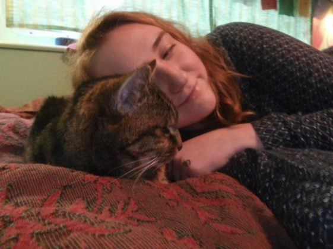
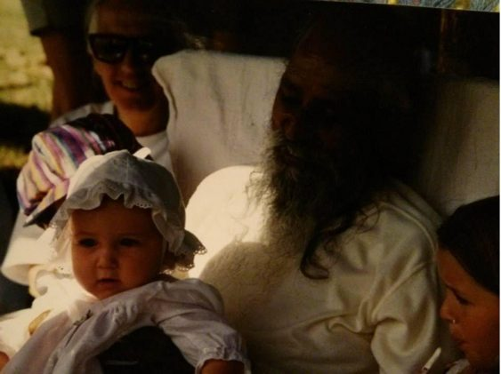
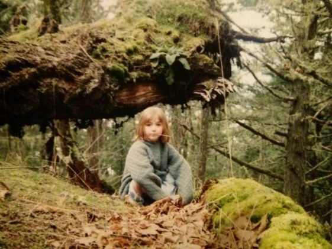
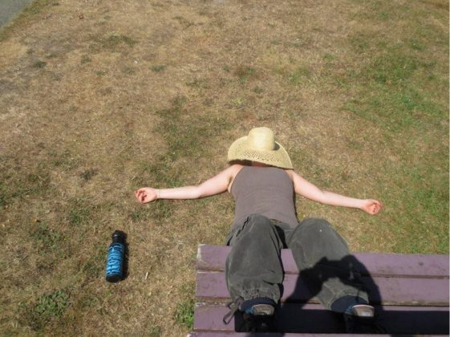
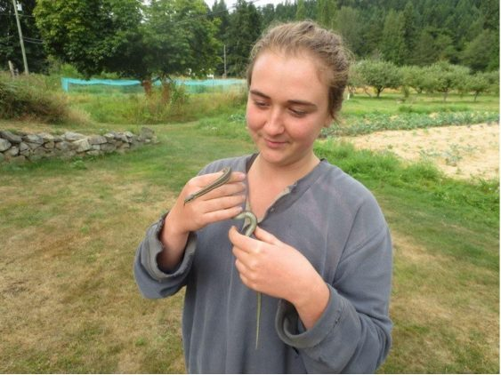

 Present day 24 year old Arpita with Pussywillow in the motorhome on the Centre soccer field
I don’t remember a time in my life when I didn’t love Babaji, because I was born into the Satsang. My parents, Padma Diana and Purna Doug, met at the Centre sometime in the 80’s, and I came into the picture in 1991. As a child I didn’t think about Babaji’s role as a Guru, but his presence was deeply comforting for me. I could feel the wisdom he brought to the community, and the love. He felt more like a grandfather than a teacher, and I thought of him as part of my family.
 Baby Arpita being held by Babaji
I remember when Babaji would give candy to me and the other kids. I was one of the shy ones, and I remember him sometimes holding onto the candy and playing tug-of-war with me, maybe to help me break out of shyness. I remember once when he did that I cried because I was so shy. I loved him very much, but was also afraid of him. I could sense how deeply he witnessed me, and though I longed to be witnessed completely, I was also afraid. Even at such a young age, he was working with me on unraveling ego.
We lived in Seattle until I was 4 and then moved to SSI for a few years. I went to the SSC school and made mischief on the land with Sarah and Ceilidh. I have always looked back on those times as being the happiest and freest of my life.
 5 or 6 year old Arpita out on a hike with her dad on Salt Spring
When I was six in 1998, we moved to Texas and I went through the school system there. I missed Salt Spring and Babaji very much and cried a lot for years. Although we were apart from the satsang, I always felt connected inside. We would occasionally receive updates about the changing lives of satsang members and the Centre, and mom would teach weekly classes out of a big beautiful room in our house.
In my teens, mom started teaching at a studio called Yoga Yoga in Austin, and started inviting me and dad to go to the classes. I had entered the angst of teenage-hood at that point and refused to go, although I always held a feeling of faith and devotion in my heart, knowing that one day I would start doing yoga myself.
When my parents divorced, I was filled with grief, confusion and anger, and was having a lot of trouble staying focused in school and feeling well in myself. Mom suggested that I start doing yoga and dad bought me an unlimited class pass to the yoga studio in our neighborhood. During my last year in Texas, I enjoyed a healing ritual of driving to the studio after school and practicing asana under the guidance of wise, loving teachers.
When I was 17 in 2009 I moved to Niagara Falls to live with my mom and grandmother. Grandma Sadie was dying that summer, and mom didn’t want me to witness that for some reason. She asked me if I would like to go to the Centre to take YTT. I had already known for a while that I wanted to teach yoga one day, but I hadn’t dared to hope that it would happen so soon. I said of course I wanted to! Dad generously paid, and mom shipped me off a few days later.
I had visited the Centre for one family retreat when I was 11 or 12, but it felt like a very long time ago. I stepped onto the land and felt like I had finally come home. Seeing all the old satsang members who were like aunts and uncles was nourishing and healing after having been away for so long. YTT was very intense since my practice and I were both so young. But I opened and learned as much as I was able to, and by the end I felt like a sponge that had been joyfully squeezed out and filled back up again with sweet, bright nectar.
I co-taught with mom in Niagara Falls during my last year of high school, and taught on and off during my gap year before university. At Quest University I taught weekly and sometimes more, to my peers and even to my university tutors. Teaching my peers was helpful for me in building confidence, and I started to find my own rhythm and voice in teaching, and to love it more and more.
For the last few years I have been attending Quest University Canada in Squamish, studying the question, “What is the role of embodiment in healing from trauma?” And also, “What is the role of embodiment in spirituality?” These studies have informed my understanding of yoga and my teaching, and also been informed by yoga philosophy.
In 2013 I took a Women’s YTT with Sara Avant Stover. I learned about the different forms of practice that are best for women during different phases of the menstrual cycle, pelvic floor health for women pre- and post-pregnancy, prenatal and post-natal yoga, as well as women’s circling and female leadership.
I spent the last few summers on Hornby Island, living on a small meditation retreat centre called Deerheart Sanctuary. I lived in the woods, mostly in solitude, doing my practice in the quiet, beautiful yurt by the creek. The women who started Deerheart, Michelle St. Pierre, became a spiritual teacher to me. Her love, stillness, intense presence, and embodiment of womanly grace, fierceness, love, and wise sensuality inspired and changed me deeply. She also introduced me to Adyashanti (via audio-tape), who continues to be a potent spiritual teacher for me. Michelle passed away in 2014, and I am still grieving her passing. I could have learned so much more from her had she stayed alive longer. Now the Centre is run by my dear friend, Kira Anderson, and I know that she will give blessings of love, stillness, safety and wisdom to everyone who goes there.
I have learned things from lots of different people from different systems of thought and practice, and each one has been important on my path. Babaji, though, will always be my first teacher, my spiritual grandfather, the father of this sacred, beautiful community. In 2012 I went to MMC with mom for New Years and got to see Babaji for the first time as an adult. He gave me some big truth bombs in answer to some of my questions, one of them being to encourage me to punch a young man who was bullying me at university! I never did punch him, but his advice has continued to percolate through my consciousness as a reminder to stick to what I know is true and important, and speak up about it with courage.
When I was 4 or 5 I asked Babaji for a Sanskrit name and he gave me the name Arpita, which he translated as “servant to others.” I loved it. It felt beautiful and powerful. I soon forgot it, but occasionally asked to be reminded until I could remember it myself. When I took YTT I started going by Arpita. The shift was indeed beautiful and powerful. I felt seen and respected in a way I hadn’t before, and that feeling helped me to heal and move on from some habits and self-perceptions I had picked up that were harming me. I went by Arpita full time for 6 years. When I went to India in 2014, I was getting a lot of attention for being white with an Indian name, so I decided to go by Jessy again for a while. I found that there were some parts of me I had disowned during the name change, so it felt good to embrace them again. Now that I’m back at the Centre, I’m going by Arpita again, while feeling like both names are my names whenever I want to use them. Arpita, though, is the name of my heart.
 That year I was on maintenance
I stayed at the Centre as a KY during the summers of 2009 (in between the two YTT blocks), 2010, 2011, and 2012. I worked mostly in housekeeping, with the occasional dish and kitchen shift, and failed wildly one year in maintenance. This year, 2015, is my first winter here, and I am enjoying working in housekeeping and scanning old Babaji Q&A’s into the computer system. I am overjoyed to be living in this loving, bright, silly, supportive community in my motorhome with my elderly cat, Pussywillow. Thank you, Babaji, for bringing these blessings into my life.
 Found a snake in the garden while on mauna in 2012
Jai Babaji!
Arpita
