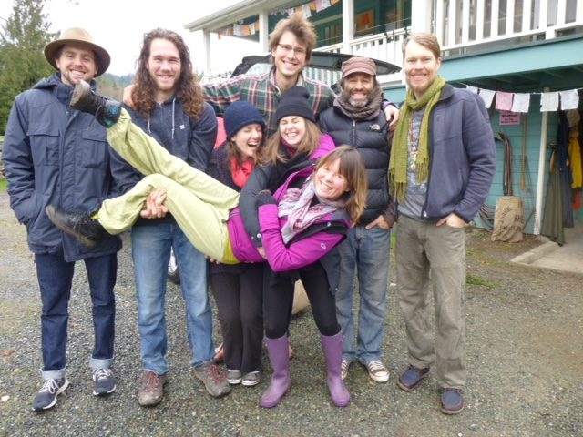

Happy 2016, everyone - another new beginning, another opportunity to re-dedicate our lives to what matters most. So many major world events have happened in this past year, life continues to unfold, and here we are.
Currently many people in our satsang family, including most of the Centre resident community, are at Mount Madonna Centre, our sister centre in California, to bring in the new year at the Annual New Year’s Retreat. On the third of January, the Centre office will reopen. Meanwhile, life is relatively quiet here. Winter solstice has passed, and slowly the days will lengthen and the light will return.
 Cars packed, heading to the ferry on the way to Mount Madonna.  
 Top row: Brendan, Kyle, Brandon, Raven, Blair. Bottom row: Marianne, Cailin, Tana
Please keep checking our website for upcoming events and postings because it won’t be long before the Centre is in full swing and programs will resume. Satsang continues throughout the winter, so come sing with us!

### Donations for Sri Ram Ashram

One of the many projects inspired by Baba Hari Dass is [Sri Ram Ashram](http://www.sriramfoundation.org/), a home for orphaned and destitute children near Haridwar in India. You may make tax deductible donations to Sri Ram Ashram through Ram Yoga. [Click here for details](https://saltspringcentre.com/2016/01/donations-for-sri-ram-ashram/).

### New book by Babaji

For those of you who have been waiting for another book by Babaji, here is some exciting news. The third volume of Srimad Bhagavad Gita (chapters 13-18) has been published and we will have copies soon. Meanwhile I hope many of you have been enjoying the first item in our digital store - the [kirtan album](http://saltspringcentreofyoga.bandcamp.com/releases) recorded at the 2014 ACYR. If you haven’t yet seen it, do check it out on our website.

### In this month's newsletter

This month’s asana article - [Setu Bandha Sarvangasana](https://saltspringcentre.com/2016/01/asana-of-the-month-setu-bandha-sarvanagasana/), also known as bridge pose, is by Marianne Butler, who has served as our programs coordinator for the past year. She also teaches regular yoga classes at the Centre. She notes that this pose boosts the immune system and lowers stress levels; who doesn’t need that?
Arpita Jessy Rose shares [the story of her connection to Babaji](http://Our Centre Community: Arpita Jessy Rose) [and the Centre](http://Our Centre Community: Arpita Jessy Rose) in ‘Our Centre Community’. Arpita was born into the satsang family, did YTT here when she was only 17 (our youngest YTT graduate ever), has served as a karma yogi here several times and is currently living at the Centre till the spring.
[Joseph Ramesh Pallant](https://saltspringcentre.com/2015/08/our-centre-community-joseph-ramesh-pallant/), another member of our satsang community who has been active in environmental issues for many years, recently returned from the Paris climate talks. In this issue he shares with us his observations and reflections in ‘[Paris, Climate Change and the Bhagavad Gita](https://saltspringcentre.com/2016/01/paris-climate-change-and-the-bhagavad-gita/)’.
‘[Life at the Centre](https://saltspringcentre.com/2016/01/life-at-the-centre/)’ introduces you to many of our karma yogis, all of whom have answered the questions: What is important to you about being here at this time? What is your focus? and What are you learning? Although readers of this newsletter may not live in a spiritual community, these questions are useful for all of us to consider as we consider the choices we make in our own lives.
May 2016 be a year of abundance and peace for all.
*Wish you happy.*
Love,
Sharada
