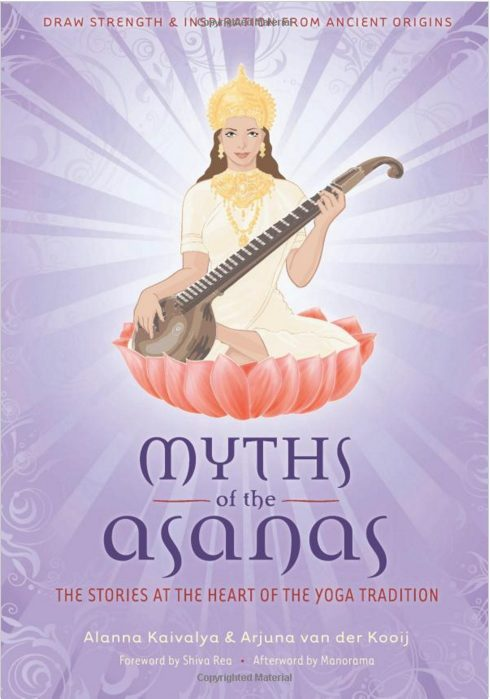
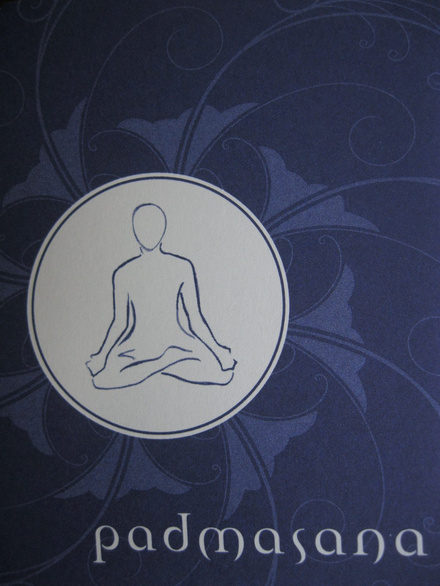
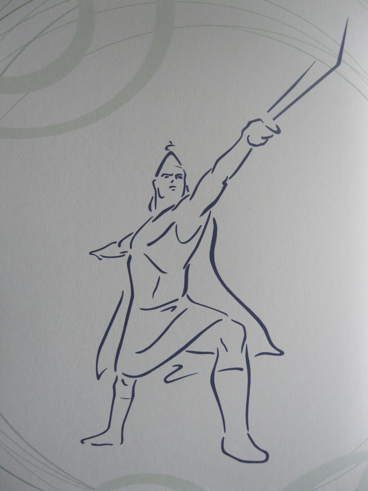
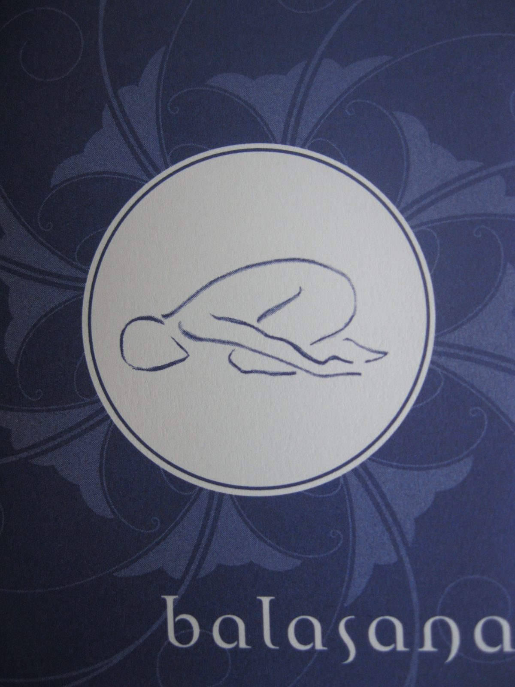

# Myths of the Asanas

## The Stories at the Heart of the Yoga Tradition Written by Alanna Kaivalya and Arjuna van der Kooij

### Book review by Kenzie Pattillo

*"Yogic myth has a genius to clothe the infinite in human form."* Eknath Easwaran

The authors of 'Myths of the Asanas', Alanna Kaivalya and Arjuna van der Kooij, use the asanas (yoga postures) as a means of turning us towards the true goal of yoga by way of myth and metaphor. "The myths point to a higher state of consciousness. They depict the travel of the soul from ignorance to illumination. Their goal is to take us from the illusions of our ego centred existence (samsara) to the reality of liberated existence…" Especially in the West, where yoga is offered as primarily a physical practice, this book shows that a closer look at the poses themselves offer a means of moving the practitioner closer to truth. As Manorama so eloquently writes in the epilogue,
> "Myths of the Asanas' offers the reader an opportunity to journey into this metaphoric link that exists between the yoga pose and its myths. When one engages an asana, one can explore not only the literal pose but also the depth contained in a pose's story. This fluid linking between the ancient and the modern gives the student of yoga both a window into the profound yogic path as well as a manageable lesson to practice with."

Because I bought the book with the intention of applying its contents to my teaching, I was briefly disappointed to find a lot of the poses offered are quite advanced. I teach mostly beginner and multi-level classes and many of these poses I will not have opportunity to teach. But what I have found is that even the most unattainable, pretzel-like poses are based soundly in truth that can be applied to other, more attainable ones. For example Padmasana (lotus pose) is not easily achieved by many yogis but by reading about the lotus growing from Vishnu's navel opening  to reveal the sound of 'Om' thus causing the creation of the universe, one can realize it's not just about the pose. Onward the text reveals the metaphorical significance of the lotus flower and brings it full circle back to the posture as a seat for meditation and ultimately enlightenment by way of the term 'avidya' and Patanjali's yoga sutras.
> "The journey of this sacred flower reflects the journey of the yogi. We are rooted in the earth, absorbed by the endless cycle of births, deaths, sicknesses, tragedies, celebrations, bills, apartment leases, and family relations. The yogi knows this muck as the dirt of avidya, the great mistake of identifying ourselves with something other than our divine nature…The promise of yoga is that eventually, through enough nurturing and determination, we will surface above the water and realize our full potential."

This was just the first pose in the book! Every pose explored by the authors leads the reader from posture, through myth, into metaphor until the deep, profound intention behind the practice is once again revealed. Every pose exposes the potential for transformation of consciousness.
Sometimes the myths themselves seem rather inexplicable, yet Kaivalya and Kooij manage to elevate them. For example, the myth attached to the warrior poses (Virabhadrasana) is shown to be about our own struggle against our reactive mind and how to maintain an uplifted outlook (chitta pranadam) by introducing yoga sutra 1.33,
> "In order to preserve an elevated state of mind, be happy for those that are happy, cultivate compassion for those that are sad, feel delight for those deemed to be lucky (virtuous or righteous), and experience indifference to those perceived to be wicked."

Sure, Shiva sent Virabhadra to cut off his father-in-law's head when his wife Sati appeared to instantaneously combust. But he made it right: he replaced Daksha's head with a goat's head…(?) Apparently even god's make somewhat questionable decisions sometimes.
> "It is not easy being a warrior, especially one who is constantly fighting against a reactive mind…Warrior poses are a reminder that ferocity exists not only to destroy but also to allow us sufficient strength to achieve integrity, compassions, and a loving state of mind."

'Myths of the Asanas' offers explanations to many Sanskrit terms I've come across in my yoga studies, yet by reading this book I feel they've finally sunk in. Terms like abhinivesha, avidya, chitta pranadam, dristhi, guna, guru, isvara pranadana, jivanmukta, karma,  lila, maya, nadam, namaste, om, sadhana, sadhu, samasara, Shraddha, siddhis, and yoga nidra (just to name a few) are all introduced and explained seamlessly and effectively.  I actually hoped there was a glossary of terms at the end of this book so I could test myself! Coupled with an index, this could be an excellent textbook and a very effective approach to teaching yoga philosophy and history at a teacher training.
Kaivalya and Kooij are concise and not effusive in introducing ancient yogic texts from which many of the myths originate or the metaphors are expounded. The Bhagavad Gita, Ramayana, Yoga Sutras, Mahabharata, Hatha Yoga Pradipika, and the Vedas are all contextualized within yoga's long history. I imagine a reader new to yoga could feel well informed and satiated while gently encouraged to explore these background texts when they feel ready. I was surprised that there wasn't a bibliography at the book's end referencing particular translations of these ancient texts. A great translation can make all the difference and obviously a lot of research went into the writing of this book.
I'm still contemplating how and when to share the bounty within these pages when I teach. For my beginner students, there is time within class to explain the significance of Anjali mudra, Namaste, 'Om' and Savasana as they are consistent parts of a yoga class that might seem inexplicable to those unfamiliar with yoga.  The more physically accessible poses such as Balasana (child pose), Tadasana (mountain), Gomukhasana (cow's face), and Dandasana (staff pose), could allow for some deeper explorations, as they are often held for more than five breaths.
I feel strongly that 'Myths of the Asanas' could be very valuable to both yoga practitioners and teachers, and all lovers of myth and metaphor. This book acts as an accessible guidebook, graciously offering to lead the reader from the physical realm of asana to the infinite realm of truth. Alanna Kaivalya and Arjuna van der Kooij have created an exceptional and unprecedented contribution to the contemporary study and practice of yoga.
--
 
**
Kenzie Pattillo** completed her 200 hour YTT at Salt Spring Centre of Yoga in 2002. She is a householder yogi/mama living in North Vancouver, B.C. and presently teaches yin, hatha and flow yoga in her community. En route to completing her 500 hour YTT designation she has recently begun practicing one on one restorative therapeutics.
