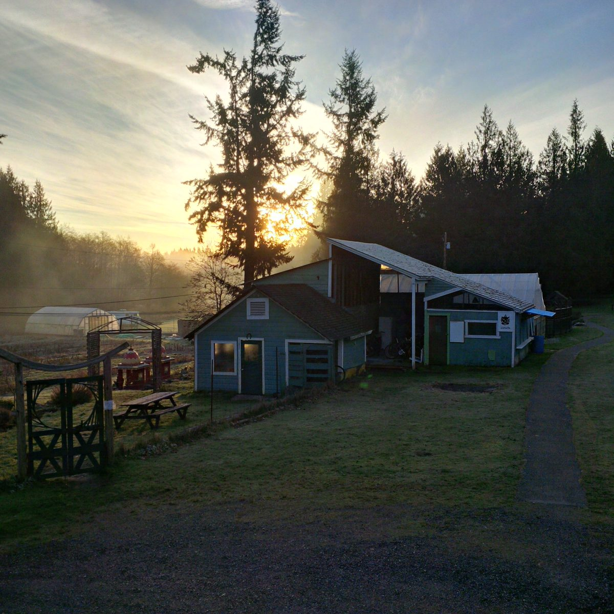
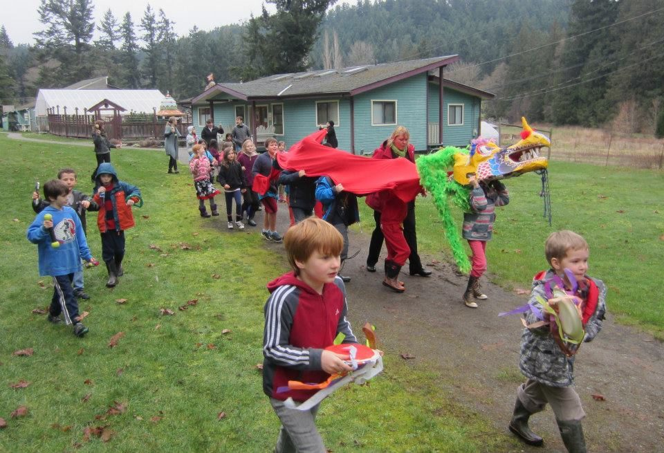

Hello everyone,
I hope you’re enjoying the winter season, wherever you are. On Salt Spring Island, although it’s still winter, signs of spring are in the air - or at least in the ground. In some places on the island crocuses are beginning to bloom and trees are beginning to bud. We know it’s just the beginning of February, winter is not yet over and we could still get more cold weather, but the seasons are turning and the light is returning.
There is plenty of light at the Centre. In addition to the ongoing yoga classes, Wednesday evening kirtan and Sunday satsang, full moon yajnas each month ([check the calendar for dates](https://saltspringcentre.com/calendar/)), the resident karma yogis are studying the Yoga Sutras with Chandra and Nonviolent Communication with Sharada.
[caption id="attachment\_13003" align="aligncenter" width="576"] Karma Yogis, from l-r: Raven, Kishori & Cailin, Arpita, Tana & SN, David.[/caption]
There will be a few new people joining us this month in various roles: Jules and Brianne in the office in the roles of office manager and operations manager, Amy as Yoga Service and Study Immersion (YSSI) coordinator, and others coming soon for the maintenance and farm departments. We are excited to welcome these new community members.
Applications are coming in for the 3 month [Yoga, Service and Study Immersion](https://saltspringcentre.com/yoga-service-and-study/). If you or someone you know is interested in the opportunity to live in a yoga community for the summer, please check the website for details.
The Centre’s [Yoga Teacher Training](https://saltspringcentre.com/yoga-teacher-training/) (YTT) is coming up later in the summer. There are many YTT programs available, but very few residential programs with a faculty experienced teachers focusing on all aspects of yoga.
A new program being offered next month is the [Ayurveda Spring Cleanse Weekend](https://saltspringcentre.com/retreats-programs/ayurvedaweekend/) on March 18-20, taught by Dr. Manjiri Nadkarni, assisted by Girija Edwards and Rajani Rock, both Ayurvedic practitioners. This is a perfect opportunity to study Ayurveda, the ancient system of healing from India, and apply it directly to your life.
[caption id="attachment\_13005" align="aligncenter" width="575"] Annual dragon parade at the Centre School[/caption]
The Centre School will celebrate the Lunar New Year on Tuesday, February 9, beginning as always with a dragon parade accompanied by many children with various noisemakers. For more information about what’s going on at the school, check the [Salt Spring Centre School](http://saltspringcentreschool.ca/) website.

### This Month's Newsletter Offerings

As always there are several interesting articles to read. This month [Ishi Dinim shares the story of his connection to the Centre](https://saltspringcentre.com/2016/01/our-centre-community-ishi-dinim/) from 1998 to now. If you were at ACYR last summer, especially if you were here with your children, you would have enjoyed seeing all the kids so happy with the kids’ meals prepared by Ishi and Catherine. I saw a few adults enjoying it, too.
Kenzie shares another inspiring book review this month, [Myths of the Asanas](https://saltspringcentre.com/2016/01/book-review-myths-of-the-asana/) by Alana Kaivalya and Arjuna van der Kooij. The book links the asanas (postures) that so many people are familiar with to ancient myths from India, and draws us from the physical practice of asana to yoga’s deeper meaning through myth and metaphor.
We have been very fortunate to have met and been inspired by Baba Hari Dass. Babaji has made it clear over the years that it’s not the physical presence of the teacher but the teachings and the practice that matter. I invite you to read [The Role of the Teacher, The Role of the Student](https://saltspringcentre.com/2016/01/the-role-of-the-teacher-the-role-of-the-student/). We have been given the gift of this ancient wisdom. It’s up to us to do our part.
*Guru is one who is higher in knowledge
and capable of transmitting that knowledge
by words, action, or just by being.
But the real guru is the pure consciousness
that dwells in the heart of everyone.*
Love,
Sharada
