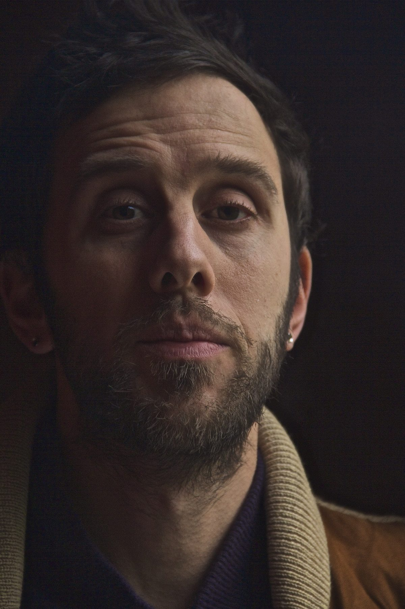
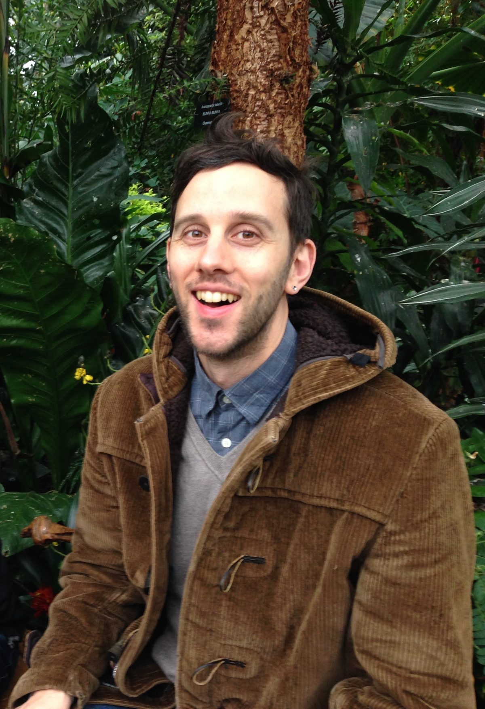
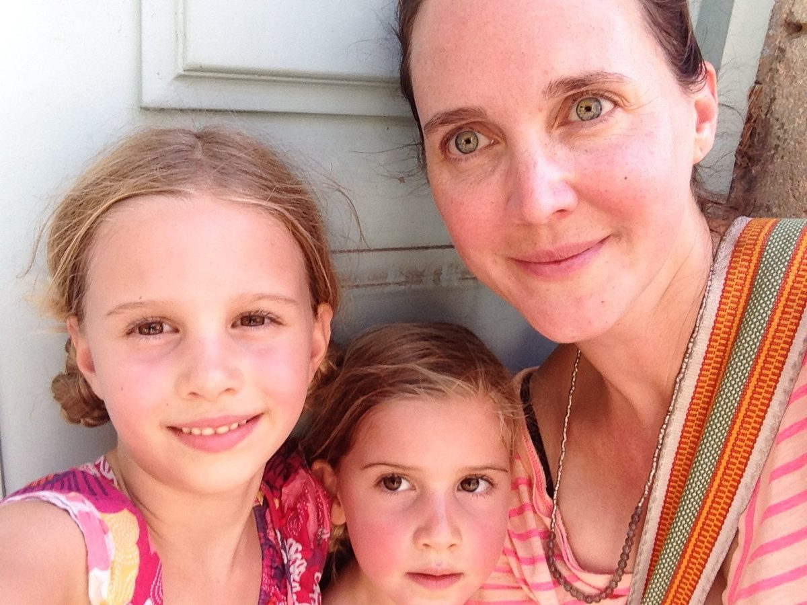
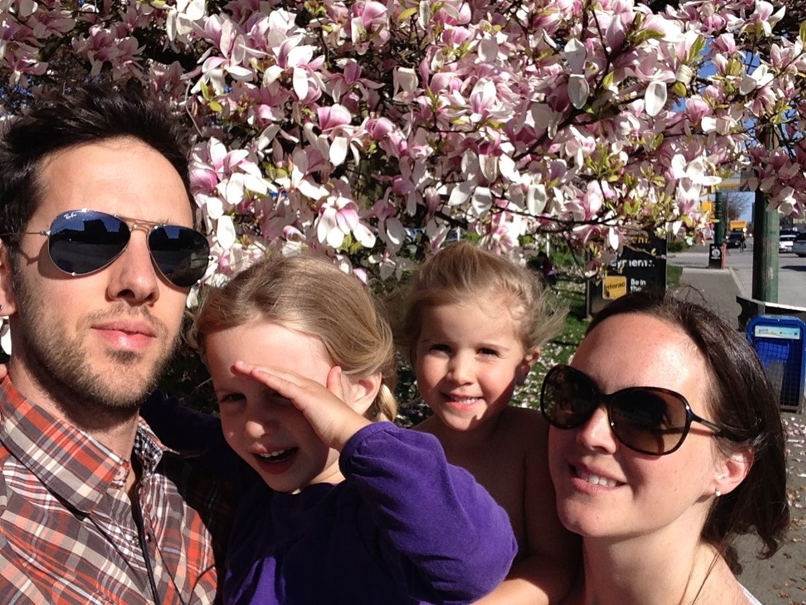

 Ishi Dinim, part of our Centre Community
My name is Ishi Dinim. Baba Hari Dass gave me the Sanskrit name Ishan. I was first introduced to the Salt Spring Centre of Yoga in the summer of 1998, by my then partner Maya Suess, a lifelong member of the community. We were immersed in a three month Karma Yoga experience which was part of a government exchange program - community service for university tuition. I was attending Emily Carr University fulfilling my photography degree and striving to learn how to survive as a creative person. 
This was such an exciting time to be introduced to the Centre’s unique intentional communal living style. The routine and preparation before the yoga retreat was a great time to learn how the Centre functioned and to build relationships with the characters living in and around the land while gardening, cooking, building, playing, practicing, swimming, talking and learning. The transition from the smallness of pre-retreat time to having hundreds of new people joining us on the land was energizing. The influx of new personalities allowed for new friendships - and the occasional conflict.
Meeting Babaji for the first time there was definitely a cosmic zap. I was instantly drawn to his wisdom, playfulness and calm strength. As I look back to my twenty year old self I’m reminded how impactful and profound getting to spend those formative years being introduced to Baba Hari Dass’ teachings, and having the privilege to meet and work with him, has been to my development as a person. As a very skeptical young man I was wary of having a guru; I’d heard of so many negative stories of guru worship gone wrong. Being surrounded by well-intentioned spiritual seekers every day created a safe environment to delve into yoga philosophy and practice. I never felt pressure or expectation to accept Babaji’s teachings or be somewhere on a “path”.
When my partnership ended with Maya, after a couple years, I was despondent about what would happen to my connection to Babaji and the SSYC community. As much as I felt accepted and a strong desire to continue learning there, I was torn by feelings that it wasn’t “my” place. I pushed past my uncertainty and realized that the generosity of spirit that thrives in the community is available for all comers, new and old.
There are too many people connected with my time at the Centre to name each person. Many have stopped coming or have passed away or are waiting to return. I don’t remember the names of all the folks I crossed paths with but I do cherish the memories we shared. Rock crew, kitchen adventures, basketball and volleyball, photographing, not-talking and talking a lot, Ramayana, so many dishes, rainbows, shooting stars, lake swims: I’m so lucky to be full of these memories.
 Ishi's family
As I remember it, I continued returning year after year, returning by myself, with family members, and eventually with Catherine, who is now my wife. Over time I felt that the culture was subtly shifting towards stricture and being too rulesy. This feeling combined with starting a new career in 2007 began a long drought in my attendance at the Salt Spring Centre, although I made a few visits down to the Mount Madonna Center during that time. 
My career as a film and television cameraperson consumed my life and conflicted with the timing of the retreat. I couldn’t rationalize prioritizing my life differently and I stayed away for what felt like a long time. I spent many years yearning to come back and “spiritually recharge” while I depleted myself on many different levels aiding in the production of meaningless entertainment. It took a lot of soul searching but when I finally decided to walk away from my camera career, it occurred to me that I would again have an opportunity to attend the retreat, amongst other new opportunities.
 Ishi and his family
In my absence I had gotten married, created two amazing daughters and experienced several of life’s transitions. It was 2014, the 40th anniversary retreat, and I told myself that if I couldn’t make it to that one then I probably never would. Catherine and I decided that we wanted to come back and see what we’d been missing and connect with whoever was there. Once again it was a good choice to push past my doubts and return to the centre. It has done my heart good to come back and rekindle my relationship with such a wonderful place and community. Returning to the centre as a grown-up with a family has been incredibly rewarding. Seeing the joy in my children's experience of this magical place and connecting and reconnecting with people is a real gift. Now, I again look forward to being a part of this vibrant community and helping it continue into the future. I’ve learned so much and I look forward to learning and sharing so much more.
