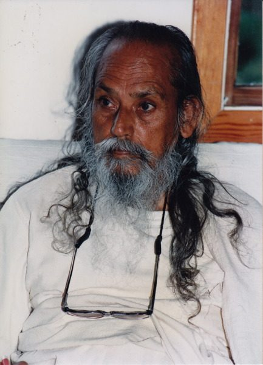

We have many teachers throughout our lives, beginning with our parents, even if they’re not particularly skilled at parenting. As children we begin to learn about life in the world, and based on our experiences with family, school, friends and the culture we live in, we develop ideas about what life is like. These ideas, which harden into beliefs, influence the way we navigate our way through the world.
A spiritual teacher teaches us not about the world, but about ourselves, about possibilities we had never considered, and ultimately how to free ourselves from our limited awareness. It’s a reverse process of learning to get out of the world we’ve created in our minds.
In the “spiritual marketplace” of the internet, there are many teachings available from many teachers. How do you choose? By all means, listen to the teachings and see if you feel an affinity for a particular teacher.
Babji writes that the relationship between student and spiritual teacher is *based on faith, trust and devotion. If you have faith in a person who is on the spiritual path, whose life is a model for you, whose teachings are acceptable to you, whom you can trust, and for whom you can feel devotion, that person is your spiritual teacher.*
People often ask, “Do I need a guru, a spiritual teacher?” Babaji says, *it’s not impossible to attain enlightenment without a teacher. Ramana Maharshi did it without a teacher. You can learn to drive without a teacher, but it’s wise to learn from a teacher and not take the risk of knocking the car here and there in the process of teaching yourself.*
*The aim of life is to attain peace. A guru or spiritual teacher teaches how to attain that peace. The guru teaches how to live in the world with truthfulness, with nonviolence, and with selfless service to others. The guru either presents these teachings in words or through the way they live their life.*
*The understanding of love, God, or nothingness can’t be taught by words, correspondence, or by reading books, just as sweetness can’t be described. A teacher or guru can only point toward a tree and say, “Look, there is a bird sitting on a branch. The guru’s duty is finished and the student’s duty begins. He or she tries to see the bird, moves his head up, down sideways, and sometimes asks, “Where is the bird?” The teacher again points a finger and says, “Look straight along my finger.” The student finally sees the bird. The act of seeing is within, and one only needs to use his or her vision in the right manner.*
Doing the practices the teacher has given us is our job. Babaji says *I can cook for you but I can’t eat for you.* In the video “One Track Heart”, Krishna Das talks about the practice of chanting the names of God. He says “It’s like anything else - you’ve got to do it. You don’t do it, nothing happens.”
Babaji makes that clear: *I don’t claim that i can give enlightenment. I say that anyone can attain it by their own effort. As long as we are not responsible for cleaning out our own garbage, we carry that garbage with us everywhere we go. No one is going to clean out our garbage for us; we have to do it ourselves.*
That’s our work. We are given the gift of the teachings and it’s our choice whether or not we do our homework.
Sogyal Rinpoche, in his book, “The Tibetan Book of Living and Dying”, writes about the guru.
“At the deepest and highest level, the master and the disciple are not and cannot be in any way separate, for the master’s task is to teach us to receive, without any obscuration of any kind, the clear message of our own inner teacher, and to bring us to realize the continual presence of this ultimate teacher within us.”
Babaji in his concise manner, says: *God, guru and Self are one.*
In striving to achieve peace, we have work to do:
*For the spiritual level - sadhana
For the household level - job, health, responsibility
For the social level - friendship, compassion, etc.*
 
*Work honestly**Meditate every day**Meet people without fear**And play.*
 
contributed by Sharada, with gratitude to Babaji
quotes in italics from writings by Babaji

---

Sharada Filkow, a student of classical ashtanga yoga since the early 70s, is one of the founding members of the Salt Spring Centre of Yoga, where she has lived for many years, serving as a karma yogi, teacher and mentor.
