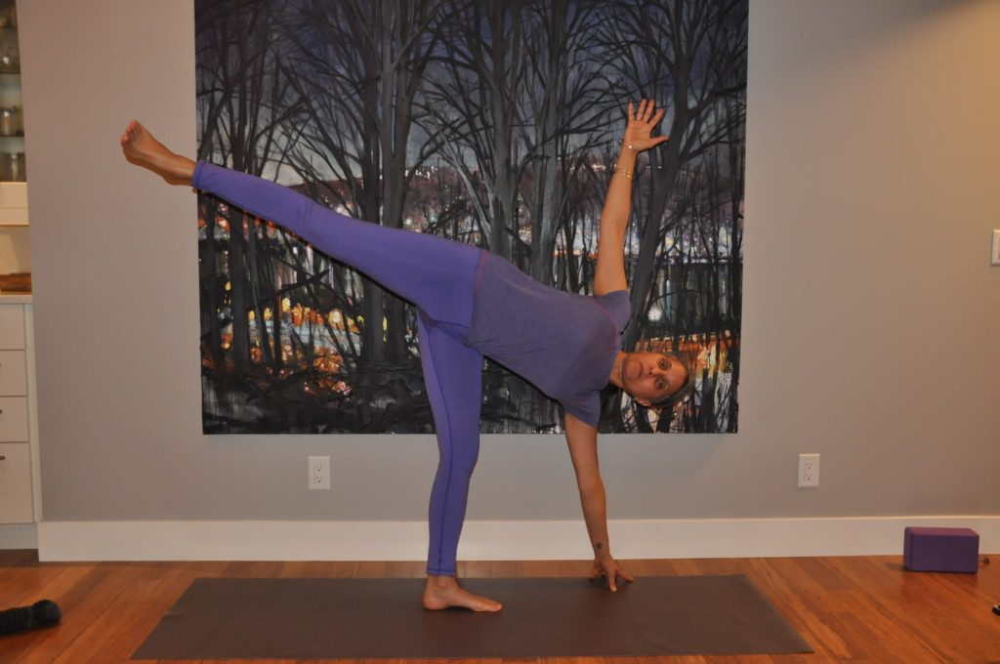
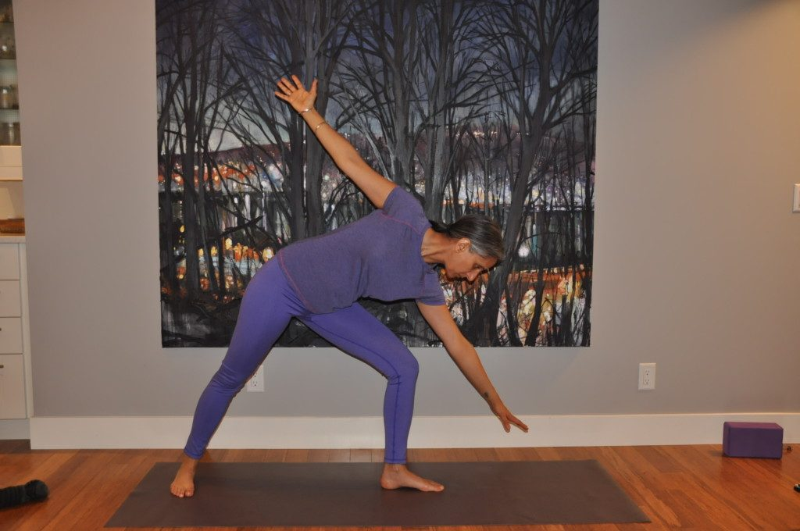
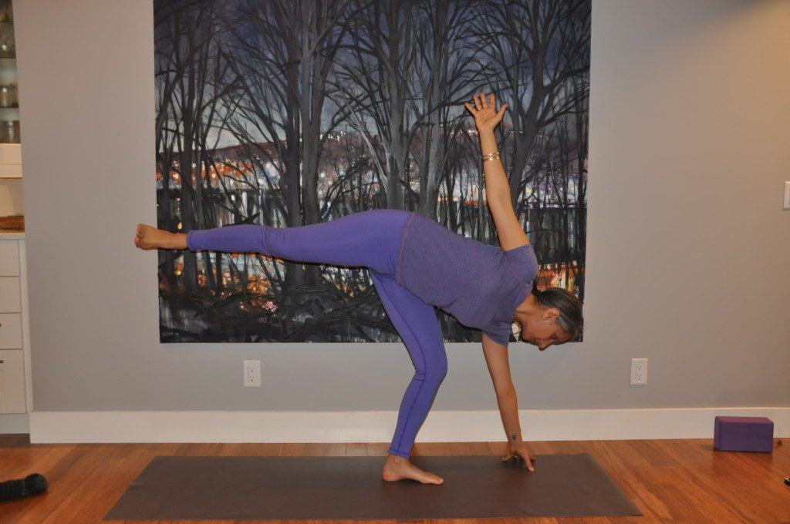

## Ardha Chandrasana Ardha: means half, Chandra: means moon

Ardha Chandrasana (Half Moon) pose helps improve balance and strength. It works on stretching the hamstring muscles as well as the front of the thighs, and it increases opening of the hip joints.
[caption id="attachment\_13171" align="aligncenter" width="575"] Preet demonstrates Half Moon Pose[/caption]

### THE POSE

Half Moon is usually sequenced somewhere in the middle of a standing pose series, usually after Extended Triangle (Utthita Trikonasana) because it flows naturally from this pose. It can also be practiced against a wall to help with balance.

### Moving from Extended Triangle

- From Extended Triangle on the right side, bend the right knee, until you are able to place your right fingertips on the mat, just to the right side of the toes. Keep your left arm extended.
  [caption id="attachment\_13169" align="aligncenter" width="575"] Transitioning from triangle pose[/caption]
- Establish the pose through the position of the front foot (right foot), ensuring that your right foot does not pull inward. Keeping your foot firmly planted in this position and keeping an external rotation in the thighs will provide stability in your hips.
- Once the fingertips of the right hand reach the mat, exhale and straighten your right leg while lifting your left leg, so it is horizontal to the floor.
  [caption id="attachment\_13170" align="aligncenter" width="575"] moving from triangle to half moon pose[/caption]
- Inhaling, slowly rotate your upper torso to the left, drawing the left shoulder back, keeping a lifted feeling in your heart. Feel the energetic connection between both extended arms.
- Keep the lifted leg (left leg) active and energized; it will provide you with increased stability in this pose. Be mindful to not lock the standing knee (right knee).
- Hold the pose for 5 breaths or longer.
  [caption id="attachment\_13171" align="aligncenter" width="575"] Half Moon Pose[/caption]
- Come out of the pose by stretching back with the top leg (left leg), as you bend the right knees. Allow the left leg to come to the mat back to where it started.
- You can move into extended triangle again, by straightening the front leg. Hold for a breath, then come up.
- When you feel complete, practice the pose on the other side.

### Against the Wall

- Balance is always tricky in this pose for beginners and a wall is a useful prop.
- Standing with your right hip against the wall, exhale and bend forward until your fingertips reach the mat. If you are unable to reach the floor, place a block in the right hand.
- Firmly pressing down through the right foot, inhale and extend the left leg straight back so it is horizontal to the floor.
- Exhale and move your left hand away from the ground and place it on your left hip. Inhale, slowly turn the upper torso and hip toward the wall behind you. Feel the support of the wall along your back.
- When you feel steady, extend the left arm up to the ceiling, gazing straight ahead. Breathe and feel the support of the wall behind you and the opening of the front body as you extend the arms.
- Keep the lifted leg active and be mindful to not to lock the knee of the standing leg.
- To come out of the pose, exhale and bring the left arm back to the left hip. Inhale and re-square the hips and bring the left leg back to the ground coming into forward fold. Inhale and lift the torso and come back up to standing.
- When you are ready, you can turn the left side of the body to the wall and practice Half Moon pose on the other side.

### MODIFICATIONS

- Using a block
- If the fingertips of your lower hand do not reach the mat in the completed pose, you can use a block to support your hand. Hold the block in the right hand as you move into the pose and place it on the floor to the right of your toes.
- Remember, the block has 3 sides, so adjust the height of the block edge that feels best for you. You might start with the block at its highest height and, if your balance is steady and comfortable, lower it down first to its middle height, then finally if possible to its lowest height.

### ADDING MORE CHALLENGE

**Bending the raised leg**
Once you are in the pose, bend the raised leg (left leg) and reach for the top of the foot with the left hand. Then lift through the chest, opening up the front body.
**Raising the lower hand**
Once you are in the pose, raise the lower hand away from the floor and rest it on the standing thigh. Balance solely on the standing leg for 15 to 30 seconds.

### CONTRAINDICATIONS

- Half moon is not recommended during menstruation, or when your balance is shaky when recovering from illness.
- For women who are over 5 months pregnant, this pose may be practiced with the back against the wall and with a block under the hand.
- If you have any neck problems, don't turn your head to look upward; continue looking straight ahead and keep both sides of the neck evenly long.

# About the Instructor

Preet works as an Urban Planner for the City of Surrey, and also teaches yoga part time from her home studio in White Rock. She did her yoga teacher training at the Salt Spring Centre, and teaches at some of the Yoga Getaway Weekends.
She finds yoga a perfect complement to her busy life. Preet focuses her teaching on the aspect of bringing present moment awareness into each asana, integrating mindfulness with the physical practice. Yoga has been part of her life since she was 9 years old.
*“The moon was up, painting the world silver, making things look just a little more alive.”*
― N.D. Wilson,
*“We ran as if to meet the moon.”*
― Robert Frost
