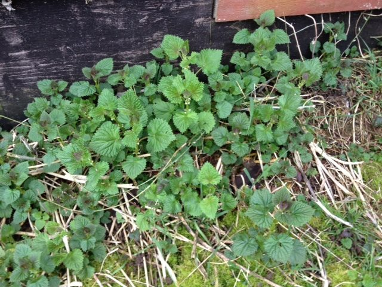
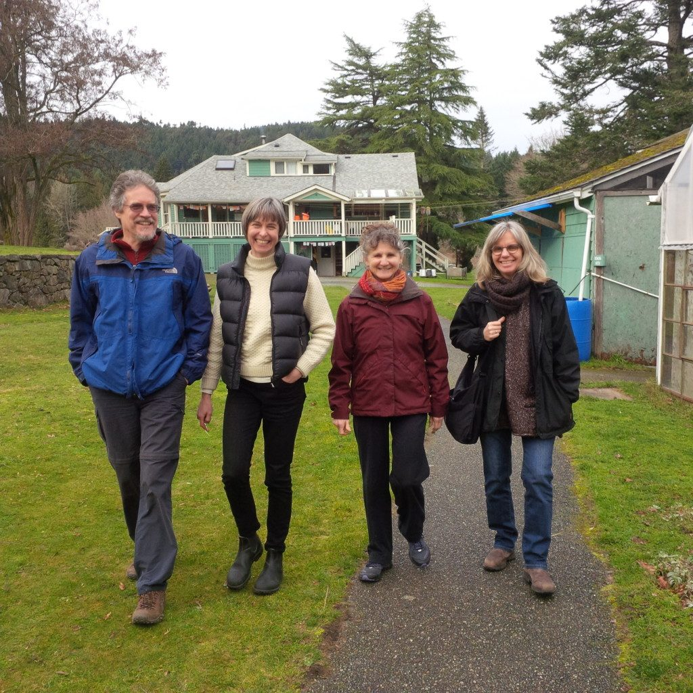
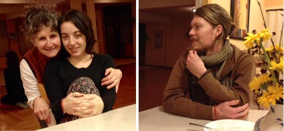
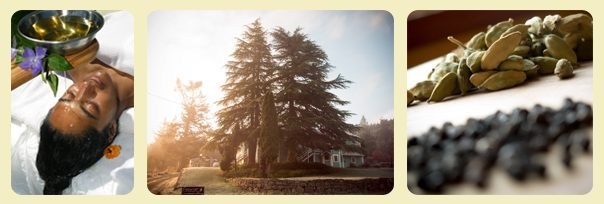

Hello everyone,
Spring! It’s March, the month that marks the official beginning of spring and the change back to daylight saving time. It is also the time of daffodils, nettles, budding trees, spring planting, Easter, and spring break for schools.
 Nettles. A sure sign of spring!
 OmPK, Julie, Rajani, Paramita
 Rajani, Natasha and Blair

## New and Upcoming Programs

We are excited to offer a new program this month - [Ayurvedic Spring Cleanse Weekend](https://saltspringcentre.com/retreats-programs/ayurvedaweekend/), March 18-20, a perfect opportunity to delve into the philosophy and practices of Ayurveda, the ancient Indian system of healing. This program will be taught by Dr. Manjiri Nadkarni, an Ayurvedic doctor from India. Please note that there will be a free introduction to Ayurveda at the Centre, presented by Dr. Nadkarni, at 7:00 pm on Thursday, March 17.
Check our website for other upcoming programs. [Yoga Teacher Training](https://saltspringcentre.com/yoga-teacher-training/) (YTT) is looking like it may to be pretty full this year, so if you’ve been considering signing up, this would be a good time to do it. Registrations have also begun coming in for our 42nd Annual Community Yoga Retreat (ACYR) July 28-Aug 6. It’s been such a big hit the last couple of years that people have been booking really early, before it’s even posted on our website.
Applications continue to come in for [Yoga Service and Study Immersion](https://saltspringcentre.com/yoga-service-and-study/) (YSSI), and interviews will begin soon. If you or someone you know would like to spend the three summer months living, studying and working in a practicing yoga community, this is the perfect program, and this is the perfect time to apply.

## Board News

The Dharma Sara Board has been looking forward. I’ve begun attending the monthly Board meetings because I’m energized and inspired by the big picture explorations along with practical on the ground plans. Younger board members bring new energy, supported by those who have been serving in this role for a long time. At the most recent Board meeting, Christine Torgrimson of the Salt Spring Nature Reserve made a presentation about possible ways for us to continue to protect our valuable wetlands. If you’d like to know more about what goes on at Board meeting, note that members have access the minutes. If you’re not yet a member and would like to be, you're invited to follow [this link](https://saltspringcentre.com/about/dharma-sara-satsang/) to join.

## New Kirtan Book and Album coming!

The kirtan book we published last summer continues to be well used every Wednesday and Sunday for kirtan and satsang as well as for spontaneous kirtan practice that happens quite regularly in the resident community. We are now about to publish a second edition, complete with diacritical marks and information about Sanskrit pronunciation. Both the first and second editions will be available for sale, the first edition at a reduced rate.
For kirtan fans, here’s another new item. Watch for our new Shiva Kirtan album, coming out soon! The hope is to have it ready before Shiva Ratri.

## In this Month's Newsletter

Arron Redford, who first spent time at the Centre 10-15 years ago [shares her story](https://saltspringcentre.com/2016/03/our-centre-community-aaron-redford/) in Our Centre Community. Two years ago, and again last year, she worked with Piet and Brian to pull the Ramayana revivals together in record time. At last year’s retreat, in a little role switch-up, she played the part of Ravana, the demon king.
Preet Heer, who did her yoga teacher training at the Centre about 12 years ago, volunteers to teach at Yoga Getaways when her busy schedule as an urban planner permits. Here she shares [Ardha Chandrasana, or Half Moon pose](https://saltspringcentre.com/2016/03/asana-of-the-month-half-moon-pose/), which helps improve balance and strength. This pose will stretch your hamstrings and the front of your thighs, at the same time opening your hip joints.
Shiva Ratri, the ‘Night of Shiva’, will take place this year on March 7-8. You can read more about this annual ritual and find the schedule [here](https://saltspringcentre.com/2016/02/shiva-ratri-2016/). Please read about the deeper meaning of Shiva Ratri in [Shiva Ratri: the Destruction of Ignorance](https://saltspringcentre.com/2016/03/shiva-ratri-destruction-of-ignorance/).
As we move back into the light of spring (in the northern hemisphere) and nature begins to blossom once more, may our hearts and minds also open and blossom.
Love,
Sharada
