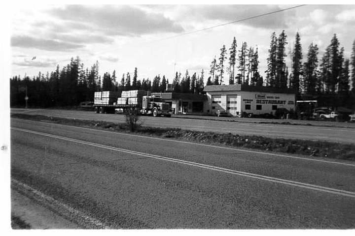
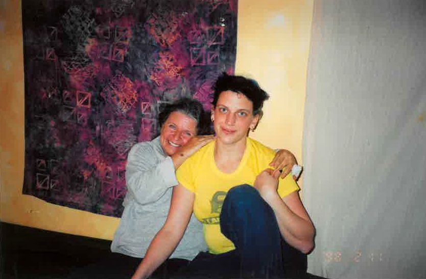
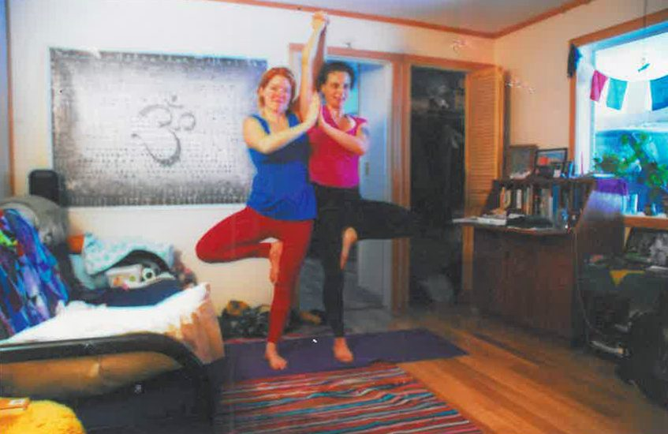
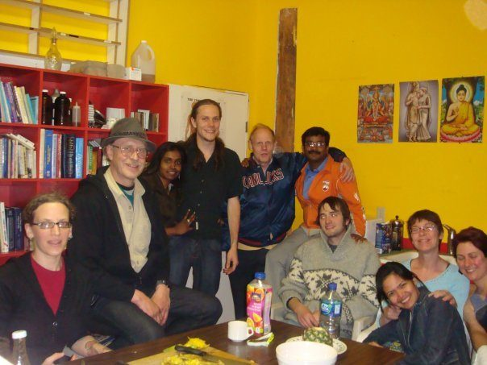
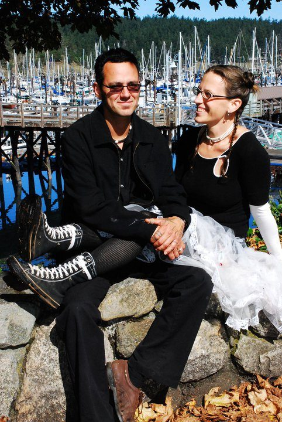
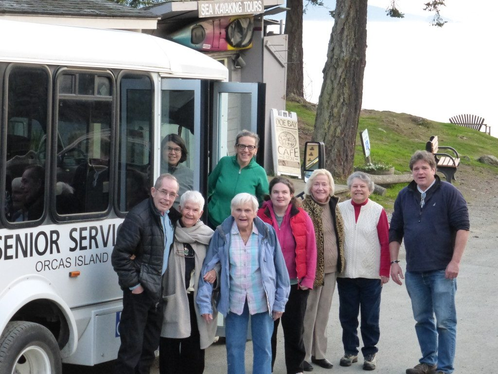
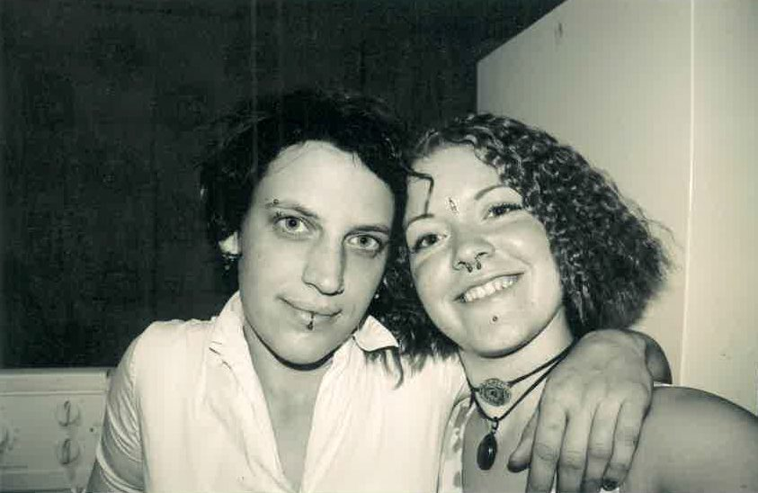
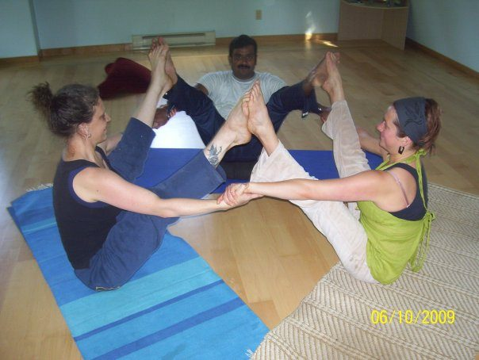

I was born in Prince George B.C. and spent most of my life living in the Peace River area. My fondest childhood memories are of the year or so that I spent living with my grandparents at a small truck stop/trailer park in Burns Lake, British Columbia. My father has 3 brothers and 4 sisters, all of whom at one time in their lives worked at the restaurant. I can remember serving a cup of coffee to a truck driver when I was as young as 3 or 4. I was constantly surrounded by family and friends, working together, preparing and eating meals together. There was plenty of time to play and time to visit and, it seemed, an endless amount of love to go around.
 Truck Stop in Bromen Lake
My parents divorced when I was 3 years old and I moved several times while receiving my childhood education, both between them and with them. In my graduating year I was living in a small northern town in the Peace River area. Compared to a handful of experiences I had had in the rest of the world, the views and opinions of the people I knew in that town seemed limited and narrow. Although I continued to receive an abundance of love from the people who raised me, my relationships at home were dysfunctional.
I sought for “higher ground” on Vancouver Island, where I completed a degree in Fisheries and Aquaculture. In 2001, I moved to Salt Spring Island to work in a greenhouse, growing algae for mussels. Two years later, I found myself working as a physiotherapist for Sally Sunshine. Sally is and was a “warrior for peace”, an activist, traveler, dancer, gardener, mother of many and, although I didn’t know it at the time, a Salt Spring Island celebrity. Five years before I met her, Sally had an accident while riding her bicycle in Victoria after which she did not walk again. She retained the use of her arms, head neck and shoulders and although she lost the dexterity in her fingers, she could feed herself, paint watercolors and hug like a Goddess. I had no prior experience working as a physiotherapist or as a caregiver, but for Sally the only qualifications were that I was fun and willing to take her out on adventures.
 Me and Sally Sunshine on the Physio Table
With that spirit of adventure, Sally and I travelled to Cuba together in February, 2004 to visit her nephew. I began work with her there as a caregiver, with support and training from both of her sons, her daughter and many other extended family and friends. Working with Sally and becoming a part of the family of friends that surrounded her changed me in many ways. There were many mistakes that I had made in my youth and people that I had hurt, including my family, because of choices I had made. Having a community to serve and to love gave me the opportunity to see myself in a new way and to let go of much of the pain and resentment that I had been holding onto. As a team we kept Sally’s body healthy with a daily, oily, hour long massages and regular physiotherapy. This routine and connection taught me to appreciate and respect my body in a way that I had never been able to do before or had even realized was necessary.
Sally lived on Salt Spring Island. In the community that surrounded her, many forms of physical play and spiritual growth were initiated, supported and encouraged. Anyone who has spent any time on Salt Spring will not be surprised to hear that I went for hikes and swam in the lake, rode my bike, practiced Capoeira, African dance, Yoga, Qi Gong, and meditation. I went to my first Peyote ceremony with Sally, and we sat together during weekly sweats with Prem. Inspired by Sally’s son Sasha and encouraged by my Zazen practice with Peter Levitt, I did a 10 day Vipassana sit in the fall of 2004 in Merritt. Although I felt that I had found the what I had been looking for when I left my small northern town, everything still seemed frantic and disconnected. I had difficulty keeping up with it all and I sought a way to piece everything together somehow.
 Partner Tree
My trip to Cuba with Sally had given me the courage and the confidence to travel to Thailand in the spring of 2005 and then to Montreal in the winter of that same year. In Montreal, I practiced regularly at an Ashtanga Yoga studio and worked night and day, saving to take my yoga teacher training at the in the summer of 2006. While in Thailand, I had studied Thai massage; the latter, combined with the massage experience I gained from working with Sally, provided me with the foundation I needed to begin studying Ayurvedic massage at the Salt Spring Spa Resort.
 Salt Spring Spa Kitchen
In February, 2007, I began work at the Salt Spring Spa as a housekeeper. In November that same year, I moved a 14-foot trailer out to the property of the resort where I studied and practiced massage full-time until I moved to Orcas in 2009. I met my husband, Nathan, on Salt Spring when I returned from Montreal in the spring of 2006; he was there visiting Sally and some of our mutual friends. After he returned to the United States, we continued to date, and we were married in 2010.
 Our Wedding Photo
I have enjoyed attending Satsang at the Salt Spring Centre since meeting Sally in 2003. My first memory of chanting is in Savita’s yurt during a Hare Krishna gathering. I’ll never forget the first time my mind was able to stop struggling to make sense of the words written down on the page in front of me and the subsequent experience of my entire being, fully immersed in the constant repetition of a few words. After that, I attended Satsang regularly and sometimes volunteered to wash dishes after the monthly community dinner.
After completing my 200 hour Yoga Teacher Training at the Salt Spring Centre in the summer of 2006, I began teaching at the Ganges Yoga Studio. I taught as a karma yoga teacher, and also subbed regular classes when asked. While working at the Salt Spring Spa, I taught private classes for groups of 1-5 people. In February of 2011, while my husband and I were completing construction of our house, I began teaching at Orcas Athletics in exchange for a gym membership. A student of mine told me that a teacher at the local yoga studio, Orcas Mandala, was leaving to continue her training and that I should apply to take her place. I did, and I began teaching 2-3 classes per week from September, 2011 until May, 2014. Inspired by Celeste Mallett-Jason, I also taught chair yoga at the Orcas Island Senior Center from August, 2013 until May, 2014.
 Doe Bay Pizza Night
I returned to the Salt Spring Centre as often as I was able to between taking my teacher training and moving to Orcas. I believe that I was able to serve as a karma yogi during yoga teacher training and the retreats of 2007 and 2008. I remember doing dishes and helping out with housekeeping. I remember Kaliyani’s kind and patient instruction and Anuradha silently setting an example for focus and devotion to one’s duty. It is always a blessing and an honor to be back on the land. It is such a gift to be invited to participate in the Salt Spring Centre community and to be included in the fold of the magic that happens there every year.
I was blessed with the grace of Baba Hari Das’s attendance during my second session of YTT. At that time, he was still coming to Salt Spring for the annual retreat and then staying for second session of YTT. I had the opportunity to see him again in October, 2012 while attending the “Awakening to Divine Presence” Upasana Retreat at Mount Madonna. Again, shortly after my visit, Babaji stopped sitting with these groups for tea. I can’t fully explain the peace, reassurance, acceptance and contentment that I experienced in his presence. I remember sitting with him for meditation in our second session; after which there would be a question and answer period – so much wisdom, insight and clarity. The mind is always searching for answers, and we were given that particular time and space in the day to ask him any question that we wished. However, in his presence, all questioning in my mind seemed to cease and it seemed so unnecessary to know why something was or wasn’t.
During my train trip to California in October of 2012, my mind was again filled with questions. While sitting with Baba Hari Dass for afternoon tea, without even asking, I realized that no matter what choice I made, every action and every thought could be used to serve the whole - could be used to bring me closer to God. During the retreat we were performing Yajna every day. As I understand it/experienced it, Yajna represented taking all of my actions and all of my thoughts and offering them to God to transform them and use them to bring me closer to him. We threw seeds into a fire while chanting the Gayatri mantram --- 108 times! The seeds represented our past, present and future actions and thoughts (our offering); the fire represented a cosmic energy or power which could transform all energy into wisdom and insight, purifying all actions (karma) and bringing us closer to God.
 Friends
In July, 2012 I sustained a back injury at work, which I am still recovering from. I have absolutely no idea where I would be right now – physically, mentally, emotionally - if it were not for the wisdom and awareness that I have gained from my meditation and asana practice. Regular Sadhana has made it possible for me to use my injury as a tool for going deeper in my practice and as a tool for self-inquiry. The ways in which my practice has enriched and enabled me to begin, to continue and to sustain all of my relationships, friends, family, co-workers and my relationship with myself… After attending the 2013 Annual Retreat on Salt Spring, I felt inspired to return and to serve as a karma yogi. In 2014 I was able to commit to 3 months in the Yoga Service and Study Immersion program at the Salt Spring Centre, where I served in housekeeping. I thoroughly enjoyed having the time to deepen relationships and receive support for my asana and meditation practice.
 Dharmesh, Amy and I in Triple Navasana
In the world, I live a life that is quite counter-cultural. It was such a relief for 3 months to be served vegetarian food, have the opportunity to attend Satsang, Kirtan, Gita Study, Arati, Asana classes, spiritual talks, guest lectures, and movie nights! As a teacher, it was a gift and a blessing to have the opportunity to practice teaching Pranayama, meditation and Asana to a group of my peers. I was also blessed to participate in our epic 2014 Ramayana revival! I felt completely supported by the spiritual community; I was in a space where I could completely focus on spiritual practice, and I began to have an understanding of how everything that I did could become spiritual practice. At the Centre, I was able to learn by direct experience how even “work” (karma yoga) could be spiritual practice. I was given permission by my peers and supervisors to work steadily without injury to my mind or my body. This question arose: “What is it that is keeping me from working in the ‘real world’ with the same calm and steady energy”?
The experiences that I have had at the Salt Spring Centre and being in the presence of Baba Hari Dass, although they have been reinforced by spiritual readings, could not have been learned solely from a book. There is no knowledge that can replace a direct experience of peace and contentment. What kind of world would we be living in if everybody could experience the kind of peace that has transformed so many of our lives? To be able to sustain it is a worthy life-time goal. I will be forever grateful to have had so many experiences of this possible reality. May my life’s purpose be to pass on the message of the possibility of peace for everyone. OM Guru.
