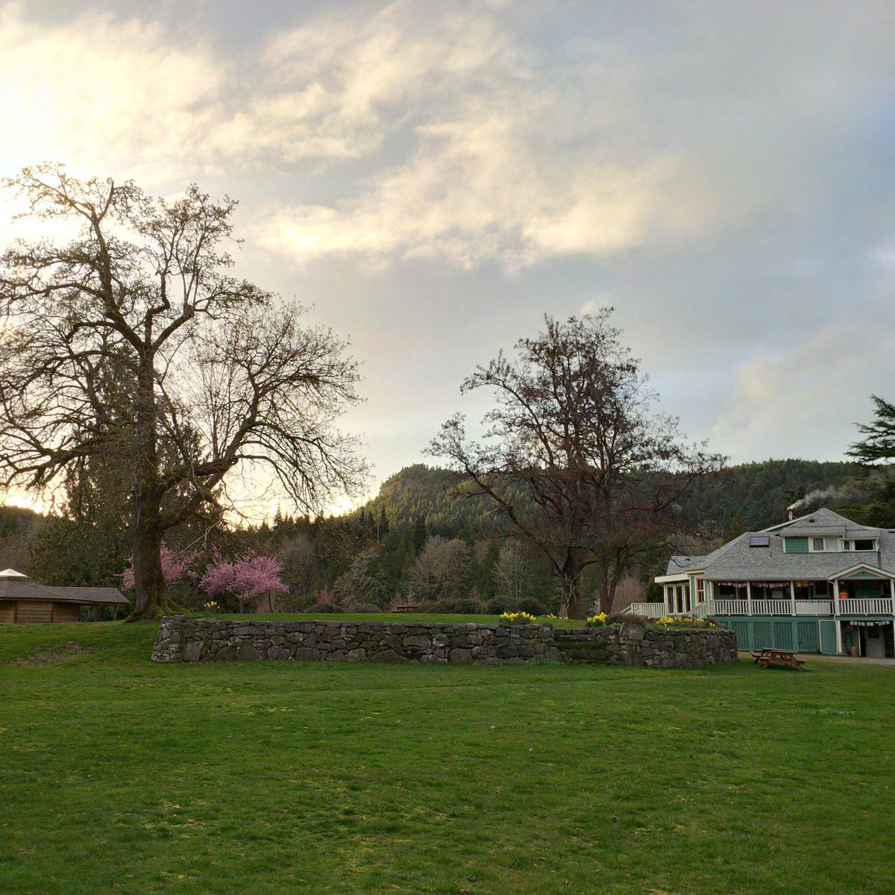
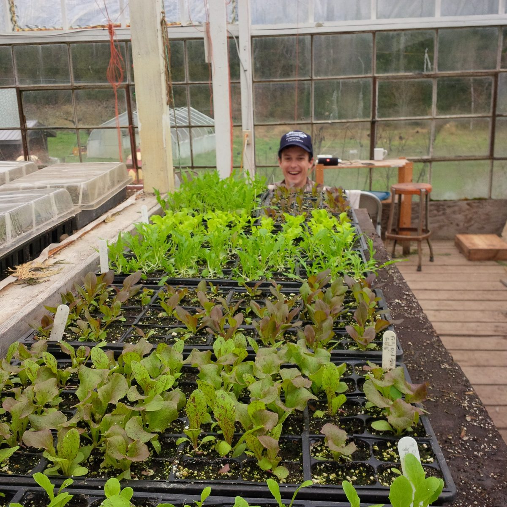
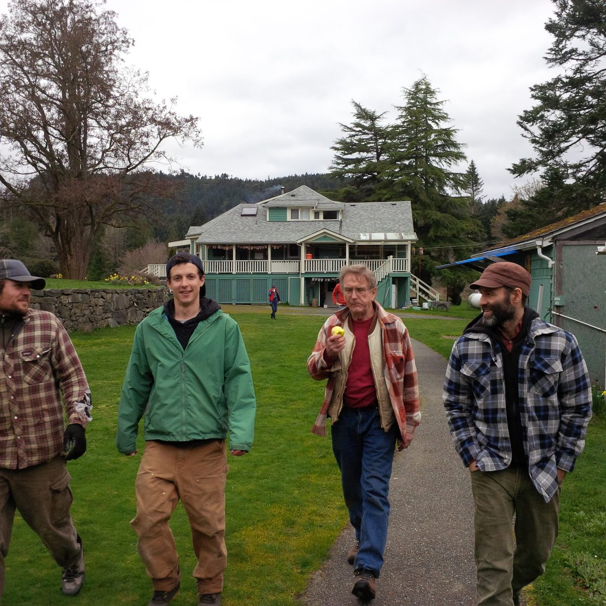
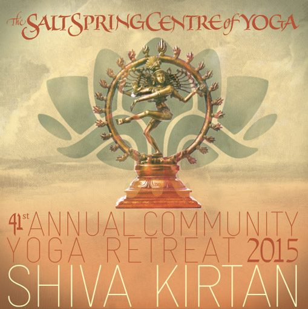
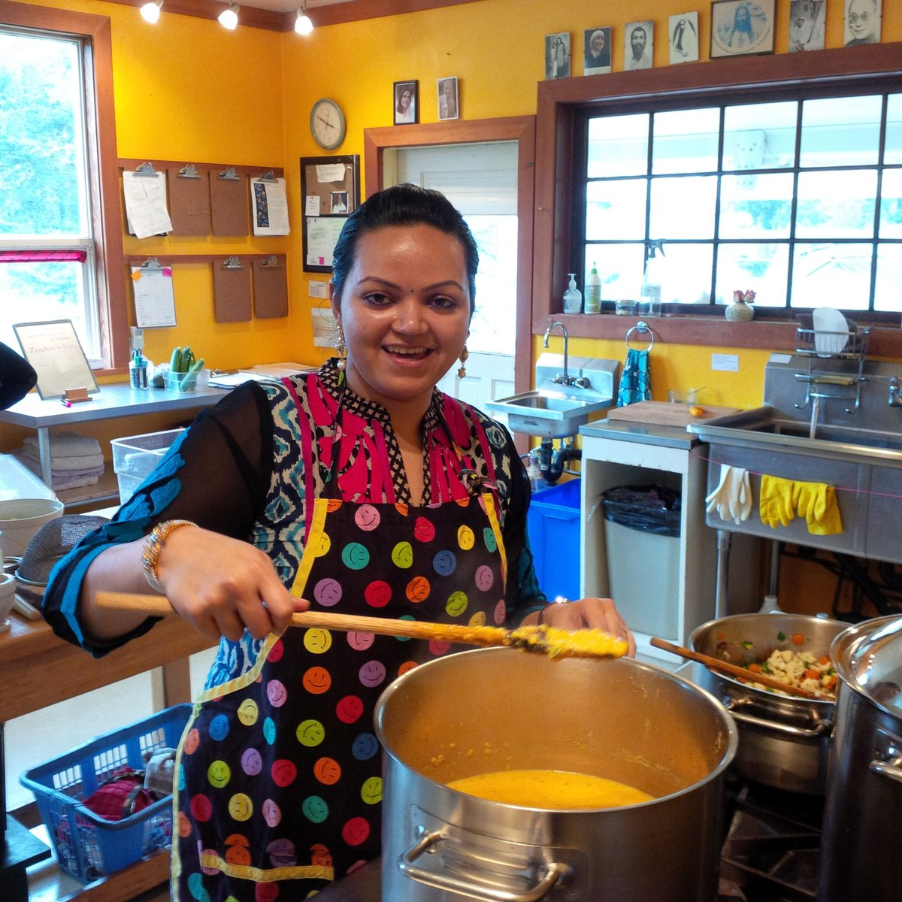

Hello everyone,
Although there are still some chilly early mornings, spring is in full bloom on Salt Spring, with trees and flowers blossoming.
[caption id="attachment\_13321" align="aligncenter" width="590"] Springtime at the Centre[/caption]
Our residential community is also blooming. Some people who have arrived over the past few months include Shawn (programs), Amy (YSSI), Jules (office), Bri (operations), Harley (maintenance), Milo (garden), with Kitty arriving shortly to join Milo in the garden.
[caption id="attachment\_13324" align="aligncenter" width="590"] Lettuce plants in the greenhouse.[/caption]
Here’s a lovely farm update provided by Milo:
> Spring is peeking out from the frost curtain and our freshly pruned orchard is budding with life.
> The greenhouse is packed to the gills with eager seedlings, and construction has begun on a monster worm bin that will be processing all of our kitchen scraps.
> Honeybees are on the horizon here as we gather materials for hives and cultivate flower filled sanctuaries in all corners.
> A beautiful tractor has joined the family here at the Centre, inspiring wonderfully drastic shifts in our crop field layout towards the natural contours of the land, allowing us to pacify rainwater into a tool for fertility and away from its erosive potential.
> Woohoo!

[caption id="attachment\_13323" align="aligncenter" width="590"] Off to work - David, Milo, SN, Raven[/caption]
Soon we will be bidding farewell to David and to Tana, who will be heading off on new adventures. David has played a very important role on the farm over the past few years, coordinating planting, weeding, harvesting, and all the other work that goes into growing food - not to mention all the other things he’s done here, from cooking meals and washing dishes to snowshoeing paths when the snow was deep a couple of winters ago - a kind-hearted and hard working man! Tana has also been here for a few years, coordinating landscaping (mowing, pruning, keeping everything beautiful) along with many other tasks - cooking, doing dishes (dishes being the universal constant), cleaning, pouring her heart into whatever she does - and singing! We wish both of them well and send them off with love - and hope it won’t be too long before we see them again.

## New Look for our e-Newsletter

If you receive the newsletter in your inbox, you will have noticed that we've changed our look - hope you like it. Please let us know what you think; we'd love your feedback. If you're reading it on the blog on the website, this won't make any sense to you because it looks the same there as always. Either way, the content is the same. If you would like to receive the newsletter in your inbox, you can sign up easily using the form at the [bottom of our website](https://saltspringcentre.com/).

## Announcing our New Kirtan Album

We now have a second kirtan album! - Shiva Kirtan, recorded at last summer’s ACYR! You can listen to and download a digital copy of either album on [iTunes here](https://itunes.apple.com/ca/artist/salt-spring-centre-of-yoga/id1068175844).  To order a Shiva Kirtan CD, email [office@saltspringcentre.com](mailto:office@saltspringcentre.com).

## A Wonderful Ayurveda Cleanse Weekend

[caption id="attachment\_13320" align="aligncenter" width="590"] Dr. Manjiri Nadkarni in the kitchen[/caption]
We began our program season last month with the Ayurveda Cleanse weekend, an excellent program led by Dr. Manjiri Nadkarni - with so much immediately applicable information! Everyone who attended was inspired - and we also got to enjoy delicious Ayurvedic meals. We are planning to bring Manjiri back for another workshop soon with more Ayurveda programs following. Watch for it on our website.

## Now Accepting Applications

The Centre is currently accepting applicants into the **Yoga Service and Study Immersion** program (YSSI), a wonderful opportunity to connect, learn and deepen your understanding and practice of Classical Ashtanga Yoga and become part of a loving spiritual community. The YSSI dates are May 29-Sept 1. Visit our website for [more information](https://saltspringcentre.com/yoga-service-and-study/) and the [application form.](https://saltspringcentre.com/yoga-service-and-study/yssi-application/)
**Yoga Teacher Training** (YTT) is beginning to fill up, but there’s still space. If you’ve been thinking about a yoga teacher training, I invite you to look into the [Centre’s program here](https://saltspringcentre.com/yoga-teacher-training/). It is a residential program, taught by an outstanding faculty of 20 experienced teachers. The foundation of this YTT is classical 8-limbed Ashtanga Yoga and Hatha Yoga - and it’s here at the Salt Spring Centre of Yoga.

## AGM - May 7, 2016

Coming up on May 7 is [Dharma Sara Satsang Society](https://saltspringcentre.com/about/dharma-sara-satsang/)’s Annual General Meeting weekend, filled with events for Dharma Sara Satsang Society members. The AGM is from 2:30-5:00 on Saturday afternoon, May 7. If you’re not currently a member but would like to be, it’s not too late. [You can join or renew here](https://saltspringcentre.com/dharma-sara-satsang-society-form/). Voting will be electronic again this year; DS members will receive a letter with more details. For more information, you can contact Natasha at [natasha@dharmasara.com](mailto:natasha@dharmasara.com).

## This Month's Newsletter Offerings

Adding to the ongoing introduction to Our Centre Community, [Mischa Pavan Makortoff shares his story](https://saltspringcentre.com/2016/03/our-centre-community-mischa-pavan-makortoff/). One of a number of second generation people, children of the founding members, Mischa was born into the satsang family. He and his family came to the Annual Community Yoga Retreat (then known simply as “the Retreat”) every summer, and in the past several years has become actively involved again. I’m sure you’ll enjoy his story, a journey through “the old days”.
Kenzie has written this month about [Yoga Nidra](https://saltspringcentre.com/2016/03/yoga-nidra-let-yourself-be-and-listen/), the practice of complete relaxation. Although it is different from sleep, it is as deeply soothing as a restful sleep as it calms the nervous system. Included in the article are links to a couple of Yoga Nidra guided meditations. If you’ve heard about Yoga Nidra, but never had the opportunity to experience it, you can lie down on your mat and let yourself be guided through it. Relax.
[The Seasons of Life](https://saltspringcentre.com/2016/03/seasons-of-life/) focuses on the stages of life we go through. Not all lifespans are the same, but the natural progression of life is birth, growth, decay and death. This is not a morbid topic; it is the natural cycle of nature. The life force in nature continues regardless of the stage we find ourselves in. We’re all on this journey together.
From Babaji: *Wishing you happy and healthy.*
Love,
Sharada
