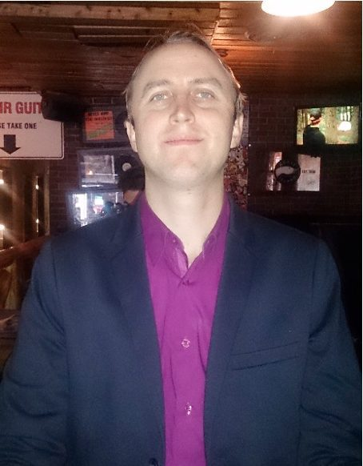
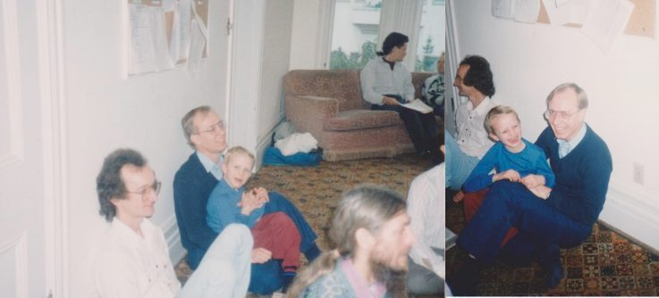
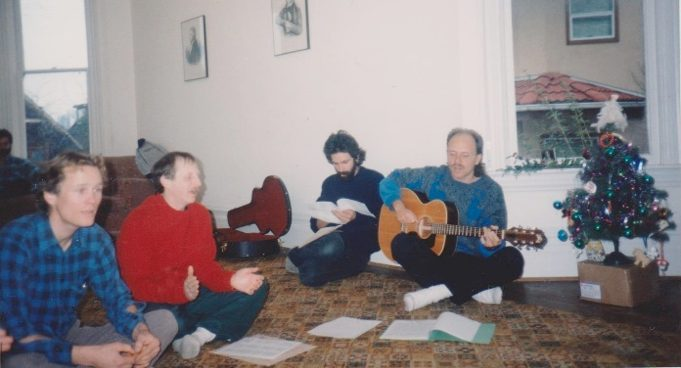
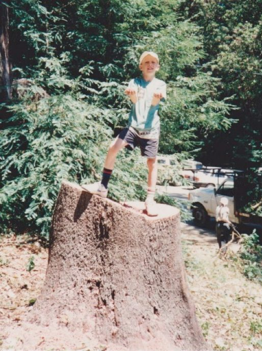
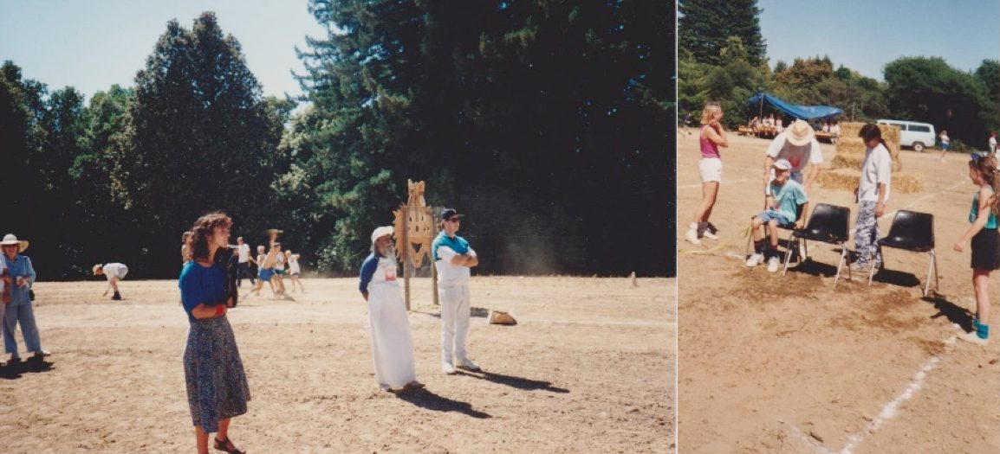
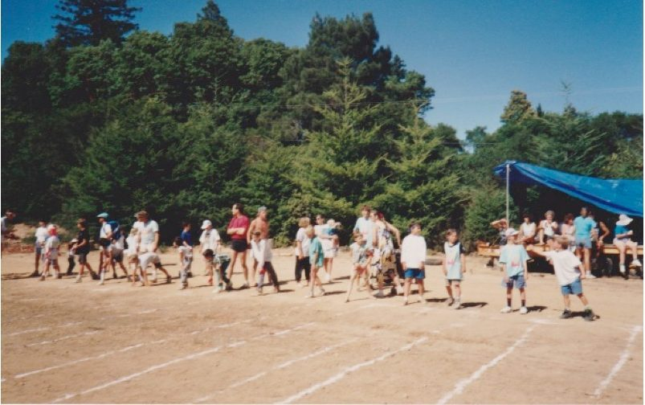
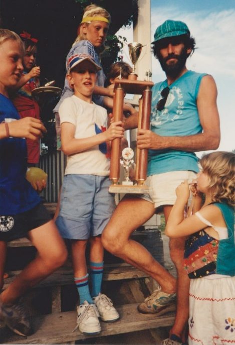
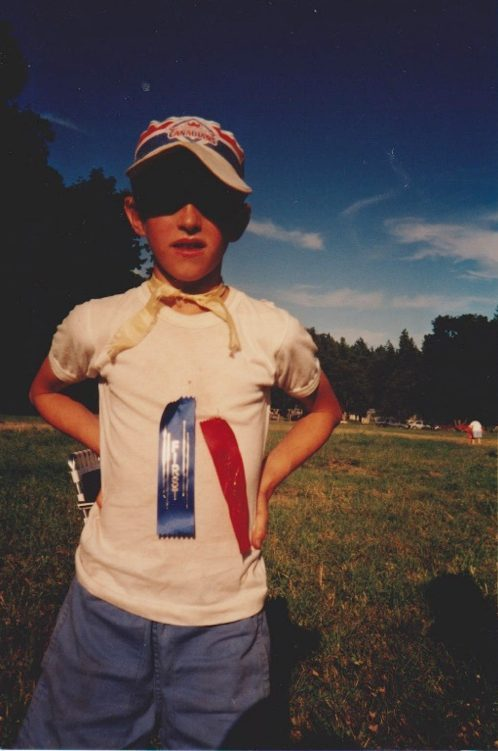
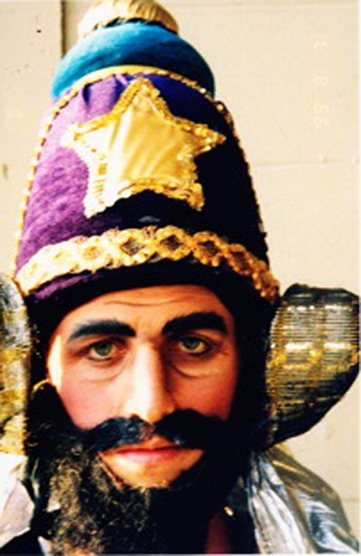
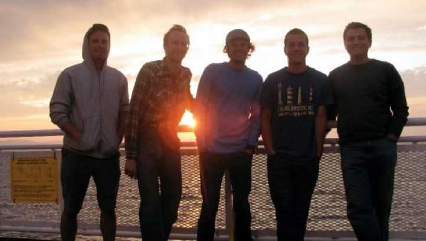

[caption id="attachment\_13338" align="aligncenter" width="454"] Mischa, part of our Centre community[/caption]
Born Mischa Pavan Makortoff with my middle name given by Baba Hari Dass after I was born, I grew up with my parents Sudha “Theota” and Phil in the Vancouver area. We lived on Barnston Island when I was born. My mom is a very spiritual person. My dad loves sports and I got my love of sports from him. Both my parents value family and community. My mom became involved in the Dharma Sara Satsang society several years before I was born. In Dharma Sara she found family, community, friendship, and her spiritual teacher, Baba Hari Dass. When my mom met my father, she brought him into the group. So when I was born, I was already part of the extended family!

[caption id="attachment\_13337" align="aligncenter" width="590"] Left: Front: Harvey Lajeunesse, Phil, Mischa, Narayan Groves. 1988; Right: Harvey, Mischa, Phil. 1988; Back: Unidentified and Vidyadar[/caption]
Above and below are pictures from our wonderful Vancouver Satsang. The pictures are from the 1988 Dharma Sara Christmas Party and I was 7. The Christmas party was one of my favourite satsangs of the year!
[caption id="attachment\_13336" align="aligncenter" width="590"] Devendra, Divakar, Ramanand, Madhav. 1988.[/caption]
As I began writing my article so many fond memories came flooding back! The retreat! Many of my fondest memories at the centre were during retreat time. I would join mom and dad for days of action packed fun and mischief at the centre! As an only child, coming to the centre to play with kids my own age was a blessing! What fun we had! Some of them I still cross paths with regularly and occasionally. My mom was involved with all sorts of things at retreat time. When I was an infant, my mom brought me over to the centre regularly during the year. I was told that I ran into the sandbox to play with the other kids.
Oh yes, Babaji! Oh how all us kids enjoyed following Babaji. Adults and kids would circle around him, and as kids moved closer, Babaji would toss candy to us! Candy was always a huge draw or us kids as the adults asked Babaji questions and he replied writing on his chalkboard. Babaji was huge supporter of “play.” Playfulness in humour, jokes, skits at talent night, and theatre performances. Play in terms of sports, games, and the Hanuman Olympics!!!
As a kid walking around “the land” it seemed so huge. You could walk a long way in every direction. I have a fragment of memory from the 80s of walking with others through the back of the property to swim at Blackburn Lake. During retreat time with hundreds of people spread across the property it was fun to see people everywhere I walked.
It was fun when Babaji led the community in a large work project during the retreat. It was exciting to see many people working together to accomplish a shared objective. Many of my memories of these projects are from when I was a child. I remember Babaji leading a group in moving a woodshed. It was near the trees where there is now a house for staff off the edge of the volleyball court. In the early 90s during one retreat, the big project was reroofing the main house. Lots of adults and older teenage boys were on the roof for hours each day. They were transporting material to and from the roof via truck, wheelbarrow and any means. As I was too young to be on the roof, I enjoyed watching from a distance.
Oh, and who can forget time spent in the childcare program! I have one memory when the childcare was in the basement of the program house. We were watching a Pink Panther video with Inspector Clouseau, so funny! I think there were some men “in charge” that shift.
[caption id="attachment\_13335" align="aligncenter" width="514"] Mischa, 1991, Mount Madonna Centre (Huge tree stump!)[/caption]
In 1991 when I was 9 my parents and I took a road trip down with many stops, including Mount Madonna Center for a retreat and Hanuman Olympics. It also felt like home. It was a great feeling being welcomed into 9 on 9 volleyball games with men, women, and kids of all ages. Being taught volleyball on the fly was such fun! I met the Aguirre boys - Jai, Toby, and Emile. I met Yogi and a bunch of other teenagers who were tons of fun! The older kids constantly included the younger kids which made me feel welcome in volleyball and other activities!

[caption id="attachment\_13334" align="aligncenter" width="590"] Left: Babaji, 1991. (Middle) Right: Mischa (sitting)[/caption]
Then a couple of years later, many of those teenagers I met at Mount Madonna came to the Salt Spring Centre retreat performing their Power of Pranayam! Bending re-bar, having rocks split with a sledgehammer over a person’s chest! Wow, they were impressive – that was a major highlight that retreat!

[caption id="attachment\_13333" align="aligncenter" width="590"] Mischa (2nd from right), 1991, Mount Madonna Centre. (That was a big heat of sprinters)[/caption]
The Hanuman Olympics was often the highlight of my retreat each year. It enveloped the entire front field. To a kid it seemed massive, to the scale of the Olympics I watched on TV at home. When he wasn’t on the field watching an event, Babaji would spend time sitting in the shade, in the tent on the front field and watch the Hanuman Olympics from there - for what seemed like hours to a small child! Oh, how Babaji supported the Hanuman Olympics! It was males and females from infants and through the generations up to the elders. Everyone wore their team colours and the team leaders’ fostered a sense of community on their teams. Some years, team leaders wrote the names of the participants on large sheets of easel paper and taped it to the side of the house. Everyone was eagerly awaiting the games!

[caption id="attachment\_13332" align="aligncenter" width="469"] Mischa, Rajesh Kreisler, Mamata(?) 1991 (Rajesh, so our team won the Hanuman Olympics!)[/caption]
There was a large obstacle course which always began which a gigantic wooden clown face – maybe 12 ft high? Sprinting, long distance running, high jump, long jump, and the sack fight are at the top of my mind. Also the water balloon toss duo event which often ended up with people throwing the left-over balloons at one another afterward. From the age of 9 and up I joined cross country running and track and field at school. I felt at home during the Hanuman Olympics and always looked up to the older boys and the men. As a boy I recall the suspense leading up learning how Divakar and the organizers were setting the age groups each year. I loved competing and I loved watching others compete. Hearing your gender and age category called to the start line of an event over the loud speaker would bring an adrenaline rush.
[caption id="attachment\_13331" align="aligncenter" width="498"] Mischa, 1991. (1st & 2nd place ribbons, a great day!)[/caption]
There was an Indoor Hanuman Olympics in the early or mid-90s. It was raining so hard one year that the Hanuman Olympics could not take place outdoors! So the adults organized an indoor Olympics. You didn’t know that musical chairs was an Olympic Sport? Well it was at the Salt Spring Centre indoor Olympics! It was competitive too!!
A huge thanks to Divakar and all of the many staff who organized the Hanuman Olympics and prepared the front field and grounds every year! I recall my dad ran the long jump some years in the 90s and Surendra Barber ran the high jump. As kids we jumped on the high jump mat before, during, and after the Olympics - Ah, what fun. What would the Olympic be without music? Madhav and the band were on their stage singing away for what seemed like hours! I recall Madhav singing “Let it be” during one of the last large scale Hanuman Olympics in the front field (1998 or 1999).
The Staff Kitchen was one of my favourite places during the retreat. It went through a period as a seed house and a garden office. Things have a way of coming full circle as it is now a KY kitchen. I had so much fun hanging out in the staff kitchen in the evening! It was always a diverse group with kids, teenagers, adults, elders. With Canadians, Americans, and folks from elsewhere it was a great place to learn about life. We played cards, talked about every topic imaginable, drank tea, and snacked on toast and whatever food was available. In the late 90s I entered the staff kitchen very early one morning during the retreat and RPD “Chai Baba” was brewing his legendary chai. That chai hit the spot after limited sleep!
The Talent Nights during the retreat were so much fun! Lots and lots of skits and laughter. In those years the talent night was in the satsang room of the main house and Babaji would sit in his usual place against the pillar near the front of the room. I remember Divakar as a hilarious emcee. Sid, Sanatan, Anuradha and many of the others entertained us annually with skits and songs – that brought down the house full of laughter.
How could we forget the basketball tournaments? I remember the first big basketball tournament at the centre was in the mid- 1990s. It was on the half-court in front of the entrance to the school (this was before the full court existed). There were many Americans up from California and the big work project that year was “The Garden House.” Jaggadish Wolfman and Sanatan were some of the organizers. I was riveted to the action and watched many games each year. We were treated to such a high calibre of basketball for several years! I thoroughly enjoyed watching and I played a few years as well. During the games, sometimes tensions ran high with no referee, and some people lost track of the score. While watching the games form the balcony of the school I began calling out the score to Jaggadish during the game when he asked for a score check. I felt a lot of pride when Jaggadish told me that I kept a good score. He would regularly check the score with me during the games. Sanatan sometimes captained a team of all-Canadians and I remember the rivalries with the Americans.
1999 was a special summer for me as my Mom and I did karma yoga at the centre and lived on the land for several weeks. I reconnected with Piet and Caleb. My mom and some of the other adults said the 3 of us used to play together when we were small. I hadn’t seen much of Piet and Caleb in the intervening years aside from a rare meeting in the playroom of the Vancouver Satsang (near Oak & W 7th was it?). The 3 of us had lots of adventures that summer and many more since then. In the Ramayana I was Lord Vibishan, and it was special to perform in front of Babaji. Rehearsing and performing was so much fun, as I also acted in high school plays. My mom helped out with the Ramayana by sewing costumes, among other things. I met Ishi that summer, and so many other people.
[caption id="attachment\_13339" align="aligncenter" width="400"] Mischa dressed as Vibishan in the Ramayana, 1999[/caption]
Every kid who attended retreats in the 80s and 90s remembers the Pad Kirtan. Madhav “Jerry” DesVoignes sang Pad Kirtan during the retreat for many years. With his wonderful voice he would serenade us to wake us up in the morning. I often tried to sleep in or go back to sleep but I had fragments of memory that I was actually awake for a moment before 6am!
In 2000 I graduated high school and started at university. This began a period of several years in which I did not attend an entire retreat. I came to a few retreats and only stayed a few days at a time. A few years previous my Mom was diagnosed with Early Onset Parkinson’s disease. From that time on, her health gradually got worse until she had to get around in a wheelchair. I attended some of the retreats when Mom was in a wheelchair with Dad and other members of our care team.
During this period of absence from the centre, I took summer courses at University three summers in a row. Although that was fun, I knew there were things missing from my life. While I was finishing my undergrad at university, mom decided to stop attending the retreat. During this period Anuradha and others encouraged me to return to the centre and attend retreats again.
The 2008 retreat was the first retreat which I attended fully since 1999. Familiar faces welcomed me like family and it felt like home. I have been attending every year since. 2009 was an especially fun retreat with Piet bringing the full quintet with Chris, Bennie, Jeremy, and Matt. Those dish pigs shifts on the brunch crew in 2009 & 2010 were so much fun! This was back when dishes were still in the main kitchen. Five members of those dish crews are pictured below.
[caption id="attachment\_13330" align="aligncenter" width="722"] Bennie Schutze, Mischa, Matt Ellis, Jeremy Schutze, Tobias Aguirre (Somehow we all squeezed into my 96 Carolla with a guitar and lots of gear. Everyone was scrunched!)[/caption]
Although Babaji does not attend the Salt Spring retreat in person, Babaji’s spirit and influence are present at the centre. I am lucky to have been born into this community with Babaji as the guiding light. I look forward to being a part of the Centre for many more years!
