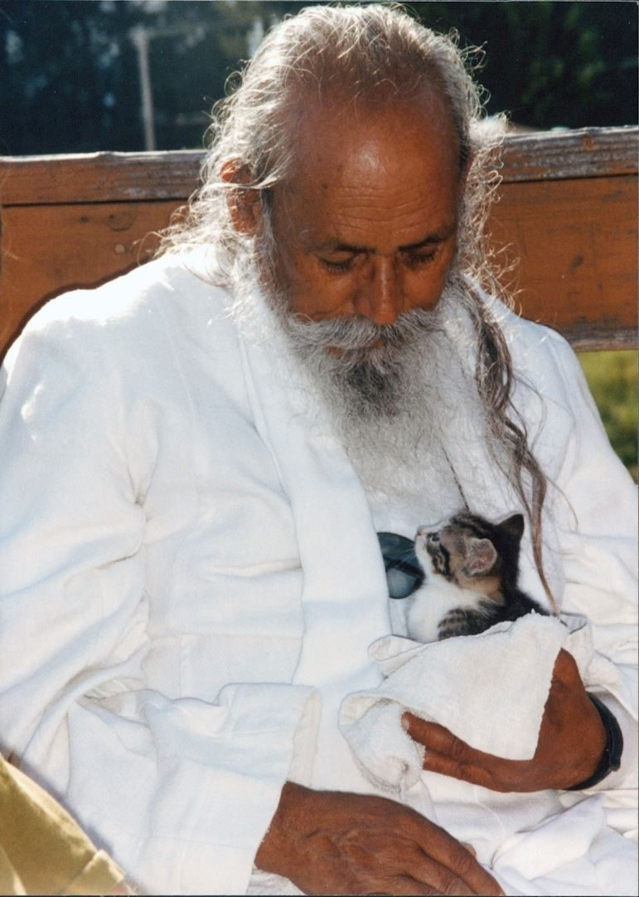
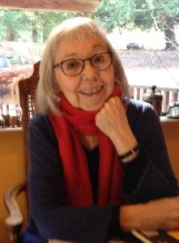

“Turn! Turn! Turn!” is a song made popular by the Byrds in the 60’s, the lyrics of which come from the Book of Ecclesiastes in the Bible. The chorus says, “To everything - Turn! Turn! Turn! - there is a season - Turn! Turn! Turn! A time to be born, a time to die………”
The seasons of life include all aspects of life. Everything in nature is born, grows, lives for a period of time, and dies. It is an endless cycle, with death prompting growth.
*Life’s essence is absolute, omnipresent and immortal. Death is but a change of form. Human beings, animals, the vegetable kingdom, the mineral kingdom - all are alive. They take birth, grow, decay, and die (change form). When one form changes into another form it is called death, although the life force still exists in that form. For example, as soon as a plant dies, a second form takes birth and starts to decay it. When it is completely decayed, a third life force starts working. The cycle of change of forms goes on and on, but the essence of life is always there - it is immortal.*
The birth of a baby is experienced as a joyful occasion - a celebration of innocence and complete presence. As they grow, babies explore the world using their senses - feeling, tasting, smelling, seeing, hearing - an adventure of discovery. By the time the baby reaches the age of 2, the ego of individuality has begun to set in, and parents may start hearing “No!” “Mine!” Thus begins the experience of separateness and suffering (although, of course, there are many moments of play and joy!).
As children grow, their views of the world develop. Through play, school, and family, gradually moving toward adolescence, they begin to strive for independence, finding their place in the wider world. In the process, adolescents often experience this as a time of struggle - with parents, with external authority in general, and within themselves.
As adults, the focus changes over the years to other roles. Early adulthood expands life’s options - possibly continuing with further study, finding a job, trying to choose a career path, looking for a partner, wondering how go about being a grown-up.
The period of adulthood stretches over many years. During that time, life’s themes may include work, relationships, marriage, children, responsibilities. In this culture, it can be a time of stress - a familiar story of too much to do, not enough time, not enough money, not enough sleep. As a result, sometimes relationships break down and health problems arise.
At some point in the process, people may begin questioning why things are the way they are: why life is hard, why there’s suffering - and the spiritual search begins.
*This is life. It includes pleasure, pain, good, bad, happiness, depression, etc. There can’t be day without night. So don’t expect that you or anyone will always be happy and nothing will go wrong. Stand in the world bravely and face good and bad equally. Life is for that. Try to develop positive qualities as much as you can*
*Life is for learning and the world is our school. Doing your homework every day brings liberation.*
Eventually, everyone will die. This is not morbid. This is the natural cycle of life.
*Birth is seen as a moment of happiness and death appears as a great tragedy. But both are two ends of the same rope.*
*Birth, growth, decay, and death are the laws of nature. Those who truthfully accept the laws of nature live in the present and die in the present.*
*Every second of our lives is like a seed of grain, and time is a hungry bird eating every seed very quickly. When the grain is finished the bird will fly away. So worship God, surrender to God, and attain peace.*
Contributed by Sharada
Text in italics is from writings by Baba Hari Dass

---

Sharada Filkow, a student of classical ashtanga yoga since the early 70s, is one of the founding members of the Salt Spring Centre of Yoga, where she has lived for many years, serving as a karma yogi, teacher and mentor.
