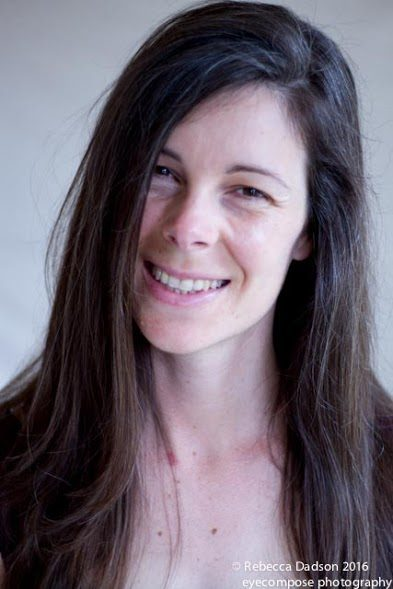
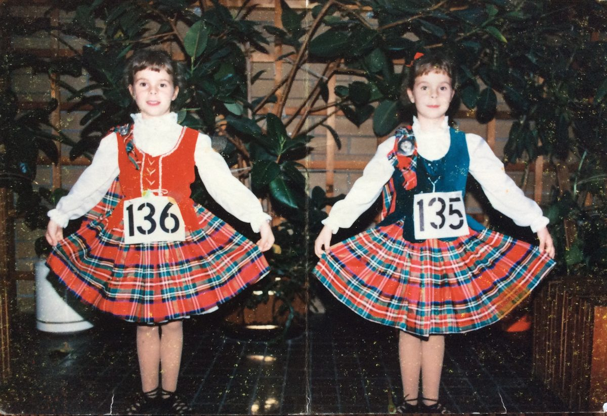
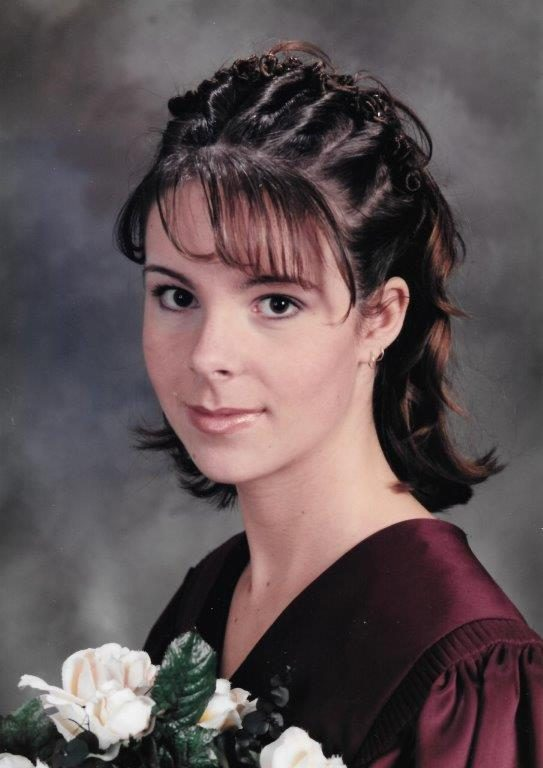
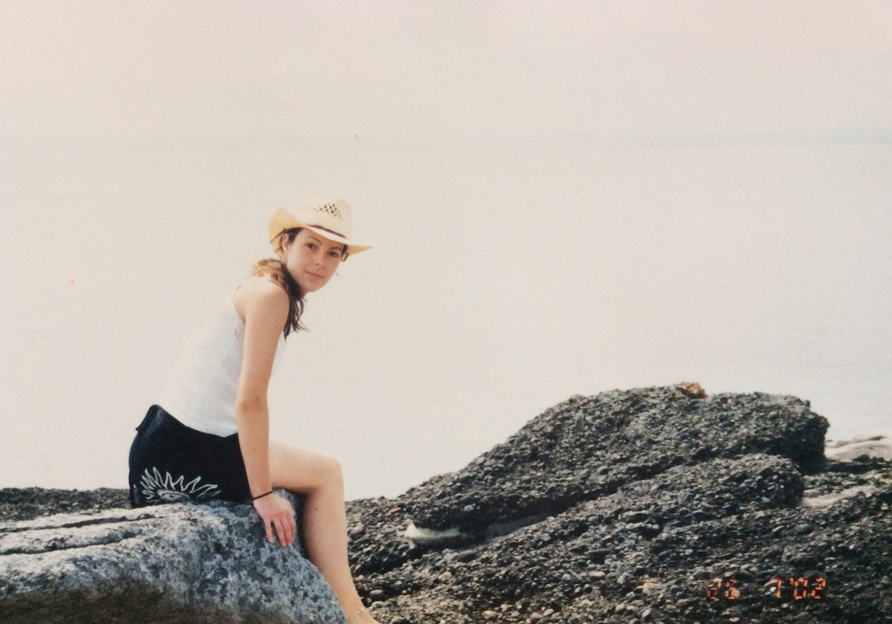
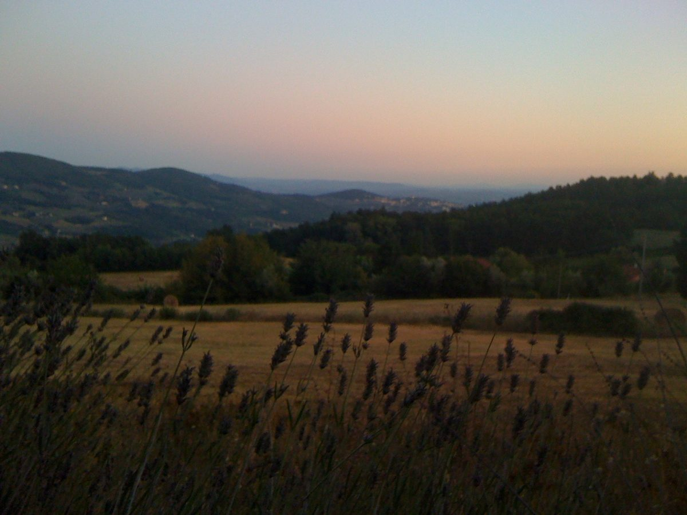
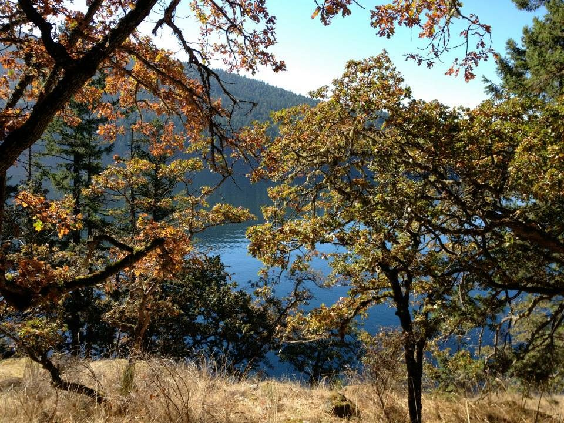
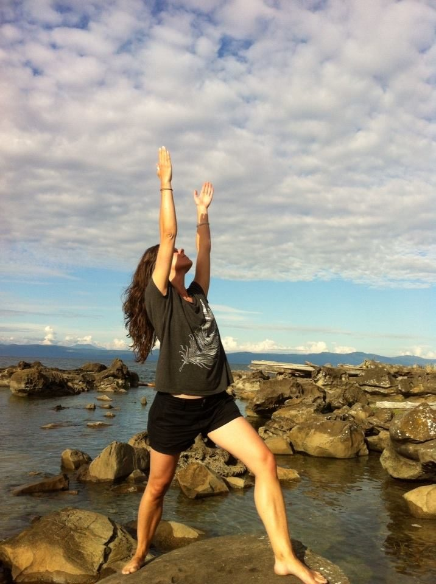
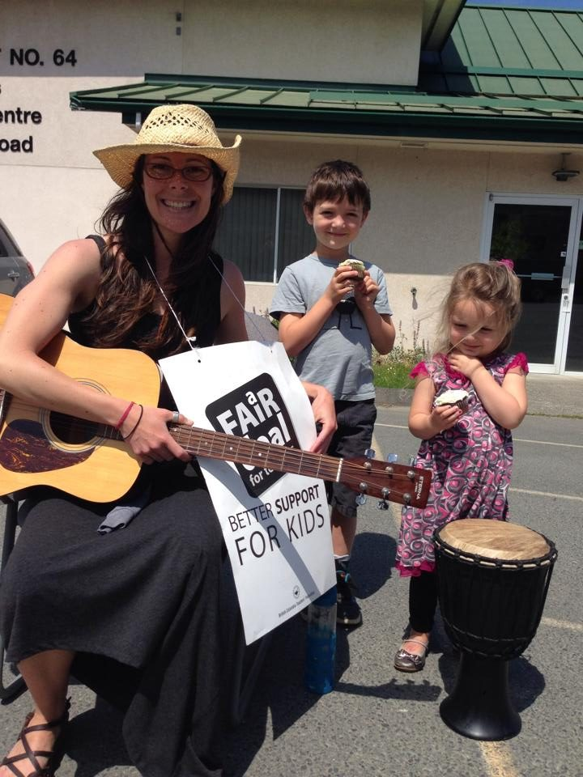

[caption id="attachment\_13485" align="aligncenter" width="393"] Amy Cousins, part of our Centre Community. April 2016[/caption]
There are many stories we can tell about our lives. Narratives are like stepping stones we use for support and leave behind along the way: here’s one.

# Chapter One

I’m currently living at the Salt Spring Centre of Yoga. I was born three hours north on Vancouver Island in 1981, the same year the Centre was officially formed. As a child I had an inquisitive mind, as most children do. I was also born into this world as an identical twin, which brought an early contemplation of Self and what makes us who we are: What makes us unique and what is awareness. Of course now I can look back with my adult mind and name these things –as a child I did not have any kind of context for my experiences.
[caption id="attachment\_13478" align="aligncenter" width="590"] My twin sister, Adrienne, and I at a Highland Dancing competition circa 1989. We spent a lot of time at dance competition - all forms of dance for many years - I’m on the left.[/caption]
As a teenager I experienced, what I can only describe as an existential crisis (I think this is also common). I suffered from anxiety, recurring lung infections and mild depression. I spent a lot of time writing poetry and songs and escaping into sadness. On the outside, I was an A student, popular, talented, pretty and privileged. The dissonance between my inner and outer worlds, I think, were a major cause for my anxiety. I understood it at the time as my inner or subconscious self crying for attention, but I had no skills, awareness or context around what I needed to do.
[caption id="attachment\_13479" align="aligncenter" width="543"] Carihi Secondary School graduation in my home town, Campbell River, 1999[/caption]
I was able to manage my anxiety attacks through instinct: by being aware of the symptoms before the onset, bringing awareness to my breath and calming my heart-beat. I was graduating high school, it was 1999 and I was 17 years old.

# Chapter Two

After two years of University I decided to take a year off. There were several things that happened all around that time that contributed to a large shift in my awareness. It was around the time of 9/11 and my anxiety was really high. I would burst into tears at any news footage on the TV. I started taking St. John’s Wort to calm my nerves. I travelled to Mexico. I started to connect with what really mattered in life. Somewhere in that time, I first experienced acupuncture. A friend had told me it could help with my lung condition. That first experience with the acupuncturist told me everything I had known to be true about my illness, but had never before heard spoken out loud. He told me my illness was emotional and that in order to heal my lungs I also needed to connect with my emotions.
It took me a year to generate the courage to return to his office and work with him for the summer. I returned to university and changed my major, I started learning about things that interested me, I started eating organic, I met real friends, I stopped going to bars, I started noticing quality, I started noticing goodness, truth and beauty in places our society ignores. I started reading Ken Wilber, Annie Dillard, Joanna Macy and Fritjov Capra. I started questioning everything. I started to find my voice. It was 2002 and I was 21 years old.
[caption id="attachment\_13480" align="aligncenter" width="590"] Spending time each summer on Hornby Island with my family was a special time for me, this photo is from July 2002.[/caption]
At the end of 2004 I finished University with a double major in Environmental Studies and Anthropology. February 2006 I bought a one-way ticket to Europe. I worked and lived there for nine months: I started to learn how to be with myself.

# Chapter Three

One of the most profound things anyone ever said to me in my high school years was, “you need to befriend yourself.” I had no idea what that meant at the time, but somewhere inside me a quiet voice told me it was true.
I was organizing a Halloween festival at my high school in gr. 10 and my twin sister and I decided to invite the ladies from the local metaphysical bookstore to give some aura readings. We’d always been interested in crystals and cards this was however, the first time we’d actually approached any of the adults and asked them anything. At the end of the festival I asked one of the women to read my aura. She said that I was protected, but that I needed to befriend myself.
[caption id="attachment\_13481" align="aligncenter" width="620"] On retreat in Tuscany, summer 2011[/caption]
A decade later, I found myself on the phone with Andrew Cohen. I was at a friend’s house in Vancouver participating in a virtual retreat. Andrew had just given a talk on the post-metaphysical relationship with God. I wanted to know what he meant. After a few tries, and me saying, “no that’s not it”, he softened and gave me a teaching from his teacher, Papaji. He told me about finding a friend “you’re never going to be able to see”. In that moment I felt like I had found a teacher. I never thought I was looking for a teacher until that moment. It was the same message I had received from the aura reading in high school. I knew in my heart this was a path I needed to travel to find myself. That summer I travelled to Tuscany and participated in a ten-day silent retreat with Andrew. It was 2011, I was 29 years old.
I realize there is some controversy around Andrew’s teachings. I have to say that my experiences with him were very profound and meaningful for me. I can only speak for myself. I sat with him again in the Mojave Desert for seven days; I completed two years of on-line course work with mentors from EnlightenNext; I lived and worked as an intern for three months in community at Fox Hollow, Massachussets.
The last interaction I had with Andrew before he stopped teaching was organizing his visit to Vancouver a few years back, just before I moved to Salt Spring Island and found the SSCY. While I was living at Fox Hollow I remember looking at old photos of Andrew as a young man traveling in India. It was the first time I had made any kind of connection between his teachings and India. Because he had “Americanized” the message, I hadn’t realized I was part of a lineage: that the teachings were a part of a lineage. It was the first time I became interested in where it all came from.
[caption id="attachment\_13482" align="aligncenter" width="620"] Burgoyne Bay, Salt Spring Island[/caption]
When I moved to Salt Spring, Andrew stopped teaching and my attachment to the teachings simply fell away. My love is still there for the people, but there was an openness and a readiness in me to start looking more deeply and more broadly within myself. To release the scaffolding that surrounded my understanding and soften.

# Chapter Four

My name, Amy, means “beloved friend”. The path to loving and befriending myself has been the most profound teaching that continues to unfold, and continues to reveal truth. Joanna Macy once said that the heart broken open can contain the entire universe. I feel like moving to Salt Spring has allowed for me to soften, to embrace the breaking open and allow the truth and beauty to shine through.
[caption id="attachment\_13483" align="aligncenter" width="590"] Hornby Island, 2014[/caption]
A big part of this for me has come through my relationship with bhakti yoga and kirtan. I’ve been drawn to ceremony for several years. In my late twenties, when I was living in Victoria, friends and I started a seasonal circle where we met each quarter and shared in sacred sounds and sharing of intentions around a fire, we then started hosting sweat lodges with elders for two years. I benefitted from the traditional knowledge, practice, deep honour and wisdom that was shared with me in community during that time. I learnt a lot about my connection with the land that had previously been a cognitive understanding. The same is true for any kind of ceremony.
There is an embodiment that moves energies through a position of deep surrender. Andrew himself said that the ‘second face of God’ – meaning the second person ‘I-thou’ relationship we find in worship – is the only thing that will get the ego to bend it’s knee – a position of surrender. I had to learn this teaching for myself. As a singer I’ve longed to sing from my heart in a devotional way, and have found a deep love for kirtan. I remember watching Vidya’s face as she sang kirtan when I first arrived at the SSCY and wondering, does she really feel that much joy? The answer, I found for myself, is yes! When I connected with that pure joy that kirtan can bring, I was hooked. I’ve also been very committed to the full moon ceremonies and other offerings here at the Centre that have made my heart sing for the past two, almost three years.
[caption id="attachment\_13484" align="aligncenter" width="590"] Teacher’s strike 2014 hanging with my friends Kai and Anna.[/caption]
I first arrived to Salt Spring Island as a teacher with the Gulf Islands School District in June 2013. After living at Fox Hollow, MA, I stayed in Vancouver for a while with my twin sister Adrienne, and wasn’t sure where to go next. My prayer was, “where can I be of service” –I got a job on Salt Spring and the whole island opened up to me very quickly. I was working on my masters degree online, teaching part-time, mentoring environmental youth activists, and attending Satsang at the Centre. It was a beautiful time for me and I feel very, very grateful to still be here on the island within such a beautiful community of activism and spiritual practice. I completed my masters thesis in Community Resilience on February 1st of this year, and moved to the SSCY on the 15th. It is a deep honour for me to deepen my practice and be here in service, living at the SSCY. I am very grateful to Babaji and the extended community for creating such a loving and peaceful place.
Om Shanti Shanti Shanti
