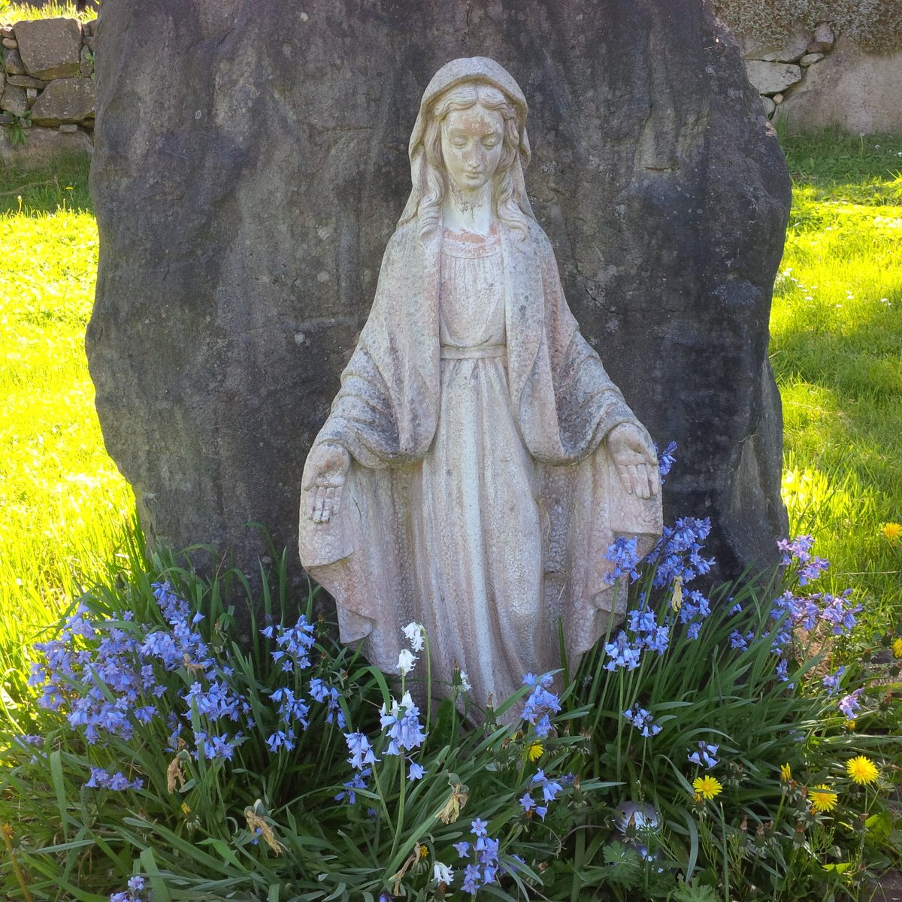
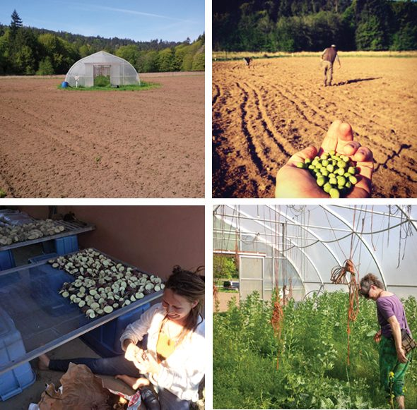
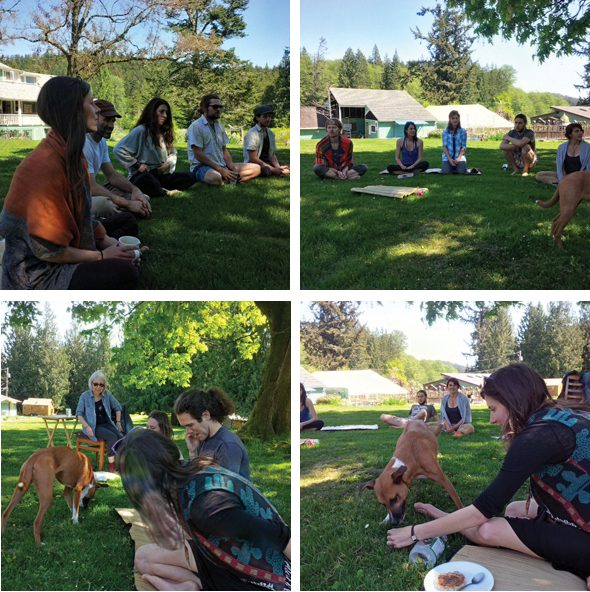
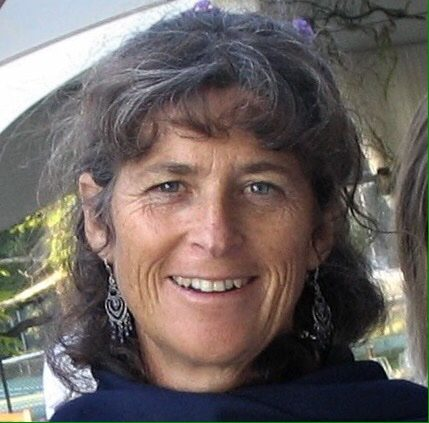

 Mary in the garden
> Yes – the springtimes needed you. Often a star was waiting for you to notice it.
> A wave rolled toward you out of the distant past,
> or as you walked under an open window, a violin yielded itself to your hearing.
> All this was mission.
> -Rainer Maria Rilke, Duino Elegies, translated by Stephen Mitchell

Greetings friends.
Every year spring comes round and feels like a miracle. By now spring’s seemingly (miraculous!) newfound fecundity might even be wearing off on you but it’s truly only just beginning. As April turns to May, here at the Centre our community, like our gardens and grounds, continue to grow and grow and grow!
Milo shares with us again this month the happenings of the garden:
 Scenes from the Spring garden. For more, click the image to visit Milo's Instagram account.
> *"We're in a full sprint here as spring sings of summer and a sunny week allows our tractor to finally break ground.*
> *The water-wise earthworks alluded to last month have shaped up nicely in the crop fields and our beds are now ready to harvest rainwater!*
> *Donated seeds from Dan Jason fill the beds, pushing our "Power of the Pulses" project into action as peas and broad beans burst to life above damaged soils.*
> *On the horizon our hoop houses get prepped for peppers and the first spuds find their way into the warming soil.*
> *Onward!"*

# Comings and Goings

As you read this, we will be just saying good bye to a wonderful group of folks who attended our first [Yoga Getaway](https://saltspringcentre.com/retreats-programs/yogagetaways/) of 2016. We hold a getaway once a month throughout spring, summer and fall, so please feel free to join us when you can. The Centre offers the possibility of short [personal retreats](https://saltspringcentre.com/retreats-programs/personal-yoga-retreats/) as well, so if you’d like to pursue your individual practice of yoga in a peaceful and beautiful environment shared with a small spiritual community follow [this link](https://saltspringcentre.com/retreats-programs/personal-yoga-retreats/) for more information.
Coming up on May 7th, Dharma Sara Satsang Society will be holding its Annual General Meeting at the Centre which is open to all members. Elections for board president, treasurer and four board members will take place electronically by all who have been members for at least 90 days. Visit our website if you are interested in [joining DSS or wish to renew your membership](https://saltspringcentre.com/dharma-sara-satsang-society-form/).
The Salt Spring Centre School will be performing ‘[Time Lord](http://saltspringcentreschool.ca/time-lord-sscs-annual-whole-school-play/)’, directed by Kate Richer, teacher of the grade 4-5-6 class at the Centre School. This annual whole school play will be held at Mahon Hall May 27-29th.
Our community grows significantly larger at the end of May when the [Yoga Service, Study Immersion](https://saltspringcentre.com/yoga-service-and-study/) (YSSI) begins. This twelve week residential program is just about full, so if you or someone you know is ready to dive deep into an authentic yoga lifestyle please get in touch soon.
We are still accepting applications for our [200 hour Yoga Teacher Training](https://saltspringcentre.com/yoga-teacher-training) as well. This one month residential program takes place over two weeks in July and August. Our YTT is entering its 14th year and is taught by an outstanding faculty of 20 experienced teachers. For both aspiring yoga teachers and experienced yogis wishing to deepen their practice, this training offers a solid foundation in Classical Ashtanga yoga and Hatha yoga.
 First gathering on 'The Mound' (Click the image to visit us on Instagram!)
Spring has finally allowed our first community check-in on ‘The Mound’. This cherished gathering spot at the heart of the Centre offers its own peaceful quality to our communions - both divine and seemingly mundane. Here are a few pictures from this first of many gatherings of hearts and minds on ‘The Mound’.
Most full time residential karma yogis attended a first aid course and a fire safety course this month which are both annual occurrences. These courses offer important knowledge as we are a rural community with limited ambulances and fire services.
Kitty, our new assistant garden coordinator, and her dog Mawa, have arrived! While writing this, we await the arrival of Chris Skleryk, our new Maintenance assistant as well. We have lots of beautification and renovations projects in line for him already!
Sharada, founding member of the Centre, yoga mentor, newsletter editor and karma yogi extraordinaire, will be having back surgery this month. Well wishes and prayers are welcome and forthcoming!

# This Month’s Newsletter Offerings

“The narratives we create become like stepping stones: it’s helpful to look back and acknowledge where we’ve been, but if we’re constantly looking back or constantly looking forward, and we don’t bring awareness to where we presently stand, we can risk making a wrong step.” This is just a taste of the lyrical beauty of Amy Cousins’ writing. Amy shares her story with us in this month’s Our Centre Community.
As this year’s [Yoga Teacher Training](https://saltspringcentre.com/yoga-teacher-training/) comes closer, we thought it might be fun to ask some YTT grads to reflect upon their experience of the training. This month we offer [YTT Reflections](https://saltspringcentre.com/tag/ytt-reflections/): some Q & A with [Craig Stewart](https://saltspringcentre.com/2016/04/ytt-reflections-craig-stewart/) and [Linda Rogers](https://saltspringcentre.com/2016/04/ytt-reflections-linda-rogers/). What I find most compelling about both of their offerings is that neither came to become teachers, and though both had expectations that were met, it was the unexpected that had the most profound effect on their lives. The diversity of their backgrounds and experiences within the training reinforce for me that there is not only one kind of teacher trainee and that if you dig deep enough you will almost assuredly find your best self hidden in plain sight (waiting to be found!).
Pratibha Queen has contributed [Karma Yoga...A Path of Inner Development](https://saltspringcentre.com/2016/04/karma-yoga-a-path-of-inner-development/) to our newsletter this month. The practice of Karma yoga is the lifeblood of this community, yet sometimes the ‘idea’ of karma yoga is hard to grasp. Pratibha uses Babaji’s teachings, and specifically his ‘bank manager versus bank owner’ metaphor to so sweetly and effectively allow us to grasp this ideal in action. For those of us who learn best through metaphor and analogy this piece of writing is a gift! Thank you Pratibha!

# Janaki

To honour our dear satsang sister, Janaki Polden, who passed away last month, we are pleased to [re-post her founding member story from 2012](https://saltspringcentre.com/2016/04/janaki/). Janaki was a gift to all who knew her. In her quiet way, she touched the lives of many people within the satsang and the wider community, as a mother and grandmother, nurse and administrator of the Greenwoods nursing home, an active participant in the Spinners and Weavers Guild on Salt Spring and member of the Salt Spring Water Preservation Society and the Salt Spring Land Conservancy. She was devoted to her family, to Babaji, to sadhana. We are grateful to have been able to share in the gift of her life.
Love,
Kenzie and Sharada
