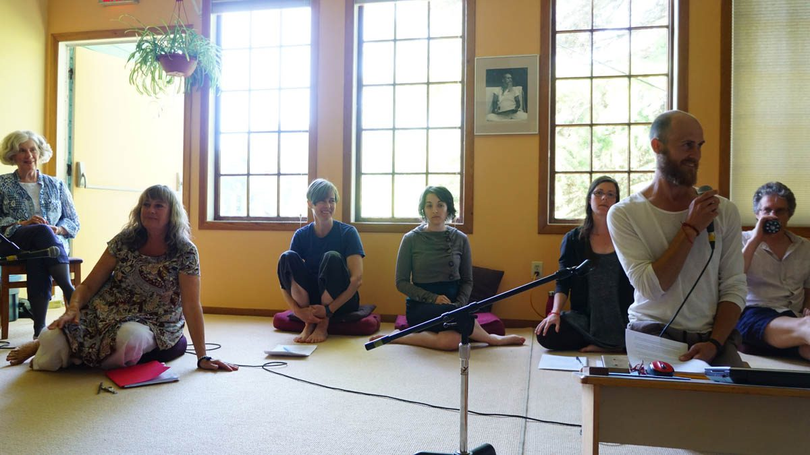
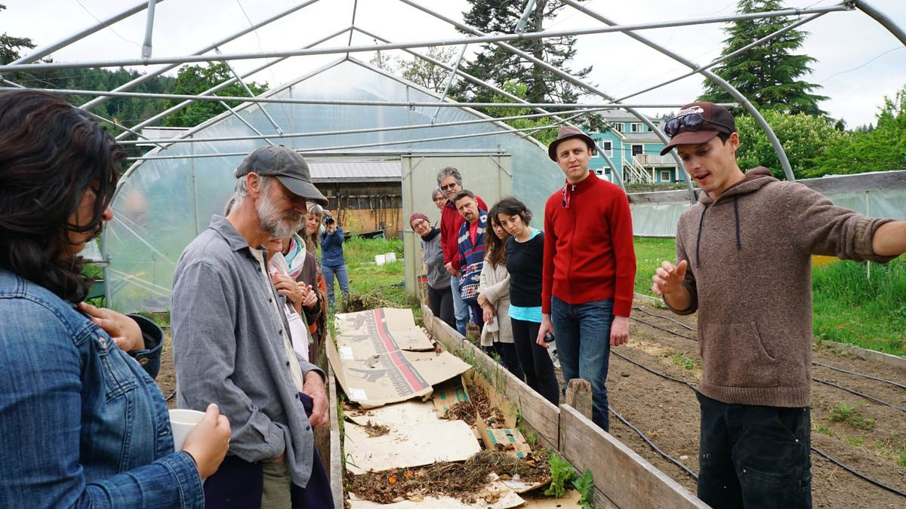
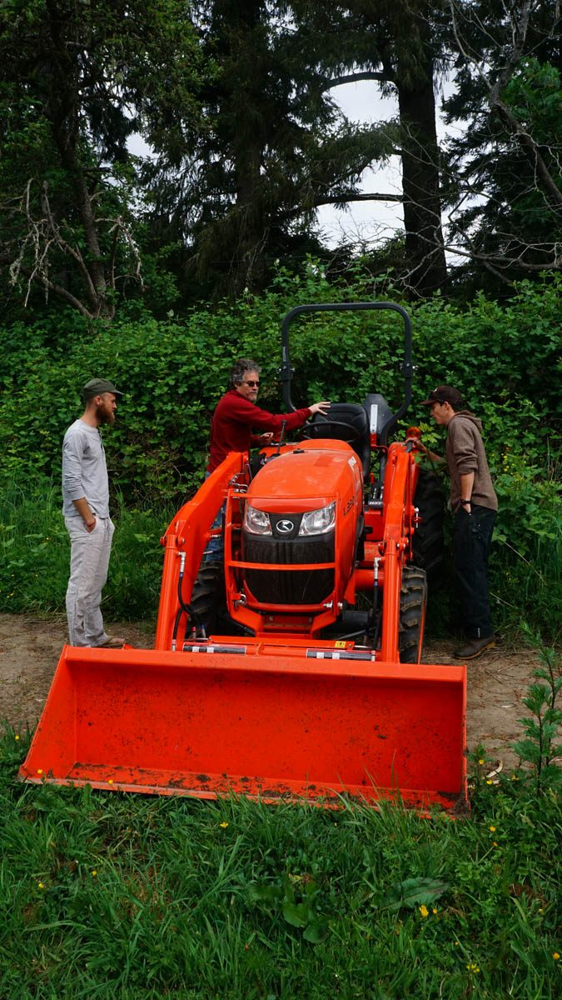
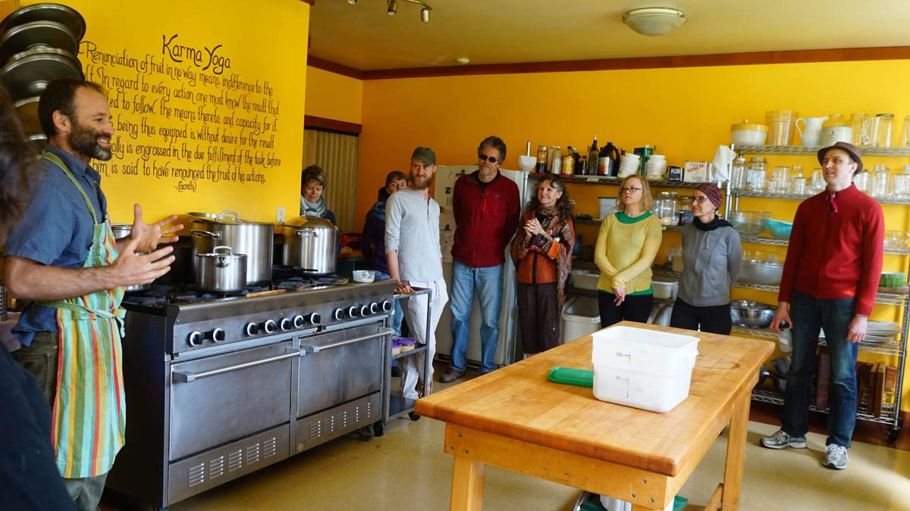
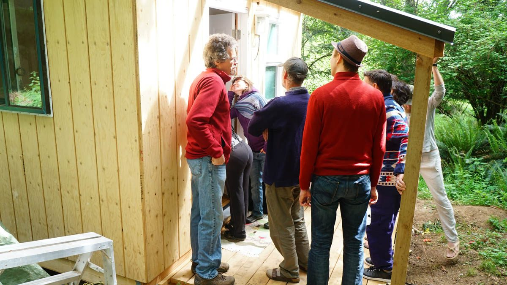
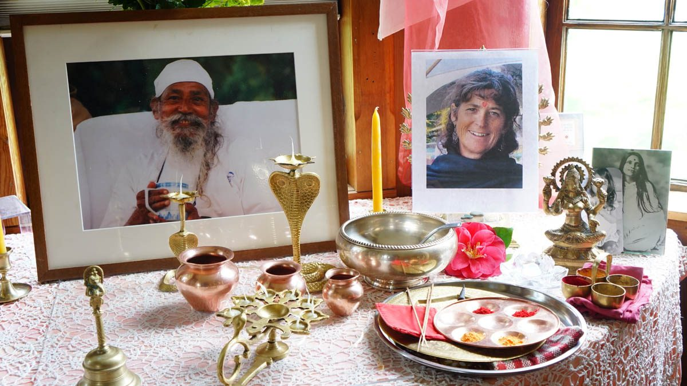
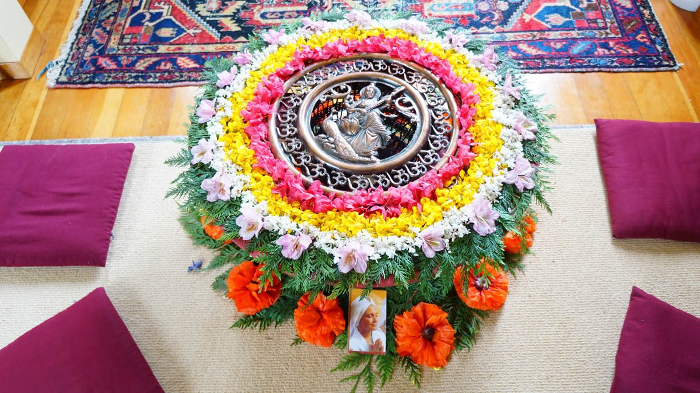

The weekend of May 6-8 was so much more than an AGM. Friday evening started off with stories about the satsang in the early days. That theme continued on Saturday morning with readings from notes of early meetings with Babaji - and lots of stories from people who were around in those days.
[caption id="attachment\_13667" align="aligncenter" width="620"] Members of the Dharma Sara board[/caption]
[caption id="attachment\_13671" align="aligncenter" width="620"] Milo explaining the worm composting structure and process during our tour around the land[/caption]
[caption id="attachment\_13670" align="aligncenter" width="576"] Milo and Om PK talk about the features of the new addition on the farm on our tour around the land[/caption]
[caption id="attachment\_13669" align="aligncenter" width="620"] Raven taking a moment to share about the Kitchen and to lead us in a blessing for the new season[/caption]
[caption id="attachment\_13668" align="aligncenter" width="620"] Checking out the newly build and part under construction cabins for our staff accomodations[/caption]
After brunch there was a tour of the land to see some of the things that have been happening here in recent months. Milo gave a farm tour and introduced the new tractor, and Piet showed folks the new building projects. In the afternoon reports at the AGM filled us in on all aspects of the operation of the Centre, the Vancouver satsang, and the Centre School. The new DS Board was announced: Mark Omprakash Classen - president; Jules Higginson- treasurer; Amy Cousins - secretary; Natasha Samson and Bhavani Chlopan- members at large. You can [meet them officially here](https://saltspringcentre.com/about/dharma-sara-board-members/).
[caption id="attachment\_13665" align="aligncenter" width="620"] Celebrating the life of our satsang sister, Janaki[/caption]
Saturday evening was dedicated to celebrating Janaki, with kirtan and stories of remembrance and appreciation of our beautiful satsang sister. Raghunath had created an amazing photo display of Janaki and her family. It was an evening filled with joy, tears, laughter and a strong sense of loving community.
[caption id="attachment\_13666" align="aligncenter" width="620"] Beautiful preparation of the Divine Mother offering Sunday afternoon[/caption]
And that wasn’t all! Sunday was Mother’s Day - a day filled with kirtan in praise of the Divine Mother. The satsang room was packed with people, with more arriving for a wonderful community dinner and more kirtan in the evening. Raven reports that there were about 150 people here - like a mini summer retreat - and a prelude to ACYR on the August long weekend.
Jai Gurudev!
