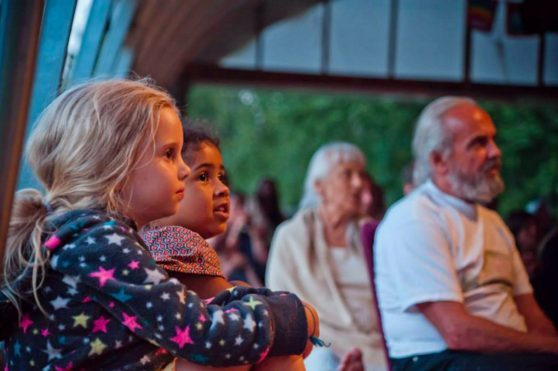
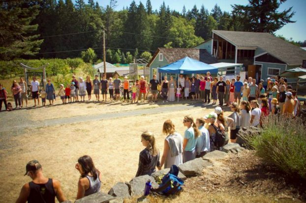

> When someone starts yoga, he or she thinks they should be very serious. Then they develop pain and go crazy as a result of their yoga. When you develop seriousness you cut yourself off from others. Yoga doesn't say hide in a corner. Don't feel you are old. For God, all are children, and children always play. ~ Babaji

If you’ve never attended one of the Centre’s [Annual Community Yoga Retreats](https://saltspringcentre.com/retreats-programs/annual-retreat/), you might not know what makes it such a special experience. While there are many elements that make it special, for me what really sets it apart from other retreats is the presence of families and children.
Depending on where you live and the kind of lifestyle you maintain, joining others in an intergenerational community for an extended period of time to focus on yoga and togetherness might be a rare experience. It revealed for me a new world of possibility and a way of being together that I’d never really felt before.
The last two summers I’ve had the privilege, and sometimes challenge, of being involved in co-ordinating the kids program. I have experienced first hand the unique element that kids bring to retreat. The retreat offers many opportunities for silence, reflection and personal study, yet there is also an element of community and relationship that invites a different kind of practice. A community retreat can challenge us to weave contemplation into the fabric of togetherness and family, and to start living our inner-realizations in a relational context.

Babaji stresses the importance of allowing whatever life brings us to be our practice. So I suppose sometimes practice looks calm and still on the outside, and other times it might look quite active, even at times chaotic. If we restrict our practice to times of silence and stillness, we may be missing out on some of the richest opportunities for growth.
Children can be great teachers in that they embody such a diverse range of expression, and you never know what to expect. Sometimes they can be infinitely sweet and insightful, at other times bursting with emotional turmoil and upset. In these moments, there is an opportunity to meet whatever arises, either with resistance or open curiosity. While it can be easy to avoid or ignore some of the emotional turmoil that arises internally, it is difficult, often impossible, to ignore this expression in a child. In this way, relationships, and in particular relationships with children, can challenge us to face the unsettling parts of ourselves with compassion and curiosity. Children also have a delightful way of connecting us to our inner freshness, and keeping alive a way of seeing that can get lost as we grow-up.
As Babaji says:
> Become a child. If you love them it’s easy. You were and are a child. A tree grows from a seed and the tree never separates from the seed. We don’t have to pretend to be a child; that nature is always in us.

To me, Babaji’s teachings really are about the yoga of life. Whatever stage of life we are in becomes our practice. Family life can be like this as well.
> Your children make a world of your family. God and the creation are not separate. To love God we have to love God’s creation, which is visible and can be identified. Your family is a miniature form of this vast creation. If you serve your children, you are serving the whole creation.

The beauty of retreat, and in particular a community retreat, is that we create a little microcosmic universe together. We have the opportunity to serve each other, to see each other more deeply and to find common ground.
> Don’t separate yourself from social activities, but do your sadhana regularly. The world is an abstract art. Everyone sees it as they want to see it. It is a garden of roses and it is also a forest of thorny bushes and poison oak. You don’t need to stop seeing your friends to seek the truth. You have to see the truth in everything, including your friends, family and society.

In this way, community retreat gives us the opportunity to deepen and to widen our practice. It has offered me some of the most challenging moments, and some of the most exquisite. But life is like that, both challenging and exquisite. Children know this and live this truth honestly, without trying to pretend it is different. I love that about being with them, and, just like yoga, they teach me how to be with life just as it is, and not to take things too seriously.
> This is life. It includes pleasure, pain, good, bad, happiness, depression, etc. There can’t be day without night, so don’t expect that you or anyone will always be happy and that nothing will go wrong. Stand in the world bravely and face good and bad equally. Life is for that. Try to develop positive qualities as much as you can.

**Contributed by: Johanna Peters**
 

---

Johanna became connected to SSCY through a series of serendipitous events that allowed her to work at the centre as a karma yogi. She remains connected to the centre and Babaji’s teachings by attending Satsang in Vancouver, and has learned the most about the true spirit of karma yoga through her work with children. Combining her love of yoga and working with kids, she had the privilege of co-ordinating the kids program at this year’s Annual Community Retreat. The centre continues to be a place of spiritual nourishment, inspiration and connection for Johanna, and the support it provides has allowed her life to blossom and flourish in the most unexpected and delightful ways.
