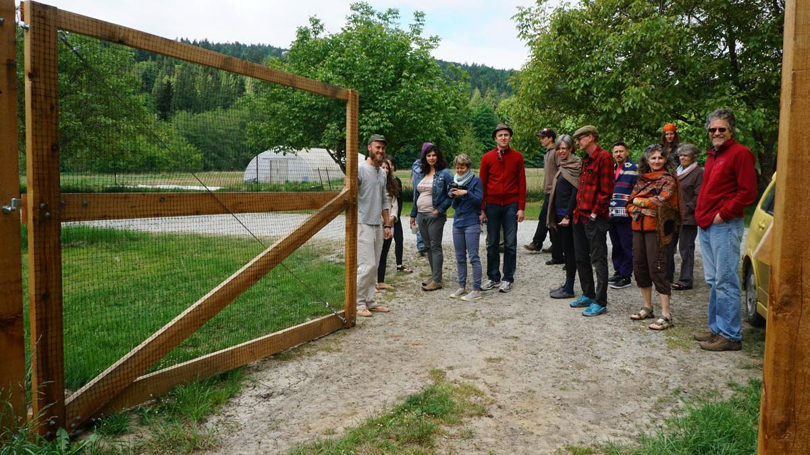
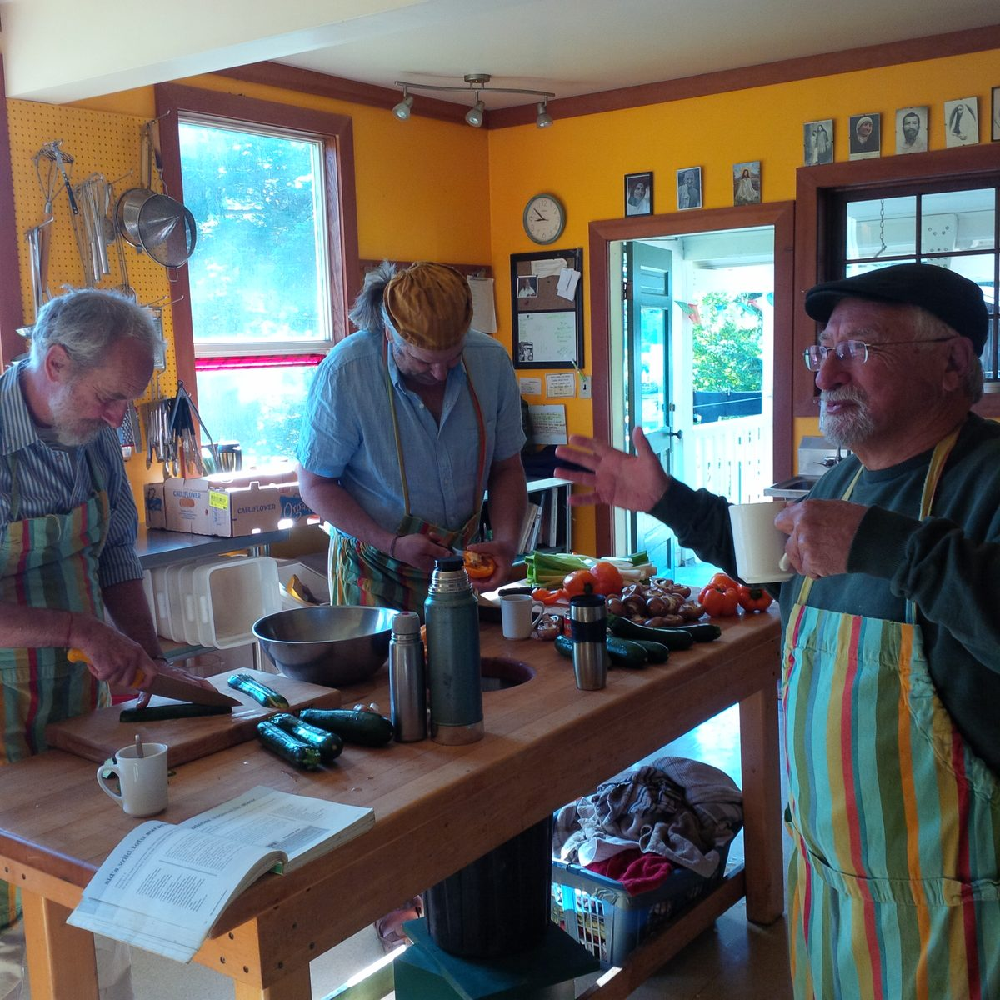
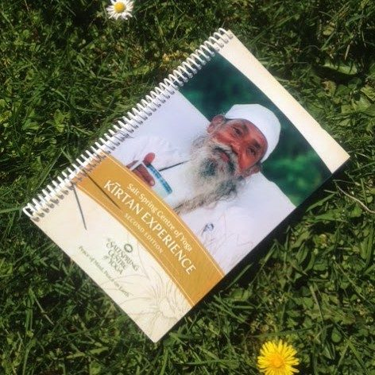

Greetings friends.
May is turning to June and the Centre land is buzzing with bees as the air continues to carry the sweet scent of freshly blooming flowers. Just as we settle into Spring’s expansive rhythms, life force seems to shift into a whole new cadence and we once again must find a way to join in the dance. As it is with nature- so it is with life at the Centre.
By May’s end we said goodbye to four of our long term residents. David and Melissa left in early may, while Dee and Tana are freshly away from us. We are sad to see them go but trust they will visit and know this will always feel like home. Oh how we wish them well! Angelo and Karen, who will be joining the YSSI ([Yoga Study and Immersion](https://saltspringcentre.com/yoga-service-and-study/)) program, came early to assist us in our May programs. It has been such a pleasure having them! We also had two karma yogis join us; Tom, who came for our April [Yoga Getaway](https://saltspringcentre.com/retreats-programs/yogagetaways/) and never left(!) and Carmen, a wwoofer (Worldwide Workers on Organic Farms) from Australia, who has been a much needed help in our garden.
 Out on tour of the Centre at our 2016 AGM
The Annual General Meeting weekend also happened in May, and it was a blast! It was truly heartwarming to see so many familiar faces come out and connect with each other and the Centre community. [Dharma Sara Satsang](https://saltspringcentre.com/dharma-sara-satsang-society-form/) members toured the Centre property and learned about the new happenings in the Farm, Chikitsa Shala and around the land. Speeches and reports during the AGM were filled with gratitude and joy. As we say farewell to the outgoing board members, we are grateful for their wisdom and input, but also very excited for the new Board and future of the Centre. For more details, read Sharada’s [article about the AGM](https://saltspringcentre.com/2016/05/2016-agm-weekend-review/) in the newsletter.
May finished itself off with a huge [Yoga Getaway](https://saltspringcentre.com/retreats-programs/yogagetaways/) (42 registered and a waitlist!) and the beginning of YSSI, which grows our joyful community by twelve more souls. The residents are excited to see our numbers increase and we are talking about the stages of group development; forming, storming, norming, and performing. We look forward to the fresh energy and extra hands as we roll into program season. Enrolment for one of our dearest programs, [Yoga Teacher Training](https://saltspringcentre.com/yoga-teacher-training/), continues to grow and we are still accepting applications.
But, as much as things change, some things don’t seem to change at all. These photos are from earlier this month when Raghunath, Ramanand and Sid (Sudarshan) made brunch for the community - Sid's classic 'Wild Tofu Surprise.' The soundtrack was The Grateful Dead, just like the old days. It was a big hit.
 Sid's Tofu Surprise
The music just plays on and on here. Our [shiva kirtan album](https://itunes.apple.com/ca/album/shiva-kirtan-41st-annual-community/id1094982714) has arrived and is on sale through our Jai Store and also on iTunes. Our kirtan books are also available for purchase. Edition 1 has complete translation of all kirtans and unpublished writings from Babaji about kirtan singing, while Edition 2 also has the diacritical marks added to the kirtans, which tells how to pronounce the Sanskrit. In related news, our last community dinner, until the fall, will be held June 5th after satsang.
 Kirtan song book
This month Salt Spring Centre School will wrap up it’s 2015/16 school year with a camping trip to Hornby Island. Throughout the year a couple of new initiatives helped bring the Centre and the school closer together. Raven has begun teaching a weekly meditation class for parents along with several classes a week for the children, and Milo is also working with them in the garden. [Salt Spring Centre School](http://saltspringcentreschool.ca) is a truly magical place based on these principles: We care for feelings. We care for bodies. We care for things. We respect learning for others and ourselves. We will miss the sound of children playing on the land and look forward to their return after summer holidays.

# This Month’s Newsletter Offerings.

> “Become a child. If you love them it’s easy. You were and are a child. A tree grows from a seed and the tree never separates from the seed. We don’t have to pretend to be a child; that nature is always in us.”

Babaji has always encouraged us to play, and what better opportunity to do so then with all of the children at our [Annual Community Yoga Retreat](https://saltspringcentre.com/retreats-programs/annual-retreat/). Johanna Peters, who runs the children’s programming at the retreat, offers us a reflection on just this in her article '[Community Practice and Staying Young at Heart](https://saltspringcentre.com/2016/05/community-practice-and-staying-young-at-heart/)' by sharing her own experiences alongside Babaji’s teachings on the subject.
Willow, who also works in the children’s program at the ACYR, shares her story with us in ‘[Our Centre Community](https://saltspringcentre.com/2016/05/our-centre-community-willow/)’. Willow’s own children attended Salt Spring Centre school, and she is very committed to bringing the Centre and the School closer together.
With YTT only a month away, we bring to you again ‘[YTT Reflections](https://saltspringcentre.com/2016/05/adams-ytt-reflections/)’- a question and answer piece that allows alumni to reflect on their training and the impact their experiences at YTT have had further down the road. Thank you Adam Burt for so graciously sharing your experiences with us this month.
Kenzie has once more written a yoga book review. As a yoga teacher, she is always on the lookout for appropriate poems to share at the end of her yoga classes. She read ‘[Love Poems from God](https://saltspringcentre.com/2016/05/book-review-love-poems-from-god/)’ with a particular agenda in mind, and found exactly what she was looking for.
Our final article in this month’s newsletter is by Sharada. The [AGM weekend](https://saltspringcentre.com/2016/05/2016-agm-weekend-review/) was such a wonderful “mini retreat”; full of sweetness, friendship and celebration. She wanted to share some more details and A LOT of photos. As Sharada continues to recover from her surgery, we continue to sing the healing mantra for her day after day.
Warmest regards,
Kenzie
