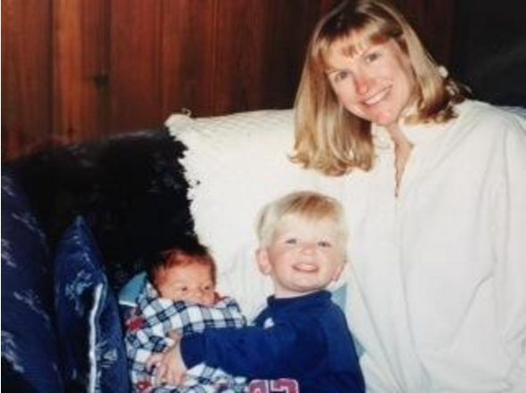
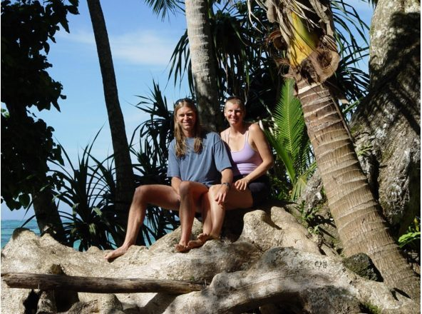
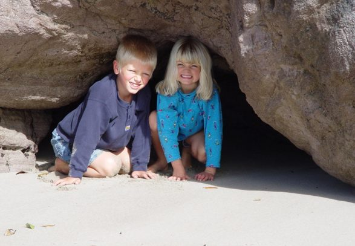
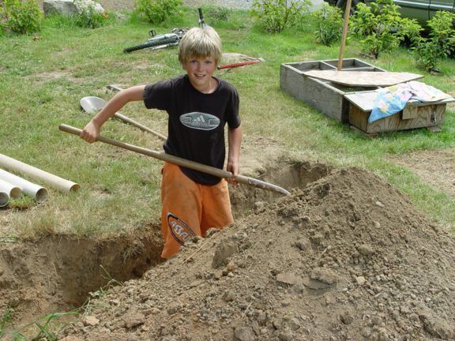
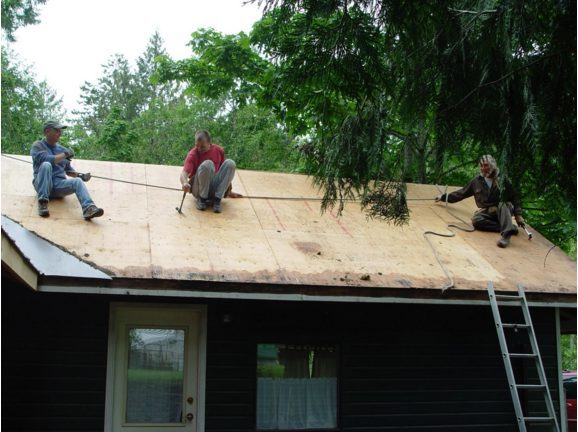
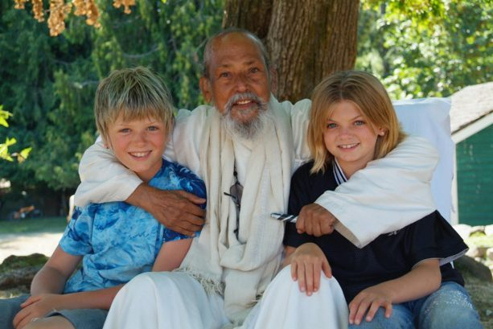

# The Story of my Life - in a Nutshell

Born and raised in Toronto, Ontario, I had a very SWEET childhood filled with lots of love, family, water fights, ice cream cones, a best friend, swimming at the farm, tree climbing, snowball fights, scraped knees, skiing, and family – worth mentioning twice. There were some nasty thingies too but I won’t talk about them here.
When I became a TEENAGER I started questioning things like, systems, authority, rules, societal norms, relationships, and the behavioural approaches to all of them. I could be found in the ‘occult’ section of bookstores regularly and, although unlabeled, became an environmentalist.
I spent a ton of time walking, had boyfriends, my best friend had a new best friend but that was okay because I had a Group of amazing girl friends. My folks had separated, we’d moved a couple of times and then I had two experiences that mattered. First, I was a vehicle through which spirit talked to my seriously troubled friend. Sorry to say I don’t remember a thing. It was life changing for him but it took a while to fully feel the impact it had on me. Second, I received from spirit the name WILLOW (before that I was called Andy – which I still like). I was 18 at the time but didn’t start using Willow until I was about 32 years old.
 About the time “WILLOW” replaced “Andy” and Kai taking delight in his new baby sister.
About the time “WILLOW” replaced “Andy” and Kai taking delight in his new baby sister.
As a young ADULT my questioning became deeper and more introspective. I went to Europe to see wonders, worked in banking, and went to Uni. While in England, on my 19th birthday, I had a life changing metaphysical experience. It was cool, weird, beautiful, awesome and seriously powerful. It’s very hard to put into words these types of experiences. Some fireworks went off (personal literal ones) and I sort of floated across the room and just stood in front of my now husband, Marty. It took us 9 years of letter writing and growing up in our respective countries before we got together. He’s awesome.
 Celebrating our 10 year wedding anniversary in Samoa 2005
So we married, and two AMAZING souls decided to join us on this journey. Kai in 1997 and Shael in 1999. They are my greatest joy, teachers, source of anxiety, playmates and travel partners. We spent 3 months at Mount Madonna Centre because I was teaching yoga in NZ but feeling spiritually isolated. It was wonderful to be with Babaji and the community at MMC which was warm and inclusive. They suggested we give SSCY a try so we did! We fell in love with SSCY and with the Centre School. We lived at the Centre for three years from 2006-2009. It was a time filled beauty, hard work and lots of major Centre transitions. Our most obvious contribution is Sage House where we lived in 283 square feet while building the addition.
 Kai & Shael at Cathedral Cove in New Zealand 2004
 Kai breaking ground on Sage House
 Marty, Ameresh & Phil on the roof
 Look at their eyes. I see Love and Happiness. Babaji was so wonderful with Kai and Shael – They are under the maple on the Mound 2008
Kai and Shael attended SSCS ([Centre School](http://saltspringcentreschool.ca/)) during which time I joined the Board as a DS representative. I continue to serve on it and am delighted to be part of the movement to bring the School and the Centre closer together again.
I look forward to serving in the Children’s Program at [Retreat](https://saltspringcentre.com/retreats-programs/annual-retreat/) again this year. Hope to see you all there!
With love and gratitude to be of service to, and share in, a beautiful practicing group of humans.
